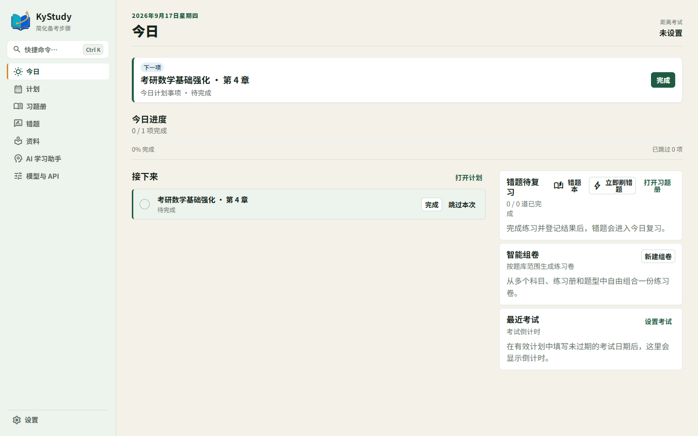
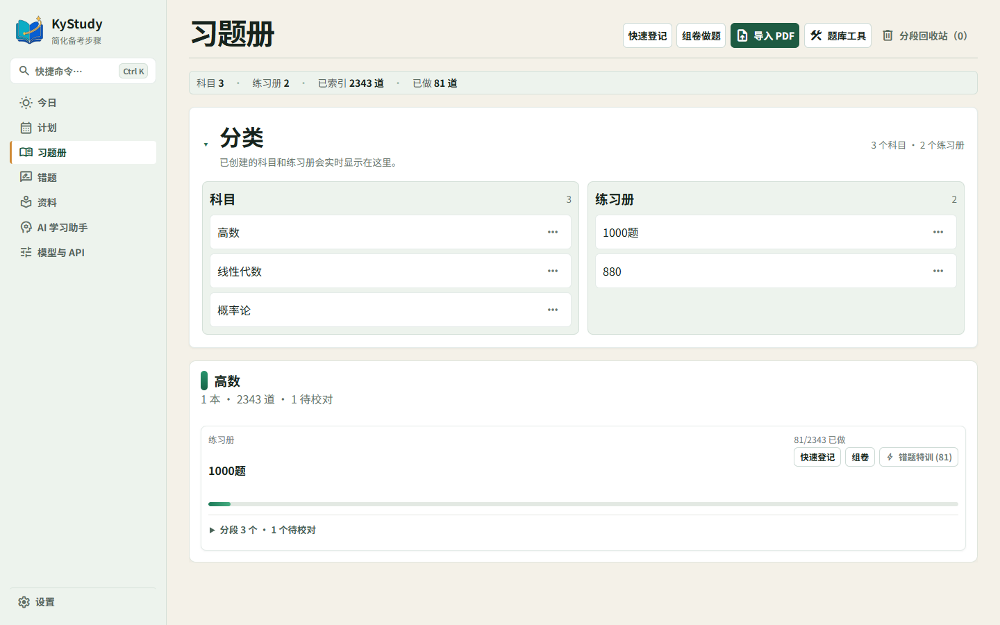
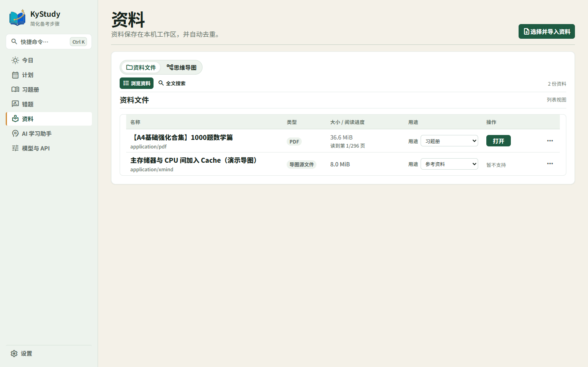

<a id="readme-top"></a>

<div align="center">
  
  <h1>KyStudy</h1>
  <p>面向中国考研学生的本地优先学习规划、习题管理与错题复习桌面应用。</p>
  <p>
    <a href="https://github.com/Trey5-7e/KyStudy/releases">下载 v0.1.2</a>
    ·
    <a href="https://github.com/Trey5-7e/KyStudy/issues">反馈问题</a>
    ·
    <a href="docs/V0_1_0_DEVELOPMENT_HANDOFF.md">开发交接文档</a>
  </p>
</div>

<p align="center">
  <a href="https://github.com/Trey5-7e/KyStudy/actions/workflows/windows-ci.yml">
    
  </a>
  <a href="LICENSE">
    
  </a>
  
  
</p>

> 当前首版支持 Windows 10/11 x64。v0.1.2 将用于验证从 v0.1.1 的自动更新流程；OCR 组件复用独立的 `ocr-v0.1.0` Release。

## 目录

- [项目简介](#项目简介)
- [核心能力](#核心能力)
- [界面概览](#界面概览)
- [技术栈](#技术栈)
- [获取与安装](#获取与安装)
- [从源码运行](#从源码运行)
- [使用流程](#使用流程)
- [数据、隐私与版权](#数据隐私与版权)
- [开发文档](#开发文档)
- [后续开发方向](#后续开发方向)
- [贡献指南](#贡献指南)
- [许可证](#许可证)

## 项目简介

KyStudy 的目标不是记录更多数据，而是减少备考中重复、麻烦、容易拖延的准备工作：

- 把长期目标和节奏整理成可确认的学习计划；
- 从多本习题册和指定范围中挑出今天该复习的题；
- 保存题目区域、作答记录和错题反馈，避免反复翻找 PDF；
- 在需要时使用本地 OCR 或用户主动触发的 AI 辅助整理资料。

产品原则是：**输入目标和节奏，系统自动安排；打开软件，只处理今天。**

### 适合哪些人

- 同时使用多本习题册、讲义和 PDF 资料，需要统一管理题目范围；
- 想把长期目标拆成今天能执行的学习任务，而不是只记录待办事项；
- 需要持续复习错题，并希望知道每道题为什么再次出现；
- 重视本地存储和数据控制，不希望学习资料默认上传到云端。

### 你可以用 KyStudy 做什么

从资料导入开始，KyStudy 将“资料 → 题库 → 组卷 → 今日任务 → 复习反馈”串成一条本地学习闭环。你可以先只使用 PDF 阅读和题目管理，也可以逐步启用计划、OCR、思维导图和 AI 辅助，不需要一次配置完所有功能。

## 核心能力

| 模块         | 能力                                                 |
| ------------ | ---------------------------------------------------- |
| 今日与计划   | 今日任务、周期计划、阶段展开、进度与逾期处理         |
| 习题册与组卷 | 导入 PDF、题目区域、题型/章节/习题册范围、拼卷与恢复 |
| 错题复习     | 掌握/模糊/不会反馈、可解释复习队列、未完成题顺延     |
| 资料阅读     | PDF 阅读、页码回跳、全文索引、规划资料引用           |
| OCR          | 可选本地 OCR 组件，按需启动、可取消、结果需人工确认  |
| 思维导图     | XMind、FreeMind、OPML 导入，浏览、搜索和有限编辑     |
| AI 辅助      | 用户主动触发、外发范围预览、Token 预算和本地缓存     |
| 数据安全     | 本地 SQLite、Blob 文件库、完整备份和恢复副本         |

首版不会内置受版权保护的题库、试卷或学习资料，用户需要导入自己有权使用的文件。

## 界面概览

README 只展示四个核心页面，具体的导入、组卷、错题反馈、PDF 阅读、思维导图和设置操作放在后面的使用流程中说明。

<p align="center">
  
</p>
<p align="center"><strong>今日</strong>：集中处理当前任务</p>

<p align="center">
  
</p>
<p align="center"><strong>计划</strong>：查看周期安排和进度</p>

<p align="center">
  
</p>
<p align="center"><strong>习题册</strong>：管理题目和索引</p>

<p align="center">
  
</p>
<p align="center"><strong>资料</strong>：统一管理 PDF 与导图</p>

## 技术栈

- [Tauri 2](https://tauri.app/) + Rust
- React 19 + TypeScript 6 + Vite 8
- SQLite（本地数据库）
- PDF.js（PDF 阅读与文字层）
- 可选 RapidOCR / ONNX Runtime 本地组件
- Vitest、ESLint、Prettier、Cargo fmt、Clippy

## 获取与安装

### 普通用户

从 [GitHub Releases](https://github.com/Trey5-7e/KyStudy/releases) 下载 Windows x64 发行包：

源码、构建脚本和完整许可证文本位于公开的 [KyStudy GitHub 仓库](https://github.com/Trey5-7e/KyStudy)；安装包不包含完整源码是正常的，源码与二进制发行包分开提供。

1. **NSIS 安装包**：推荐使用，默认按当前用户安装，不需要管理员权限；
2. **ZIP 便携版**：解压后运行 kystudy.exe，适合临时使用或手动管理目录。

安装包不包含用户工作区、PDF、题目图片或 API Key。正式安装版与 ZIP 便携版的数据默认保存在程序旁的 `data` 目录；Debug 和显式干净预览才使用隔离的临时目录。升级前建议先使用应用内备份。

### 首版边界

- 支持：Windows 10/11 x64；
- 许可证：[GPL-3.0-only](LICENSE)；
- 暂不提供：macOS/Linux 包、移动端、云端账号和多设备同步；Windows 正式版支持从 GitHub Release 检查签名更新；
- 在线 OCR 下载已配置为公开 HTTPS Release 资产，并在构建时写入 SHA-256；本地安装仍可作为兜底路径。

## 从源码运行

### 环境要求

| 工具                      | 版本                           |
| ------------------------- | ------------------------------ |
| Windows                   | 10/11 x64                      |
| Node.js                   | 22.18.0 或更高版本             |
| pnpm                      | 11.9.0                         |
| Rust                      | 1.97.1，x86_64-pc-windows-msvc |
| Visual Studio Build Tools | 含 MSVC 与 Windows SDK         |
| Edge WebView2 Runtime     | Windows 桌面运行所需           |

详细环境说明见 [docs/DEVELOPMENT_SETUP.md](docs/DEVELOPMENT_SETUP.md)。

### 安装依赖与开发

```powershell
git clone https://github.com/Trey5-7e/KyStudy.git
cd KyStudy
pnpm install --frozen-lockfile
pnpm dev
```

### 质量检查

```powershell
pnpm check
cargo fmt --check --manifest-path src-tauri\Cargo.toml
cargo test --locked --manifest-path src-tauri\Cargo.toml
cargo clippy --all-targets --all-features --locked --manifest-path src-tauri\Cargo.toml -- -D warnings
```

### 构建 Windows 发布包

```powershell
pnpm tauri build
pnpm package:windows-portable
```

NSIS 安装包输出到 src-tauri\target\release\bundle\nsis\，便携版输出到 artifacts\kystudy-windows-x64-portable.zip。构建与打包不应自动启动桌面程序。

## 使用流程

下面是一条从首次启动到日常复习的完整路径。你也可以只使用其中一部分，KyStudy 不要求先完成全部配置。

### 1. 首次启动：建立本地工作区

1. 启动 KyStudy，确认应用能够创建或打开默认工作区；
2. 在“设置”查看数据目录、应用版本和运行状态；
3. 如果你已有备份，先使用“恢复”导入；如果是新用户，可以直接进入“资料”开始导入。

工作区、索引、题目记录和复习反馈默认保存在本机。删除安装目录不会自动删除用户工作区，但升级或更换设备前仍建议先做一次应用内备份。

### 2. 导入资料：先把学习材料放进工作区

在“资料”中导入 PDF、图片或思维导图文件：

- PDF 可以作为阅读资料、规划资料或习题册来源；
- 导入后可查看页码、文字层和全文索引，后续计划可以引用具体页码；
- XMind、FreeMind、OPML 文件进入思维导图模块，可继续浏览、搜索和有限编辑；
- 扫描 PDF 或图片没有可靠文字层时，再按需启用 OCR，不要把 OCR 当作所有资料的必经步骤。

导入完成后，建议先打开资料确认页数、文字是否可检索，再进入题目校对或计划创建。遇到损坏文件、权限错误或格式不兼容时，保留原文件并重新导入，不要覆盖原始资料。

### 3. 建立学习计划：把目标变成今天能执行的任务

在“计划”中创建计划、阶段和执行节奏：

1. 写下科目、目标和阶段说明；
2. 设置学习日、休息日、每日数量或时间等节奏；
3. 将资料页码、习题册或已有题目范围关联到阶段；
4. 先查看预览，确认日期、数量、逾期处理和阶段顺序；
5. 确认后再写入正式日程。

计划预览阶段不会直接覆盖正式日程。之后可以在“今日”看到当前任务，在计划页查看阶段进度；未完成事项会按规则顺延，不会伪装成已完成。

### 4. 整理习题册：校对题目后再组卷

在“习题册”中，先完成题目结构校对，再进行组卷：

1. 打开习题册并检查 PDF 页码、章节和题号识别结果；
2. 对识别不准确的题目区域进行调整，确认题型和章节；
3. 在组卷时选择一个或多个习题册；
4. 按章节、题型、题号范围和题目数量组合筛选；
5. 查看候选题数量和最终题目列表，确认后生成练习或复习队列；
6. 需要调整时可以返回范围设置或恢复上一次组卷结果。

推荐先用一个章节和少量题目完成试组卷，确认题号、顺序和预览符合预期后，再扩大到多本习题册或更大的范围。这样可以避免一次导入大量错误索引。

### 5. 每日学习：只处理今天的内容

进入“今日”后，按当前优先级处理任务：

- 打开计划任务，完成学习、记录实际投入或标记跳过；
- 打开今日复习队列，按题目逐题作答；
- 任务中断时直接退出，重新进入后从未完成位置继续；
- 逾期或昨日未完成内容会按规则显示，不需要手工复制到今天。

如果当天时间有限，优先完成队首的顺延题和高优先级任务，再处理新安排的内容。

### 6. 错题复习：用反馈让队列逐渐变准

每道复习题完成后，选择最接近实际情况的反馈：

- **掌握**：题目掌握较好，按渐进间隔安排下一次复习；
- **模糊**：能做但不稳定，保留在较近的复习范围；
- **不会/做错**：记录真实错题并提高后续复习优先级。

反馈会形成可解释的复习记录，而不是只改变一个分数。未完成的题目会保留在队列前部，避免因为刷新或切页丢失进度。

### 7. 按需使用 OCR、思维导图和 AI

- **OCR**：在“设置”中按需安装或修复本地 OCR 组件；识别任务可取消，结果进入待确认草稿，确认前不会直接写入正式题库；
- **思维导图**：导入 XMind、FreeMind 或 OPML 后，在思维导图模块中搜索、浏览和整理知识结构；
- **AI**：只在用户主动触发时调用。发送前先查看资料范围和预算，规划结果以草案形式返回，确认后才进入正式计划；AI 不直接覆盖原始资料。

### 8. 形成自己的备份习惯

建议在大量导入资料、完成一轮题库校对或升级版本前创建备份：

1. 打开“设置”中的备份功能；
2. 选择新的备份目录，不要覆盖已有备份；
3. 定期在另一块磁盘或受控位置保存备份；
4. 需要迁移时，先确认目标目录可写，再执行恢复并检查资料、题目和复习记录。

### 推荐的第一次使用路径

如果你只是想快速体验，可以按下面的顺序完成第一轮：

1. 导入一份自己有权使用的 PDF；
2. 在资料页确认页数和文字层；
3. 创建一个科目和一个短学习阶段；
4. 从单个章节组一份 5–10 题的小练习；
5. 在“今日”完成练习并记录掌握反馈；
6. 回到错题复习查看下一次安排；
7. 创建一次备份，确认数据可以恢复。

完成这条路径后，再逐步增加多本习题册、OCR、思维导图和 AI 辅助，体验会更稳定。

## 数据、隐私与版权

- PDF、题目区域、导图、笔记和用户数据默认只保存在本地；
- API Key 存在 Windows 安全凭据存储中，不进入 SQLite、备份、日志或诊断文件；
- AI 调用前展示拟发送的资料片段，未经用户触发不会上传学习资料；
- 开源仓库和示例数据不包含完整试卷、习题册扫描件或个人学习数据；
- Issue、Pull Request、提交记录和截图中不得上传密钥、个人路径或受版权保护的资料。

## 开发文档

- [文档导航](docs/README.md)
- [v0.1.0 开发交接文档](docs/V0_1_0_DEVELOPMENT_HANDOFF.md)
- [v0.1.0 最终验收记录](docs/V0_1_0_FINAL_ACCEPTANCE.md)
- [v0.1.1 发布说明](docs/V0_1_1_RELEASE_NOTES.md)
- [精简开发流程](docs/DEVELOPMENT_WORKFLOW.md)
- [开发环境与依赖说明](docs/DEVELOPMENT_SETUP.md)
- [README 截图演示工作区](docs/DEMO_SCREENSHOT_WORKSPACE.md)
- [产品需求文档](docs/PRD.md)
- [页面信息架构](docs/INFORMATION_ARCHITECTURE.md)
- [依赖许可证审计](docs/DEPENDENCY_LICENSES.md)
- [OCR 组件管理验收](docs/R50_OCR_COMPONENT_MANAGEMENT_ACCEPTANCE.md)
- [OCR 在线下载与发布边界](docs/R52_OCR_COMPONENT_PACKAGING_ACCEPTANCE.md)

历史里程碑与 R1–R65 验收记录归档在 [docs/archive/v0.1.0/](docs/archive/v0.1.0/)，用于追溯行为契约和测试证据。

## 后续开发方向

v0.1.0 发布后，KyStudy 的开发重点是把现有学习闭环做得更稳定、更容易坚持，而不是快速堆叠新模块：

1. **稳定与反馈**：优先修复真实使用中的数据、导入、组卷、复习和窗口交互问题；
2. **核心闭环优化**：根据实际学习记录改进计划执行、题目范围选择、错题复习和进度反馈；
3. **本地智能增强**：继续完善 OCR 和 AI 的可控性、可解释性与失败恢复，不默认上传用户资料；
4. **发布质量**：持续维护 Windows 安装包、数据迁移、备份恢复、许可证和文档，确认成熟后再评估跨平台或同步能力。

具体开发顺序会以用户反馈、可复现问题和数据安全边界为准，不承诺固定发布日期或未经验证的功能。

## 贡献指南

欢迎提交问题、可复现步骤、改进建议和代码贡献：

1. 先搜索已有 [Issues](https://github.com/Trey5-7e/KyStudy/issues)；
2. 不要上传完整教材、试卷、题库、个人数据库或 API Key；
3. 功能改动请同步测试和必要文档；
4. 提交前运行前端与 Rust 质量检查；
5. Pull Request 中说明用户影响、兼容性和验收方式。

## 许可证

KyStudy 使用 [GNU General Public License v3.0 only](LICENSE)。任何人都可以免费使用、修改和商用，但分发修改版时必须继续提供对应源码并保留许可证声明。

## 致谢

- 感谢 Tauri、React、Vite、PDF.js、SQLite、Vitest 及其贡献者；
- 感谢所有通过 Issue 和验收反馈帮助改进 KyStudy 的用户。

<p align="right"><a href="#readme-top">返回顶部</a></p>
