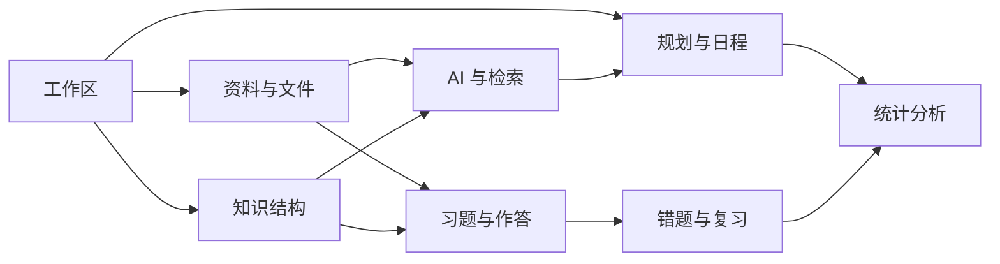
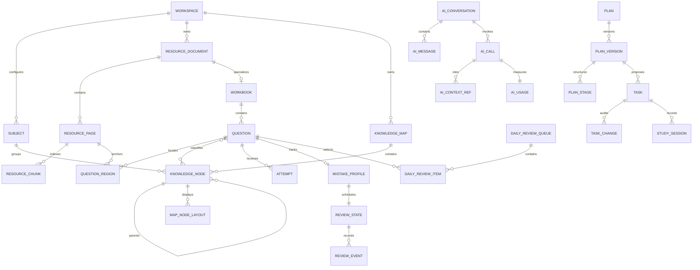

# KyStudy 数据模型设计

| 项目       | 内容                                   |
| ---------- | -------------------------------------- |
| 文档版本   | 0.1                                    |
| 对应 PRD   | 0.1                                    |
| 更新日期   | 2026-07-22                             |
| 状态       | 概念模型；M1-M7 子集已落地至 schema v9 |
| 数据库方向 | SQLite，本地单工作区优先               |

## 1. 设计目标

> 实现说明：schema v9 已在 v8 复习模型之上落地 `resource_index_job`、`resource_page_text`、`resource_text_chunk` 与 FTS5 派生索引。AI Provider、对话、Token 用量、OCR 和派生题目识别仍按本文概念边界后续实现。

数据模型需要同时支持日程、资料、思维导图、PDF 题目、错题复习和 AI 用量，又不能把这些功能堆进一个难以演进的通用表。

本设计遵循以下目标：

- 原始资料、用户正式数据、AI 草案和可重建缓存明确分离；
- 题目与作答记录分离，知识内容与画布布局分离；
- 复习算法可以替换，但历史复习结果不可丢失；
- 删除资料或更新 PDF 时，可以判断影响范围；
- 未来增加同步时，不依赖本机自增 ID；
- AI 调用的上下文、来源与 Token 可以追踪；
- 数据库损坏或索引丢失时，可从原始文件和正式数据重建派生数据。

## 2. 数据分类

| 分类         | 示例                                   | 备份策略                     |
| ------------ | -------------------------------------- | ---------------------------- |
| 原始资产     | 用户导入的 PDF、图片、导图文件         | 完整备份必须包含             |
| 正式业务数据 | 任务、知识节点、题目、作答、复习状态   | 完整备份必须包含             |
| 历史与审计   | 任务变更、规划版本、复习事件、AI 用量  | 默认包含                     |
| AI 草案      | 规划草案、导图识别草案、题目检测候选   | 默认包含，可单独清理失败草案 |
| 派生索引     | PDF 文本片段、OCR 缓存、全文索引、向量 | 可重建，可选择不备份         |
| 临时文件     | 导入中间文件、渲染缓存、失败任务残片   | 不进入备份，定期清理         |
| 密钥         | AI API Key、备份口令                   | 不进入普通数据库和备份       |

## 3. 全局约定

### 3.1 标识符

- 业务对象使用应用生成的全局唯一 `TEXT` ID；
- ID 的具体格式在实现前确定，要求离线生成、排序友好、未来同步时不冲突；
- 数据库内部的 FTS 或 R-Tree 虚拟表可以使用 SQLite `rowid`，但不能把它暴露为业务 ID。

### 3.2 时间

- 精确时间统一保存为 UTC 毫秒时间戳；
- 日程日期、每日复习队列日期保存为本地日历日期 `YYYY-MM-DD`；
- 工作区单独保存 IANA 时区，例如 `Asia/Shanghai`；
- 修改考试时区或系统时区时，不自动改变已有日历日期。

### 3.3 生命周期字段

主要用户对象统一包含：

- `id`
- `workspace_id`
- `created_at`
- `updated_at`
- `revision`
- `deleted_at`（仅需要回收站的对象）

并非所有表都使用软删除。不可变历史表通过追加记录保留；可重建缓存直接硬删除。

### 3.4 正式数据与草案

不设计一个包办所有场景的通用 `ai_content` 表。首批草案分别建模：

- 规划使用 `plan_version` 的 `draft` 状态；
- 思维导图识别使用 `map_import_draft`；
- PDF 题目识别使用 `question_detection_draft`。

当出现第三类以上具有完全相同生命周期的草案后，再评估是否抽象公共机制。

## 4. 模块边界

数据库可以位于同一个 SQLite 文件中，但表、Repository 和应用服务按模块组织。模块之间通过明确 ID 和应用用例协作，不直接操作对方内部表。

## 5. 总体关系

## 6. 工作区与科目

### 6.1 `workspace`

代表一个完全独立的本地学习空间。

| 字段                        | 说明                     |
| --------------------------- | ------------------------ |
| `id`                        | 工作区 ID                |
| `name`                      | 工作区名称               |
| `exam_name`                 | 考试名称                 |
| `exam_date`                 | 考试日期                 |
| `timezone`                  | IANA 时区                |
| `daily_review_quota`        | 默认每日错题数量         |
| `early_fill_enabled`        | 到期题不足时是否提前补足 |
| `created_at` / `updated_at` | 时间字段                 |

首版界面只打开一个工作区，但数据表保留 `workspace_id`，便于测试、导入和未来多工作区。

### 6.2 `subject`

| 字段           | 说明                         |
| -------------- | ---------------------------- |
| `id`           | 科目 ID                      |
| `workspace_id` | 所属工作区                   |
| `name`         | 科目名称                     |
| `color_key`    | 主题色语义键，不保存任意 CSS |
| `sort_order`   | 排序                         |
| `archived_at`  | 归档时间                     |

删除科目不能级联删除题目、任务和知识节点。科目需要先归档，或把关联对象移动到其他科目。

## 7. 资料与文件

### 7.1 `blob`

表示内容寻址的本地文件资产。

| 字段              | 说明                         |
| ----------------- | ---------------------------- |
| `id`              | Blob ID                      |
| `workspace_id`    | 所属工作区                   |
| `sha256`          | 文件内容哈希                 |
| `size_bytes`      | 文件大小                     |
| `mime_type`       | MIME 类型                    |
| `storage_key`     | 应用数据目录内的相对键       |
| `original_name`   | 首次导入文件名               |
| `integrity_state` | `ok`、`missing`、`corrupted` |
| `created_at`      | 导入时间                     |

建议同一工作区内对 `sha256` 建唯一约束，实现物理文件去重。不同资料记录可以引用同一个 Blob。

### 7.2 `resource_document`

表示用户可管理的资料对象，而不是物理文件本身。

| 字段                         | 说明                                   |
| ---------------------------- | -------------------------------------- |
| `id`                         | 资料 ID                                |
| `workspace_id`               | 所属工作区                             |
| `blob_id`                    | 原始文件 Blob                          |
| `subject_id`                 | 可选科目                               |
| `kind`                       | `pdf`、`image`、`mindmap_source` 等    |
| `role`                       | `planning`、`reference`、`workbook` 等 |
| `title`                      | 用户标题                               |
| `source_name` / `source_url` | 来源信息，可选                         |
| `page_count`                 | 页数，图片为 1                         |
| `parse_state`                | 解析状态                               |
| `deleted_at`                 | 回收站状态                             |

同一个 PDF 可以同时参与规划和知识库，但是否作为习题册由 `workbook` 扩展表表示，不复制文件。

### 7.3 `resource_page`

| 字段                             | 说明                         |
| -------------------------------- | ---------------------------- |
| `id`                             | 页面 ID                      |
| `document_id`                    | 资料 ID                      |
| `page_number`                    | 从 1 开始的用户页码          |
| `width_points` / `height_points` | PDF 页面原始尺寸             |
| `rotation`                       | 页面旋转角度                 |
| `text_state`                     | 文字层状态                   |
| `ocr_state`                      | OCR 状态                     |
| `text_content`                   | 合并后的可检索文字，允许为空 |
| `content_hash`                   | 当前页面解析内容哈希         |

`text_content` 是派生数据。schema v9 使用 `resource_page_text` 落地这一概念，并通过 `document_id + page_number` 与既有题目区域和阅读页码保持一致；原始 PDF 不变时可以清理并重新生成。

### 7.4 `resource_chunk`

| 字段                      | 说明               |
| ------------------------- | ------------------ |
| `id`                      | 片段 ID            |
| `page_id`                 | 所属页面           |
| `sequence`                | 页内顺序           |
| `text`                    | 片段文字           |
| `char_start` / `char_end` | 页内字符范围，可选 |
| `bbox_json`               | 页面位置，可选     |
| `chunk_hash`              | 缓存与增量索引键   |
| `embedding_state`         | 向量状态，可选     |

schema v9 首批使用确定性字符分片和 FTS5 trigram 全文检索。向量数据仍是可选派生索引，不进入核心关系约束。

### 7.5 `processing_job`

用于持久化耗时后台任务。

| 字段                                  | 说明                                                       |
| ------------------------------------- | ---------------------------------------------------------- |
| `id`                                  | 任务 ID                                                    |
| `workspace_id`                        | 工作区                                                     |
| `job_type`                            | `import`、`extract_text`、`ocr`、`index`、`ai_analysis` 等 |
| `target_type` / `target_id`           | 处理对象                                                   |
| `state`                               | `pending`、`running`、`succeeded`、`failed`、`canceled`    |
| `progress_current` / `progress_total` | 进度                                                       |
| `attempt_count`                       | 尝试次数                                                   |
| `error_code` / `error_summary`        | 脱敏错误信息                                               |
| `started_at` / `finished_at`          | 执行时间                                                   |

应用异常退出后，`running` 任务必须在下次启动时转为可恢复状态，而不是永久卡住。

## 8. 知识结构与思维导图

### 8.1 `knowledge_map`

| 字段                        | 说明                |
| --------------------------- | ------------------- |
| `id`                        | 导图 ID             |
| `workspace_id`              | 工作区              |
| `subject_id`                | 可选科目            |
| `title`                     | 导图名称            |
| `root_node_id`              | 根节点              |
| `current_revision`          | 当前可撤销 Revision |
| `deleted_at`                | 回收站状态          |
| `created_at` / `updated_at` | 创建和更新时间      |

### 8.2 `knowledge_node`

知识语义与画布坐标分离。

| 字段                        | 说明                                    |
| --------------------------- | --------------------------------------- |
| `id`                        | 节点 ID                                 |
| `map_id`                    | 所属导图                                |
| `subject_id`                | 科目，可继承但显式保存                  |
| `parent_id`                 | 父节点，根节点为空                      |
| `title`                     | 节点标题                                |
| `note_markdown`             | 节点笔记                                |
| `mastery_state`             | `unknown`、`learning`、`weak`、`stable` |
| `importance`                | 用户重要度                              |
| `sort_order`                | 同级排序                                |
| `collapsed`                 | 当前树视图是否折叠                      |
| `created_at` / `updated_at` | 创建和更新时间                          |

业务层必须阻止节点成为自己的祖先。schema v6 对非根节点执行显式子树删除，并在删除前形成可撤销 Revision；节点级软删除和“提升子节点”尚未实现。

### 8.3 `map_node_layout`

该表是后续自由画布的概念模型，schema v6 尚未创建。当前 M4 使用树形画布，`collapsed` 直接保存在 `knowledge_node`；没有保存具体前端组件的坐标或私有 JSON。

| 字段               | 说明                 |
| ------------------ | -------------------- |
| `node_id`          | 节点 ID              |
| `x` / `y`          | 画布坐标             |
| `width` / `height` | 节点尺寸，可选       |
| `collapsed`        | 是否折叠             |
| `layout_meta_json` | 具体布局器的可选数据 |

更换导图库或自动布局算法不应修改 `knowledge_node` 的语义内容。

### 8.4 `knowledge_link`

用于树结构以外的少量横向关系。

| 字段                          | 说明                                          |
| ----------------------------- | --------------------------------------------- |
| `id`                          | 关系 ID                                       |
| `from_node_id` / `to_node_id` | 两端节点                                      |
| `relation_type`               | `related`、`prerequisite`、`confused_with` 等 |
| `label`                       | 可选说明                                      |

首版不实现通用知识图谱推理，只保存明确的用户关系。

### 8.5 关联表

- schema v6 已实现 `knowledge_node_resource(node_id, document_id, page_start, page_end, note, created_at)`；
- `knowledge_node_question(node_id, question_id, relevance)`
- `knowledge_node_task(node_id, task_id)`

关联资料时优先定位到页面或片段，而不是只能关联整份 PDF。

### 8.6 `map_import_draft`

schema v6 保存结构化导图导入结果，确认前不写入正式节点。AI 图片识别仍沿用相同“先草案、后确认”原则，但尚未实现。

| 字段                        | 说明                                |
| --------------------------- | ----------------------------------- |
| `id`                        | 草案 ID                             |
| `workspace_id`              | 所属工作区                          |
| `source_resource_id`        | 来源资料                            |
| `source_format`             | `opml` 或 `freemind`                |
| `title`                     | 草案建议标题                        |
| `draft_tree_json`           | 独立草案树                          |
| `warnings_json`             | 类型化返回给前端的导入警告来源      |
| `node_count`                | 已校验节点数                        |
| `state`                     | `generated`、`accepted`、`rejected` |
| `accepted_map_id`           | 确认后创建的正式导图                |
| `created_at` / `updated_at` | 创建和更新时间                      |

### 8.7 `knowledge_map_revision`

| 字段              | 说明                                    |
| ----------------- | --------------------------------------- |
| `id`              | Revision ID                             |
| `map_id`          | 所属导图                                |
| `revision_number` | 单调递增版本号                          |
| `snapshot_json`   | 仅限 Rust/SQLite 内部使用的完整业务快照 |
| `change_summary`  | 用户可理解的修改摘要                    |
| `created_at`      | 创建时间                                |

用户在撤销后产生新修改时，会在同一事务中截断原 redo 分支并追加新 Revision。`snapshot_json` 不经 Command DTO 暴露给 WebView。

## 9. 规划、日程与执行

### 9.1 `plan` 与 `plan_version`

`plan` 表示一个持续演进的个人规划；`plan_version` 是不可变快照。

| 对象           | 关键字段                                                                                                           |
| -------------- | ------------------------------------------------------------------------------------------------------------------ |
| `plan`         | `id`、`workspace_id`、`title`、`active_version_id`、`status`                                                       |
| `plan_version` | `id`、`plan_id`、`version_number`、`state`、`summary`、`assumptions_json`、`created_from_ai_call_id`、`created_at` |

状态建议为 `draft`、`confirmed`、`superseded`。确认新版本不会删除旧版本。

### 9.2 `plan_stage`

| 字段                      | 说明     |
| ------------------------- | -------- |
| `id`                      | 阶段 ID  |
| `plan_version_id`         | 规划版本 |
| `name`                    | 阶段名称 |
| `start_date` / `end_date` | 日期范围 |
| `goal_markdown`           | 阶段目标 |
| `sort_order`              | 顺序     |

### 9.3 `task`

| 字段                                | 说明                                      |
| ----------------------------------- | ----------------------------------------- |
| `id`                                | 任务 ID                                   |
| `workspace_id`                      | 工作区                                    |
| `subject_id`                        | 科目                                      |
| `plan_version_id` / `plan_stage_id` | 可选规划来源                              |
| `title` / `description`             | 内容                                      |
| `planned_date`                      | 当前计划日期                              |
| `planned_start_at`                  | 可选开始时间                              |
| `estimated_minutes`                 | 预计时长                                  |
| `priority`                          | 用户优先级                                |
| `status`                            | `todo`、`in_progress`、`done`、`canceled` |
| `source_type`                       | `manual` 或 `ai_confirmed`                |
| `completed_at`                      | 完成时间                                  |
| `deleted_at`                        | 回收站状态                                |

AI 草案任务在确认前不进入 `task`，保留在规划版本的候选任务结构中。

### 9.4 `task_change`

不可变地记录延期、拆分、取消和完成等变化。

| 字段                         | 说明         |
| ---------------------------- | ------------ |
| `id`                         | 变更 ID      |
| `task_id`                    | 任务         |
| `change_type`                | 变化类型     |
| `before_json` / `after_json` | 相关字段快照 |
| `reason`                     | 可选原因     |
| `created_at`                 | 发生时间     |

### 9.5 `study_session`

| 字段                      | 说明                   |
| ------------------------- | ---------------------- |
| `id`                      | 学习记录 ID            |
| `workspace_id`            | 工作区                 |
| `task_id`                 | 可选任务               |
| `subject_id`              | 科目                   |
| `started_at` / `ended_at` | 时间范围               |
| `duration_minutes`        | 去除暂停后的有效分钟数 |
| `completion_ratio`        | 完成比例               |
| `reflection`              | 简短复盘               |

计划时长来自 `task`，实际时长来自 `study_session`，两者不能互相覆盖。

## 10. PDF 习题册、题目与作答

### 10.1 `workbook`

schema v7 不单独创建 `workbook` 表：首版直接把 `resource_document.role = 'workbook'` 的 PDF 视为习题册，并复用 `resource_reading_state` 保存阅读进度。下表保留为后续目录分析扩展模型。

| 字段              | 说明                  |
| ----------------- | --------------------- |
| `id`              | 习题册 ID             |
| `resource_id`     | 对应 PDF 资料，唯一   |
| `subject_id`      | 科目                  |
| `current_page`    | 阅读进度              |
| `structure_state` | 目录/题目结构分析状态 |

### 10.2 `question`

| 字段                        | 说明           |
| --------------------------- | -------------- |
| `id`                        | 题目 ID        |
| `workspace_id`              | 工作区         |
| `document_id`               | 来源习题册 PDF |
| `title`                     | 用户标题       |
| `chapter`                   | 可选章节       |
| `question_number`           | 可选题号       |
| `difficulty`                | 1～5 用户难度  |
| `analysis_markdown`         | 可选个人解析   |
| `deleted_at`                | 回收站状态     |
| `created_at` / `updated_at` | 创建和更新时间 |

### 10.3 `question_region`

一道题可以由多个页面区域组成，例如题干跨页或答案位于另一页。

| 字段                           | 说明                |
| ------------------------------ | ------------------- |
| `id`                           | 区域 ID             |
| `question_id`                  | 题目                |
| `document_id`                  | PDF 资料            |
| `page_number`                  | PDF 页码            |
| `x` / `y` / `width` / `height` | 0 到 1 的归一化坐标 |
| `coordinate_version`           | 当前固定为 `1`      |
| `sort_order`                   | 多区域显示顺序      |
| `created_at`                   | 创建时间            |

数据库保存基于 PDF 点的归一化坐标，缩放、旋转、DPR 和窗口大小不进入正式数据。M5 已用纯函数测试覆盖旋转 viewport 的坐标往返。

### 10.4 `question_attempt`

schema v7 起的作答记录采用追加写入，不提供编辑或删除入口。M6 的复习反馈继续追加真实 Attempt 和不可变 ReviewEvent；需要纠错时先追加新的真实记录，正式 `voided_at` 机制等长期使用反馈明确后再设计。

| 字段               | 说明                                |
| ------------------ | ----------------------------------- |
| `id`               | 作答 ID                             |
| `question_id`      | 题目                                |
| `attempted_at`     | 作答时间                            |
| `result`           | `correct`、`incorrect`、`uncertain` |
| `duration_seconds` | 可选耗时                            |
| `answer_note`      | 本次答案或复盘                      |
| `created_at`       | 创建时间                            |

schema v8 的作答记录仍不可编辑或删除；复习反馈通过 `review_event.rating` 表达掌握、不确定、未掌握和跳过。更细的错误原因、信心、来源和作废机制保留到后续打磨，避免过早固化枚举。

### 10.5 `question_knowledge_node`

schema v7 使用 `(question_id, node_id)` 复合主键保存题目到知识节点的显式关联。知识节点删除时只移除关联，不删除题目和既有作答。

## 11. 错题与复习

### 11.1 `mistake_profile`

保存题目当前的错题聚合状态，历史事实仍来自 `attempt`。

| 字段                        | 说明                     |
| --------------------------- | ------------------------ |
| `question_id`               | 题目 ID，唯一            |
| `first_mistake_at`          | 首次错误                 |
| `last_mistake_at`           | 最近错误                 |
| `mistake_count`             | 有效错误次数             |
| `consecutive_failure_count` | 连续未掌握次数           |
| `active`                    | 是否当前处于错题复习体系 |
| `user_priority`             | 用户手动重要度           |

这些聚合值由用例层和 Repository 在同一事务内更新，也可以从有效 Attempt 重建。schema v8 会把历史 `incorrect` Attempt 回填为激活错题；用户手动激活但尚未做错时，首次/最近错误时间允许为空且错误次数为 0。

### 11.2 `review_state`

| 字段                | 说明                 |
| ------------------- | -------------------- |
| `question_id`       | 题目 ID，唯一        |
| `policy_version`    | 使用的复习规则版本   |
| `mastery_level`     | 当前掌握等级         |
| `due_date`          | 下次复习日期         |
| `last_reviewed_at`  | 最近复习时间         |
| `successful_streak` | 连续掌握次数         |
| `manual_pin_date`   | 手动固定日期，可为空 |
| `suspended_at`      | 暂停复习，可为空     |

### 11.3 `review_event`

不可变记录每次反馈与调度结果。

| 字段                                  | 说明                                         |
| ------------------------------------- | -------------------------------------------- |
| `id`                                  | 事件 ID                                      |
| `question_id`                         | 题目                                         |
| `attempt_id`                          | 本次复习作答，可为空                         |
| `rating`                              | `mastered`、`uncertain`、`failed`、`skipped` |
| `previous_due_date` / `next_due_date` | 调度前后日期                                 |
| `policy_version`                      | 使用规则                                     |
| `interval_days`                       | 本次规则给出的明确间隔                       |
| `created_at`                          | 反馈时间                                     |

### 11.4 `daily_review_queue` 与 `daily_review_item`

每日队列是快照，防止用户复习过程中排序不断变化。

| 对象                 | 关键字段                                                                                    |
| -------------------- | ------------------------------------------------------------------------------------------- |
| `daily_review_queue` | `id`、`workspace_id`、`queue_date`、`quota`、`generated_at`、`completed_count`              |
| `daily_review_item`  | `queue_id`、`question_id`、`position`、`priority_score`、结构化原因因子、`is_early`、`state` |

同一工作区同一天只允许一个正式队列。schema v8 把选择类型、逾期天数、连续未掌握、错误次数、用户重要度、知识薄弱度和距上次作答天数保存为类型化快照；前端不接收内部 JSON。新错题可以由用户手动插入，插入项明确标记为 `manual`。

## 12. AI、上下文与 Token

### 12.1 `ai_provider_config`

只保存非敏感配置。

| 字段            | 说明                           |
| --------------- | ------------------------------ |
| `id`            | 配置 ID                        |
| `workspace_id`  | 工作区                         |
| `provider_type` | 提供商类型                     |
| `display_name`  | 用户名称                       |
| `base_url`      | 可选 API 地址                  |
| `secret_ref`    | 系统安全存储中的引用，不是密钥 |
| `enabled`       | 是否启用                       |

### 12.2 `ai_model_profile`

| 字段                 | 说明                               |
| -------------------- | ---------------------------------- |
| `id`                 | 模型配置 ID                        |
| `provider_config_id` | 提供商                             |
| `model_name`         | API 模型名                         |
| `capabilities_json`  | 文本、视觉、流式、结构化输出等能力 |
| `context_limit`      | 用户配置或探测值                   |
| `pricing_hint_json`  | 可选估价，不作为账单真值           |
| `task_role`          | `extract`、`plan`、`reason` 等     |

### 12.3 `ai_conversation` 与 `ai_message`

| 对象              | 关键字段                                                                     |
| ----------------- | ---------------------------------------------------------------------------- |
| `ai_conversation` | `id`、`workspace_id`、`purpose`、`title`、`linked_object_type/id`、`summary` |
| `ai_message`      | `id`、`conversation_id`、`role`、`content_markdown`、`state`、`created_at`   |

长对话摘要单独保存，但原消息不立即删除。构建上下文时由用例层选择摘要和有限消息。

### 12.4 `ai_call`

表示一次实际外部或本地模型调用。

| 字段                           | 说明                                                      |
| ------------------------------ | --------------------------------------------------------- |
| `id`                           | 调用 ID                                                   |
| `conversation_id`              | 可选对话                                                  |
| `model_profile_id`             | 模型配置                                                  |
| `purpose`                      | 规划、抽取、标签、题目分析等                              |
| `request_fingerprint`          | 缓存判断指纹                                              |
| `state`                        | `pending`、`streaming`、`succeeded`、`failed`、`canceled` |
| `context_manifest_json`        | 上下文清单，不重复保存全部原文                            |
| `response_message_id`          | 可选输出消息                                              |
| `error_code` / `error_summary` | 脱敏错误                                                  |
| `started_at` / `finished_at`   | 时间                                                      |

### 12.5 `ai_context_ref`

| 字段             | 说明                                                     |
| ---------------- | -------------------------------------------------------- |
| `id`             | 引用 ID                                                  |
| `ai_call_id`     | 调用                                                     |
| `source_type`    | `resource_chunk`、`question_region`、`knowledge_node` 等 |
| `source_id`      | 来源对象 ID                                              |
| `ordinal`        | 发送顺序                                                 |
| `content_hash`   | 当时内容哈希                                             |
| `token_estimate` | 该片段预估 Token                                         |
| `citation_label` | 回答中使用的稳定引用标签                                 |

通过引用表可以追踪回答用了哪些页，而无需在每条日志中复制整段 PDF 文本。

### 12.6 `ai_usage`

| 字段                   | 说明                      |
| ---------------------- | ------------------------- |
| `ai_call_id`           | 调用 ID，唯一             |
| `input_tokens`         | 实际或估计输入 Token      |
| `output_tokens`        | 实际或估计输出 Token      |
| `cached_input_tokens`  | 缓存输入 Token            |
| `reasoning_tokens`     | 提供商支持时记录          |
| `usage_source`         | `provider` 或 `estimated` |
| `estimated_cost_minor` | 估算费用最小货币单位      |
| `currency`             | 币种                      |

### 12.7 `ai_budget`

| 字段                  | 说明              |
| --------------------- | ----------------- |
| `workspace_id`        | 工作区            |
| `single_call_limit`   | 单次硬限制        |
| `daily_token_limit`   | 每日限制          |
| `monthly_token_limit` | 每月限制          |
| `limit_mode`          | `warn` 或 `block` |
| `updated_at`          | 更新时间          |

预算判断必须在开始外部调用前执行；流式输出达到可控上限时允许取消。

## 13. 全文检索与派生索引

### 13.1 首批检索对象

- 资料标题与标签；
- `resource_chunk.text`；
- 知识节点标题和笔记；
- 题目识别文本与个人解析；
- 任务标题与复盘。

### 13.2 FTS 表

建议为不同更新频率的数据建立有限数量的 FTS5 虚拟表，而不是所有字段共用一个巨大索引。中文检索需要通过技术验证比较：

- FTS5 `unicode61`；
- FTS5 `trigram`；
- 应用层中文分词后写入；
- 标题精确/前缀搜索与正文搜索分开。

FTS 表属于派生数据。正式表更新后通过同一事务或可靠后台任务同步，且提供完整重建命令。

### 13.3 向量索引

向量检索不进入首批数据库强依赖。若全文检索无法满足规划资料问答，再增加：

- `embedding_model`：模型与维度；
- `chunk_embedding`：片段、模型、内容哈希和向量位置；
- 独立可删除索引文件或经过验证的 SQLite 扩展。

更换嵌入模型时建立新索引，不覆盖旧模型的记录。

## 14. 关键不变量

1. 一个有效 Question 可以有多个 Attempt，但同一 Attempt 只属于一道题；
2. 一个 Question 最多有一个当前 `review_state` 和一个当前 `mistake_profile`；
3. 正式 PlanVersion 确认后不可原地修改，只能创建新版本；
4. AI 草案不得直接引用为正式 Task 或 KnowledgeNode，必须经过接受操作；
5. QuestionRegion 必须引用存在的 ResourcePage，归一化坐标不得超出页面；
6. 删除 Blob 前必须确认没有 ResourceDocument 引用；
7. 删除 ResourceDocument 不自动删除由用户确认的题目或知识节点，只将来源标记为缺失；
8. 每个工作区每天最多一个正式 DailyReviewQueue；
9. ReviewEvent、TaskChange 和有效 Attempt 不原地覆盖历史；
10. AI 密钥不允许出现在 SQLite、日志、普通备份和诊断导出中。

## 15. 索引建议

至少验证以下索引：

- `task(workspace_id, planned_date, status)`；
- `study_session(workspace_id, started_at)`；
- `resource_document(workspace_id, subject_id, role, deleted_at)`；
- `resource_page(document_id, page_number)` 唯一；
- `resource_chunk(page_id, sequence)` 唯一；
- `knowledge_node(map_id, parent_id, sort_order)`；
- `question(workbook_id, deleted_at)`；
- `attempt(question_id, attempted_at)`；
- `review_state(workspace_id, due_date, suspended_at)`，若表中直接保存 `workspace_id`；
- `daily_review_queue(workspace_id, queue_date)` 唯一；
- `ai_call(workspace_id, started_at, purpose)`，或通过 Conversation 关联工作区；
- `ai_usage(ai_call_id)` 唯一。

最终索引由真实查询和 `EXPLAIN QUERY PLAN` 决定，不为尚未出现的查询提前堆积索引。

## 16. 删除与恢复策略

### 16.1 进入回收站

任务、资料、导图、知识节点和题目先设置 `deleted_at`。回收站恢复时检查关联对象是否仍存在。

### 16.2 硬删除

仅在用户清空回收站或清理缓存时执行。硬删除顺序由应用服务计算并展示：

1. 解除派生索引和缓存；
2. 删除仅属于目标对象的草案；
3. 处理业务关联；
4. 删除业务记录；
5. 最后删除无引用 Blob。

### 16.3 原始来源缺失

如果用户删除 PDF 但选择保留题目和作答，Question 保持存在，QuestionRegion 标记来源不可用。已保存的题目截图是否保留由删除对话框单独说明。

## 17. 迁移与备份

- 数据库使用单调递增的 schema 版本；
- 每次迁移在事务中执行，不能在同一迁移中进行不可恢复的大文件删除；
- 高风险迁移前创建数据库快照；
- 完整备份包含数据库、Blob、清单、应用版本和 schema 版本；
- 恢复先解包到临时目录，验证哈希和版本后再切换工作区；
- 索引与渲染缓存可以在恢复后重建。

## 18. 待验证问题

1. 业务层最终放在 Rust 还是 TypeScript，以及 Repository 边界如何跨 Tauri IPC；
2. SQLite 驱动的基础能力已由 TV-02 验证：`rusqlite 0.40.1 + bundled` 提供 SQLite 3.53.2、FTS5、事务迁移和 Online Backup；中文检索质量仍待独立实验；
3. PDF.js 坐标、旋转和 HiDPI 到归一化区域的映射已由 TV-04 自动及 Release WebView 人工验证；正式 `QuestionRegion` 应遵守已接受的 [ADR-003](adr/003-pdf-rendering.md) 的 PDF 点归一化矩形与 `coordinate_version=1`；
4. OPML 与 FreeMind `.mm` 的标题、笔记和层级已完成首批验证；XMind 多版本 ZIP 与 Markdown 大纲仍待真实样本验证；
5. OCR 是否返回可靠的文字框坐标，公式内容如何降级；
6. AI 提供商返回的 Token 字段如何统一，缺失字段如何估算；
7. 大文件 Blob 去重、复制中断、完整性扫描和完整工作区恢复已由 TV-03 验证；正式数据模型应遵守 [ADR-004](adr/004-file-storage.md) 的相对 storage key、持久化 Job 与版本化备份约束；
8. 回收站保留期限与备份空间之间的取舍。
