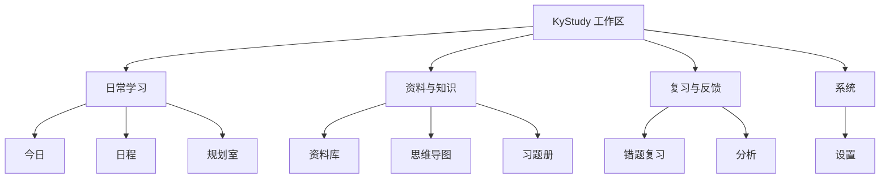

# KyStudy 页面信息架构与低保真线框

| 项目     | 内容                                               |
| -------- | -------------------------------------------------- |
| 文档版本 | 0.1                                                |
| 对应 PRD | 0.1                                                |
| 更新日期 | 2026-07-18                                         |
| 目标     | 确定桌面端导航、页面职责、关键状态与跨页面操作路径 |

## 1. 设计目标

KyStudy 的界面需要让用户优先关注“今天做什么”和“下一步做什么”，同时为资料、规划、知识结构和习题册提供稳定入口。

本阶段只确定信息层级与交互骨架，不确定最终视觉风格、品牌颜色和动效。

### 1.1 核心约束

- 默认入口是“今日”，不是数据大屏或 AI 聊天；
- AI 出现在规划、资料、导图、题目等具体上下文中；
- 正式数据与 AI 草案必须有明显状态差异；
- 原始 PDF、AI 解析结果和用户修订内容需要区分；
- 高频动作在一到两次点击内完成；
- Token、外发内容和后台解析状态始终可查看；
- 离线时保留完整导航，禁用依赖网络的具体操作即可。

## 2. 导航结构



### 2.1 左侧主导航

桌面端采用固定左侧导航，顺序按使用频率和学习流程排列：

1. 今日
2. 日程
3. 规划室
4. 资料库
5. 思维导图
6. 习题册
7. 错题复习
8. 分析
9. 设置

“今日”和“错题复习”可以显示待处理数量，但不使用连续打卡或红色焦虑提示。

### 2.2 全局顶栏

除设置页外，页面顶栏保持一致：

- 当前页面名称；
- 当前科目筛选，默认“全部科目”；
- 考试倒计时；
- 后台任务状态，例如正在解析 PDF；
- 全局搜索入口；
- “新建/导入”快捷入口。

全局搜索用于查找任务、资料、知识节点和题目，不直接搜索 PDF 全文片段；进入资料后再提供文内搜索。

## 3. 页面职责

### 3.1 今日

今日页是行动入口，只回答“今天要完成什么”。

主要区域：

1. 日期、考试倒计时和今日可用时间；
2. 今日学习任务，支持快速完成、记录实际时长、延期；
3. 今日错题配额，显示已完成数量和积压总量；
4. 后台任务与需要确认的 AI 草案；
5. 今日简短复盘入口。

不在今日页放复杂趋势图。趋势和跨周比较属于“分析”。

```text
┌──────────────────────────────────────────────────────────────┐
│ 今日 · 7 月 18 日       全部科目        距考试 159 天       │
├────────────────────────────────┬─────────────────────────────┤
│ 今日任务  2 / 4               │ 错题复习  2 / 5            │
│ □ 线性代数强化  90 分钟        │ 1. 图的最短路径   已完成    │
│ ■ 英语阅读一篇   45 分钟        │ 2. 极限计算       已完成    │
│ □ 408 错题复盘   30 分钟        │ 3. 二叉树遍历     待复习    │
│ □ 政治课程       60 分钟        │ 另有 12 道逾期              │
├────────────────────────────────┴─────────────────────────────┤
│ 待确认：AI 规划草案 1 份 · PDF 解析任务 1 个                 │
└──────────────────────────────────────────────────────────────┘
```

### 3.2 日程

日程页负责计划安排与计划/实际对比。

- 默认显示周视图，可切换日视图和月视图；
- 未安排任务、逾期任务和本周模板位于侧栏；
- 拖动任务更改计划时间时保留原计划记录；
- 点击任务打开统一任务详情抽屉；
- AI 推荐任务以虚线或草稿标记显示，确认前不计入正式负荷。

### 3.3 规划室

规划室负责把外部经验转化为个人规划。采用三栏结构：

```text
┌──────────────┬───────────────────────────┬────────────────────┐
│ 参考资料      │ 与 AI 完善规划             │ 规划草案 / 版本     │
│              │                           │                    │
│ ☑ 经验帖.pdf │ 用户问题与带引用的回答      │ 基础阶段            │
│ ☑ 时间表.png │                           │ 强化阶段            │
│ □ 课程说明   │ 引用：经验帖第 3 页         │ 冲刺阶段            │
│              │                           │                    │
│ + 添加资料   │ [输入问题……]               │ [对比] [确认写入]   │
└──────────────┴───────────────────────────┴────────────────────┘
```

- 左栏明确本轮会发送哪些资料；
- 中栏只用于当前规划会话，并展示引用页码；
- 右栏展示结构化规划、版本和差异；
- 写入日程前进入独立确认步骤，检查时间冲突和任务数量。

### 3.4 资料库

资料库负责文件生命周期，不负责直接生成正式学习数据。

- 资料列表支持按科目、类型、来源和解析状态筛选；
- 文件详情显示原文件、页数、文字层/OCR 状态、索引状态和关联对象；
- 用户可打开阅读、重新解析、加入规划会话或关联知识节点；
- 重复文件、解析失败、外部调用和存储占用需要明确提示；
- 删除时展示被哪些规划、导图或题目引用。

### 3.5 思维导图

思维导图采用“导图画布 + 节点详情”结构：

```text
┌──────────────────────────────────────────────┬───────────────┐
│                 导图画布                      │ 节点详情       │
│                                              │               │
│                   408                        │ 名称：图       │
│            ┌───────┼────────┐               │ 掌握：薄弱     │
│         数据结构  计组    操作系统            │ 资料：3        │
│            │                                 │ 题目：18       │
│          图 / 树                              │ 错题：5        │
│                                              │ [关联资料]     │
│ [+节点] [导入] [AI 建议] [撤销]              │ [查看错题]     │
└──────────────────────────────────────────────┴───────────────┘
```

- 节点选中后才显示详情和 AI 操作；
- AI 生成或修改节点时进入变更预览；
- 图片识别结果先显示为临时导图，不覆盖现有导图；
- 资料、题目和错题从节点详情进入，避免在画布上堆叠信息。

### 3.6 习题册

习题册包含“习题册列表”和“PDF 学习视图”。PDF 学习视图采用三栏：

```text
┌─────────────┬────────────────────────────────┬───────────────┐
│ 页面/目录    │ PDF 页面                        │ 当前题目       │
│             │                                │               │
│ 第 20 页 ●  │  ┌──────────────────────────┐  │ 区域：20-A    │
│ 第 21 页    │  │                          │  │ 知识点：图   │
│ 第 22 页    │  │   [框选出的题目区域]      │  │ 状态：做错   │
│             │  │                          │  │ 作答：2 次   │
│ 目录        │  └──────────────────────────┘  │               │
│ 第三章 图   │                                │ [记录作答]    │
│             │ [框选题目] [批注] [文内搜索]   │ [AI 分析]     │
└─────────────┴────────────────────────────────┴───────────────┘
```

- 左栏切换目录、缩略图和书签；
- 中栏保持 PDF 为主，不被 AI 面板挤压到不可阅读；
- 右栏只展示当前区域对应的题目和作答；
- AI 批量检测题目时，候选区域以待确认状态出现；
- 原始 PDF 与用户批注使用覆盖层分离保存。

### 3.7 错题复习

错题复习采用单题专注模式，减少同时展示的干扰。

1. 顶部显示当日进度、积压数量和入选原因；
2. 中间显示题目区域，可跳回原 PDF；
3. 用户选择是否显示答案或个人解析；
4. 完成后选择“掌握 / 不确定 / 未掌握 / 跳过”；
5. 反馈后显示下一次复习日期，再进入下一题。

批量管理、筛选和历史记录放在同一模块的“错题列表”子页面，不放进专注模式。

### 3.8 分析

分析页用于支持调整决策，初期只提供直接可行动的指标：

- 计划时长与实际时长；
- 各科任务完成率；
- 知识节点正确率与错题数量；
- 每日复习完成率和积压趋势；
- 反复出错题目；
- AI 调用与 Token 消耗趋势。

每张图需要能跳转到产生数据的任务、知识节点或错题列表。

### 3.9 设置

设置按领域分组：

- 工作区与考试；
- 科目与默认学习时间；
- 错题配额和间隔规则；
- AI 提供商、模型路由和 Token 预算；
- 本地文件、索引和缓存；
- 备份、恢复和诊断导出；
- 外观、快捷键和无障碍。

危险操作集中在数据设置底部，并在执行前展示确切影响范围。

## 4. 全局对象入口

同一个对象应使用一致的打开方式：

| 对象     | 默认打开方式         | 可跳转来源                   |
| -------- | -------------------- | ---------------------------- |
| 任务     | 右侧详情抽屉         | 今日、日程、规划、知识节点   |
| 资料     | 独立阅读页           | 资料库、规划引用、知识节点   |
| 知识节点 | 导图定位 + 详情栏    | 导图、题目、分析、任务       |
| 题目     | 题目详情并定位原 PDF | 习题册、错题、知识节点、分析 |
| 规划版本 | 规划室右栏           | 规划室、任务来源记录         |
| AI 用量  | 调用详情抽屉         | 对话、后台任务、设置、分析   |

## 5. 关键状态规范

### 5.1 AI 内容状态

| 状态     | 含义                   | 可执行操作               |
| -------- | ---------------------- | ------------------------ |
| 生成中   | 请求正在处理           | 取消、离开页面           |
| 草稿     | 已生成但未进入正式数据 | 编辑、接受、拒绝         |
| 部分接受 | 一部分变更已写入       | 查看差异、继续确认       |
| 已确认   | 已成为正式数据         | 后续按普通对象编辑       |
| 失败     | 请求或解析失败         | 查看原因、重试、手动处理 |

### 5.2 文件处理状态

`已导入 → 读取文字层 → OCR（可选）→ 建立索引 → 可检索`

各阶段独立记录。OCR 或索引失败时，文件仍处于“可阅读”状态。

### 5.3 题目状态

`未开始 → 已作答 → 正确 / 错误 → 待复习 → 复习中 → 已掌握`

“已掌握”不是永久终态；抽查错误后可以重新回到待复习。

## 6. 跨页面操作路径

### 6.1 规划到执行

`资料库 → 规划室选择资料 → AI 规划草案 → 用户确认 → 日程任务 → 今日执行 → 分析反馈 → 新规划版本`

### 6.2 PDF 到错题复习

`习题册 PDF → 框选题目 → 记录错误作答 → 关联知识节点 → 进入复习候选池 → 今日错题队列 → 反馈掌握状态`

### 6.3 导图到学习证据

`思维导图节点 → 关联资料 / 任务 / 题目 → 汇总正确率和错题 → 分析薄弱程度 → 调整任务或复习优先级`

## 7. 响应式与窗口策略

- 首要设计宽度为普通笔记本桌面窗口；
- 窗口较窄时，三栏页面依次收起右侧详情栏和左侧辅助栏；
- PDF 阅读器必须保留足够阅读宽度，详情改为抽屉；
- 思维导图画布保持为主区域，节点详情改为可收起面板；
- 手机端暂不作为首个正式目标，但避免依赖鼠标悬停完成核心操作。

## 8. 键盘与快捷操作

后续原型需要验证以下统一操作：

- `Ctrl/Cmd + K`：全局搜索；
- `Ctrl/Cmd + N`：根据当前页面新建对象；
- `Ctrl/Cmd + Z`：导图和文本编辑撤销；
- `Space`：PDF 阅读器拖动画布，仅在阅读器聚焦时生效；
- 错题复习使用可配置按键完成四种反馈，但必须同时保留可见按钮。

具体快捷键需检查与操作系统、浏览器内核和输入法的冲突。

## 9. 原型验收问题

低保真可用性验证至少回答以下问题：

1. 用户能否在 10 秒内找到今天的任务和错题入口？
2. 用户是否能理解规划草案尚未写入日程？
3. 用户是否清楚本次 AI 会使用并发送哪些资料？
4. 用户能否从一道错题回到 PDF 原页和知识节点？
5. 用户能否理解“每日配额”和“总积压量”的区别？
6. 三栏页面在普通笔记本窗口中是否仍能阅读 PDF 和编辑规划？
7. AI、OCR 或索引失败后，用户是否仍能完成手动流程？

## 10. 下一步

1. 基于本文档确定统一术语和页面路由；
2. 对“今日、规划室、思维导图、PDF 习题册、错题复习”制作可点击原型；
3. 用一个完整模拟场景走查跨页面流程；
4. 根据走查结果更新 PRD 的字段、状态和验收条件；
5. 再进入数据库模型和技术验证设计。
