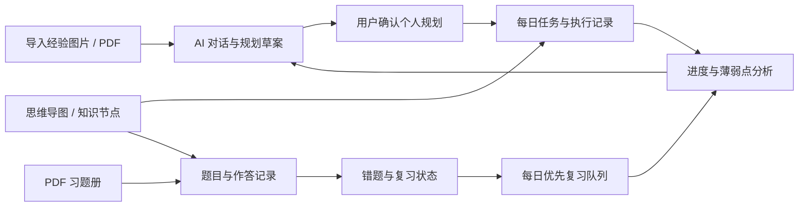
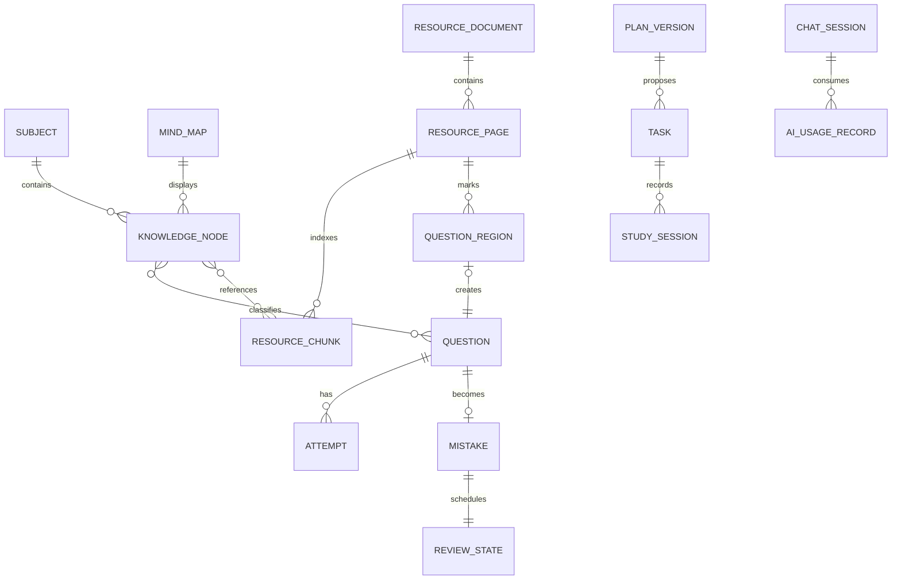

# KyStudy 产品需求文档（PRD）

| 项目     | 内容                                   |
| -------- | -------------------------------------- |
| 文档版本 | 0.1                                    |
| 状态     | 产品定义草案                           |
| 更新日期 | 2026-07-18                             |
| 当前阶段 | M1-M3 已完成，正在实现 M4 思维导图闭环 |
| 首要平台 | Windows 桌面端优先，保留跨平台能力     |

## 1. 产品定义

KyStudy 是一个面向中国考研人群的本地优先学习软件。它帮助用户导入外部备考资料，借助 AI 形成个人规划，通过日程记录实际执行情况，使用思维导图组织知识，并从 PDF 习题册中管理题目和错题，最终形成持续复习与反馈闭环。

KyStudy 不是替用户作决定的“自动学习代理”。用户始终拥有计划、知识结构和学习数据的最终控制权，AI 负责检索、提取、分析和提供候选方案。

### 1.1 产品愿景

让备考者在一个本地工作区中回答以下问题：

- 我参考了哪些备考经验，它们是否适合我？
- 我今天应该完成什么，实际完成了什么？
- 一门科目的知识结构是什么，我薄弱在哪里？
- 练习册做到了哪里，哪些题目曾经出错？
- 今天最应该复习哪几道错题？
- AI 本次使用了哪些资料，消耗了多少 Token？

### 1.2 目标用户

首要用户是需要长期复习多门科目、会使用电子资料或扫描资料、愿意自己维护计划并希望得到 AI 辅助的考研学生。产品先针对单人在个人电脑上的长期使用，再考虑多设备同步和协作。

### 1.3 产品目标

1. 把外部经验资料转换为可核对、可修改的个人学习规划；
2. 让日程计划与实际执行记录保持联系；
3. 用思维导图建立最初的知识结构；
4. 让 PDF 习题册本身成为可交互、可追踪的题目来源；
5. 自动生成数量可控、优先级可解释的每日错题队列；
6. 在不依赖云端账号的前提下保存、备份和恢复个人数据；
7. 从产品层面限制 AI Token 消耗并向用户解释成本。

### 1.4 非目标

- 不内置或公开分发受版权保护的完整题库、课程和习题册；
- 不让 AI 未经确认地修改正式计划、思维导图或学习记录；
- 不把连续打卡、排行榜和社交竞争作为主要激励方式；
- 不要求用户注册云端账号才能使用非 AI 功能；
- 不在早期建设微服务、复杂权限系统或在线协作平台。

## 2. 产品原则

### 2.1 本地优先

数据库、PDF、图片、题目区域、笔记和索引默认保存在本地。没有网络或 AI API 时，资料阅读、日程、思维导图、题目管理和错题复习仍应正常工作。

### 2.2 AI 结果可追溯

基于资料生成的规划和回答，应尽可能显示来源文件、页码和引用片段。无法确定来源的内容需要明确标记为模型推断。

### 2.3 用户确认后写入

AI 生成的计划、任务、知识节点、题目边界和标签首先进入草稿状态。只有用户确认后，它们才成为正式数据。

### 2.4 低录入负担

能够从 PDF 页码、页面区域和已有知识节点推导出的信息，不要求用户重复填写。AI 不可用时，也必须提供快速手动流程。

### 2.5 成本可见、可控

任何可能大量消耗 Token 的操作都应显示范围和预估；系统需要保存实际用量，并允许设置单次、每日和每月预算。

## 3. 核心闭环

## 4. 功能范围与优先级

优先级描述的是产品核心程度，不代表必须一次完成。

| 优先级 | 范围                                                                                                 |
| ------ | ---------------------------------------------------------------------------------------------------- |
| P0     | 本地工作区、日程、资料导入、基础 AI 对话、思维导图编辑、PDF 区域标题、错题队列、Token 记录、备份恢复 |
| P1     | OCR、结构化导图导入、AI 规划版本、自动目录/题目识别、统计分析、模型路由、增量索引                    |
| P2     | 本地模型、多设备加密同步、插件系统、公开模板、移动端和协作能力                                       |

## 5. 主要用户流程

### 5.1 首次建立工作区

1. 用户创建本地工作区；
2. 设置考试名称、考试日期、科目、当前阶段和每日可用时段；
3. 设置默认每日错题数量和 AI Token 预算；
4. 选择是否启用外部 AI，并在系统安全存储中配置密钥；
5. 系统创建空白日程、资料库和知识空间。

用户可以跳过除本地工作区以外的所有配置，之后再补充。

### 5.2 从经验资料形成个人规划

1. 用户导入一张或多张图片、一个或多个 PDF；
2. 系统在本地提取文本、页码、标题和文件哈希；
3. 用户选择参与本次对话的资料，并提出需求；
4. 系统检索相关片段，显示预计 Token 和将发送的上下文范围；
5. AI 返回带来源引用的分析或规划草案；
6. 用户继续对话，修改阶段、科目比例和时间安排；
7. 用户保存一个规划版本，并选择其中的任务写入日程。

### 5.3 建立知识思维导图

用户可以从空白导图开始，也可以导入结构化文件、图片或 PDF。

- 结构化文件通过格式适配器转换为内部节点模型；
- 图片/PDF 先生成 AI 识别草案，用户校对后保存；
- 用户可以拖拽、增删、合并、拆分和重排节点；
- 节点可关联资料片段、任务、题目、错题和笔记；
- AI 修改只能作用于选中的节点或子树，并以变更预览呈现。

### 5.4 导入和使用 PDF 习题册

1. 用户导入自己有权使用的 PDF；
2. 系统复制文件到应用数据目录并计算哈希；
3. 系统读取文字层；没有文字层时提示用户是否执行 OCR；
4. 用户在阅读器中翻页、记录进度、添加书签或批注；
5. 用户框选题目区域，或确认 AI 检测出的题目区域；
6. 系统用 PDF、页码和区域坐标创建题目，不修改原始文件；
7. 用户记录作答结果；做错或主动标记后，题目进入错题流程。

### 5.5 每日错题复习

1. 系统在当天首次打开时生成复习队列；
2. 先选择逾期、反复出错和用户标记的重要题目；
3. 按用户设置的每日数量补足队列；
4. 若到期题目不足，可按设置选择高优先级未到期题，并标记为“提前复习”；
5. 用户对每道题选择“掌握 / 不确定 / 未掌握”，也可跳过；
6. 系统更新下一次复习时间和优先级；
7. 未完成题目保留到后续队列，积压量始终可见。

## 6. 功能需求

### 6.1 本地工作区与设置

| 编号      | 需求                                         | 优先级 |
| --------- | -------------------------------------------- | ------ |
| LOCAL-001 | 用户无需注册即可创建和打开本地工作区         | P0     |
| LOCAL-002 | 工作区保存考试日期、科目、可用时间和学习偏好 | P0     |
| LOCAL-003 | 非 AI 功能在离线状态下可用                   | P0     |
| LOCAL-004 | 密钥不得以明文写入仓库、日志或普通导出文件   | P0     |
| LOCAL-005 | 用户可查看数据目录位置和存储占用             | P1     |

### 6.2 日程与执行记录

| 编号     | 需求                                                   | 优先级 |
| -------- | ------------------------------------------------------ | ------ |
| TASK-001 | 创建任务时可设置日期、科目、知识节点、预计时长和优先级 | P0     |
| TASK-002 | 任务支持完成、延期、拆分、取消和恢复                   | P0     |
| TASK-003 | 延期不得覆盖原计划日期，需要保留变化历史               | P0     |
| TASK-004 | 用户可记录实际学习时长、完成程度和简短复盘             | P0     |
| TASK-005 | AI 创建的任务必须先进入待确认列表                      | P0     |
| TASK-006 | 今日页同时显示学习任务和错题复习任务                   | P0     |

### 6.3 资料库与解析

| 编号    | 需求                                                       | 优先级 |
| ------- | ---------------------------------------------------------- | ------ |
| DOC-001 | 支持导入 PDF、PNG、JPEG 和 WebP 等常用资料                 | P0     |
| DOC-002 | 文件按哈希识别重复内容，避免无提示地重复索引               | P0     |
| DOC-003 | 文本型 PDF 优先读取原有文字层                              | P0     |
| DOC-004 | 扫描件和图片可由用户按需触发 OCR                           | P1     |
| DOC-005 | 解析失败不影响原文件阅读，并提供手动标题和标签             | P0     |
| DOC-006 | 资料可关联科目、知识节点、规划版本和对话                   | P0     |
| DOC-007 | 删除资料前说明其关联对象，支持仅移除索引或同时移除本地副本 | P1     |

### 6.4 AI 规划对话

| 编号     | 需求                                                 | 优先级 |
| -------- | ---------------------------------------------------- | ------ |
| PLAN-001 | 用户可以明确选择本轮对话使用的文件、页码或知识节点   | P0     |
| PLAN-002 | 系统基于检索结果构建上下文，不默认发送整份 PDF       | P0     |
| PLAN-003 | 回答中的资料性结论应关联来源文件和页码               | P0     |
| PLAN-004 | 用户可将对话结果保存为规划草案                       | P0     |
| PLAN-005 | 规划支持版本、变更说明、对比和回退                   | P1     |
| PLAN-006 | 从规划生成日程时提供任务预览和冲突提示               | P1     |
| PLAN-007 | API 失败或预算不足时保留输入和草稿，不产生半完成写入 | P0     |

### 6.5 思维导图

| 编号    | 需求                                                                          | 优先级 |
| ------- | ----------------------------------------------------------------------------- | ------ |
| MAP-001 | 支持创建、重命名、复制和删除思维导图                                          | P0     |
| MAP-002 | 支持节点增删改、拖拽排序、展开折叠和撤销重做                                  | P0     |
| MAP-003 | 节点可以关联任务、资料片段、题目、错题和笔记                                  | P0     |
| MAP-004 | 内部保存格式必须独立于具体导图库                                              | P0     |
| MAP-005 | 通过适配器导入结构化导图或大纲，候选格式包括 XMind、FreeMind 和 Markdown 大纲 | P1     |
| MAP-006 | 图片/PDF 可生成待确认的导图草案                                               | P1     |
| MAP-007 | AI 变更以节点级差异展示，可逐项接受或拒绝                                     | P1     |
| MAP-008 | 支持导出内部备份格式，并至少提供一种通用大纲格式                              | P1     |

### 6.6 PDF 习题册与题目

| 编号     | 需求                                              | 优先级 |
| -------- | ------------------------------------------------- | ------ |
| BOOK-001 | 支持在应用内阅读本地 PDF、跳转页码和记录阅读进度  | P0     |
| BOOK-002 | 支持在页面上框选区域并创建题目                    | P0     |
| BOOK-003 | 题目保留来源 PDF、页码和区域坐标                  | P0     |
| BOOK-004 | PDF 更新或移动时能识别文件变化并提示重新关联      | P1     |
| BOOK-005 | AI 可以检测目录、章节和题目区域，结果需要人工确认 | P1     |
| BOOK-006 | AI 可以建议题型、难度和知识节点                   | P1     |
| BOOK-007 | 用户可记录同一道题的多次作答，而不是复制多道错题  | P0     |
| BOOK-008 | 题目支持答案区域、个人解析、批注和附件            | P1     |

### 6.7 错题与复习队列

| 编号       | 需求                                                             | 优先级 |
| ---------- | ---------------------------------------------------------------- | ------ |
| REVIEW-001 | 做错或主动标记的题目可进入错题状态                               | P0     |
| REVIEW-002 | 用户可设置默认每日数量，也可临时调整当天数量                     | P0     |
| REVIEW-003 | 队列优先级考虑逾期天数、错误次数、掌握状态、重要度和知识薄弱度   | P0     |
| REVIEW-004 | 每道推荐题显示入选原因                                           | P0     |
| REVIEW-005 | 复习结果支持“掌握 / 不确定 / 未掌握 / 跳过”                      | P0     |
| REVIEW-006 | 配额不会隐藏逾期与积压总量                                       | P0     |
| REVIEW-007 | 当日队列生成后保持稳定，新错题默认进入下一次队列，用户可手动插入 | P1     |
| REVIEW-008 | 用户可以修改或关闭默认间隔规则                                   | P1     |

### 6.8 Token 与模型管理

| 编号   | 需求                                              | 优先级 |
| ------ | ------------------------------------------------- | ------ |
| AI-001 | 支持可替换的模型提供商适配层                      | P0     |
| AI-002 | 调用前展示预计输入范围、Token 和操作类型          | P0     |
| AI-003 | 记录模型、提供商、输入/输出 Token、缓存命中和时间 | P0     |
| AI-004 | 支持单次、每日和每月预算与超限策略                | P0     |
| AI-005 | 文档和对话使用分层摘要，避免重复发送完整历史      | P1     |
| AI-006 | 相同文件片段和相同任务允许复用缓存结果            | P1     |
| AI-007 | 支持按任务类型配置模型，例如提取模型和规划模型    | P1     |
| AI-008 | 用户可以查看、清理和重新生成本地索引及 AI 缓存    | P1     |
| AI-009 | 外部调用前明确显示哪些文本或图片将离开本地设备    | P0     |

### 6.9 备份与导出

| 编号     | 需求                                           | 优先级 |
| -------- | ---------------------------------------------- | ------ |
| DATA-001 | 用户可创建包含数据库、附件和清单的完整本地备份 | P0     |
| DATA-002 | 恢复前验证备份版本和文件完整性                 | P0     |
| DATA-003 | 提供不包含原始版权资料和密钥的诊断导出         | P1     |
| DATA-004 | 数据结构升级必须经过迁移并支持迁移前备份       | P0     |
| DATA-005 | 后续提供可选的加密备份                         | P2     |

## 7. 页面与信息架构

| 页面     | 主要职责                                                    |
| -------- | ----------------------------------------------------------- |
| 今日     | 今日任务、错题配额、积压提示、快速记录和今日完成情况        |
| 日程     | 日历、任务编辑、延期记录、计划与实际对比                    |
| 规划室   | 经验资料选择、AI 对话、规划草案、版本对比和写入日程         |
| 资料库   | 图片/PDF 导入、分类、解析状态、搜索和存储管理               |
| 思维导图 | 知识结构编辑、导入、AI 草案和关联对象查看                   |
| 习题册   | PDF 阅读、题目区域、阅读进度、题目状态和作答入口            |
| 错题复习 | 今日队列、题目作答、结果反馈、积压和历史复习                |
| 分析     | 科目进度、计划完成率、知识点正确率、错题变化和复习完成率    |
| 设置     | 工作区、考试信息、复习规则、AI 提供商、Token 预算、备份恢复 |

建议桌面端使用固定侧边导航。“今日”是默认入口；AI 对话属于具体业务场景，不单独做一个无上下文的万能聊天页。

## 8. 核心数据关系

### 8.1 核心对象说明

| 对象                        | 说明                                                     |
| --------------------------- | -------------------------------------------------------- |
| UserProfile                 | 考试日期、可用时间、科目配置和用户偏好，不依赖长对话记忆 |
| ResourceDocument            | 本地图片/PDF 的元数据、哈希、解析状态和存储位置          |
| ResourcePage / Chunk        | 页码、文字层、OCR 结果和可检索片段                       |
| PlanVersion                 | 一次可回溯的个人规划快照及其来源                         |
| Task / StudySession         | 计划做什么与实际做了什么分别记录                         |
| MindMap / KnowledgeNode     | 可视化知识结构及跨模块关联点                             |
| QuestionRegion              | PDF 页面上的矩形或多边形区域，负责保持原始出处           |
| Question / Attempt          | 题目本身与多次作答记录分离                               |
| Mistake / ReviewState       | 错题属性与复习调度状态分离                               |
| ChatSession / AIUsageRecord | 对话内容、使用的上下文和 Token 消耗记录                  |

## 9. 错题优先级与间隔规则

### 9.1 候选池

以下题目可以进入候选池：

- 下一次复习日期不晚于今天；
- 从未完成首次复习的新错题；
- 用户手动固定到今天的题目；
- 当到期题不足且用户启用了“提前补足”时，高优先级的未到期题目。

### 9.2 优先级因素

初始版本不强制固定数学公式，但排序必须稳定、可测试、可解释。建议按以下因素组成优先级分数：

1. 手动固定到今天；
2. 逾期天数；
3. 连续未掌握次数；
4. 历史错误次数；
5. 用户重要度；
6. 关联知识节点的薄弱程度；
7. 距离上次作答的时间。

界面应以“逾期 4 天”“连续 2 次未掌握”等文字解释入选原因，而不是只显示一个不可理解的分数。

### 9.3 初始间隔建议

| 结果     | 下一次复习建议                   |
| -------- | -------------------------------- |
| 未掌握   | 1 天后                           |
| 不确定   | 3 天后                           |
| 首次掌握 | 7 天后                           |
| 连续掌握 | 14、30、60 天逐步延长            |
| 跳过     | 不改变掌握状态，短期重新进入队列 |

间隔规则需要可配置，并保留调度版本，方便以后在不破坏旧记录的情况下引入更成熟的记忆模型。

## 10. AI 上下文与 Token 策略

### 10.1 上下文包

每类任务只构建所需的最小上下文：

| AI 任务      | 默认上下文                                                       |
| ------------ | ---------------------------------------------------------------- |
| 个性化规划   | 结构化用户档案、当前规划摘要、实际进度摘要、检索到的经验资料片段 |
| PDF 题目分析 | 选中题目区域、相邻文字、相关答案区域、已关联知识节点             |
| 思维导图生成 | 用户选中的资料片段或图片，不自动携带整个资料库                   |
| 导图节点修改 | 当前节点、必要的父子节点和用户明确选择的资料                     |
| 错题分析     | 当前题目、有限次数的作答摘要、错误原因和相关知识节点             |

### 10.2 本地处理优先级

以下工作默认不调用大模型：

- 文件哈希、重复检测、页码和书签读取；
- PDF 文字层提取、全文搜索和区域坐标保存；
- 日程冲突的确定性检查；
- 错题优先级排序和间隔日期计算；
- Token 用量累计、预算判断和缓存查找。

OCR、嵌入和摘要是否使用本地模型，由设备能力和用户设置决定。

### 10.3 用量记录

每次调用至少保存：用途、模型、提供商、关联对象、输入 Token、输出 Token、缓存 Token、估算费用、开始时间、耗时、结果状态。日志保存摘要和标识，不重复保存密钥。

## 11. 非功能需求

| 类别     | 要求                                                   |
| -------- | ------------------------------------------------------ |
| 离线能力 | 除外部 AI 调用外，核心学习流程离线可用                 |
| 数据安全 | 密钥使用系统安全存储；日志脱敏；外发内容可预览         |
| 可靠性   | 导入、OCR 和 AI 分析使用可恢复任务；失败不损坏原文件   |
| 性能     | 大型 PDF 采用分页和后台索引，不能因整本加载阻塞界面    |
| 可迁移性 | 数据库有版本和迁移机制；附件通过稳定内部 ID 引用       |
| 可测试性 | 复习排序、间隔计算、预算判断和数据迁移必须有确定性测试 |
| 可访问性 | 核心操作支持键盘；颜色不作为状态的唯一表达方式         |
| 可观测性 | 提供本地任务状态和脱敏诊断信息，不默认上传遥测         |

## 12. 验收场景

### 12.1 规划资料

- 导入文字型规划 PDF 后，用户可以搜索其内容并向 AI 提问；
- AI 回答至少能定位到来源文件和页码；
- 用户未确认时，规划草案不会出现在正式日程中；
- 相同 PDF 再次导入时，系统提示重复而不是重新产生全部索引费用。

### 12.2 思维导图

- 用户可以创建三层知识结构，关闭并重启应用后结构保持不变；
- 用户可以把一张导图图片转换为草案，并逐项接受或修改节点；
- AI 修改某个子树时，不会改动未选择的其他节点。

### 12.3 PDF 习题册

- 用户可以在 PDF 第 20 页框选一道题并记录一次错误作答；
- 再次打开该题时，可以跳转到原页并显示原区域；
- 同一道题第二次作答会新增 Attempt，而不是复制 Question；
- AI 或 OCR 失败时，用户仍能用截图和手动标签完成错题录入。

### 12.4 每日复习

- 用户设置每日 5 道后，系统按优先级生成不超过 5 道的正式队列；
- 当到期题不足且启用提前补足时，系统补足并标明哪些题是提前复习；
- 当逾期题超过 5 道时，界面仍显示完整积压量；
- 用户完成反馈后，下一次复习日期立即更新并可查看原因。

### 12.5 Token 控制

- 调用 AI 前可以看到将发送的资料范围和 Token 预估；
- 达到用户设置的硬性预算后，系统不会继续自动调用；
- 用户可以按日期、模型和功能查看用量；
- 未发生变化的文件不会无提示地重复进行昂贵分析。

## 13. 迭代顺序

不设置必须赶工的时间节点，按依赖关系推进：

1. **M0：产品定义**——确认 PRD、术语、页面结构、数据模型与技术验证清单；
2. **M1：本地基础**——桌面壳、工作区、数据库、文件存储、迁移、备份恢复；
3. **M2：日程闭环**——任务、今日页、执行记录和基础统计；
4. **M3：资料与规划**——PDF/图片导入、解析、检索、AI 对话、引用和 Token 记录；
5. **M4：知识结构**——思维导图编辑、导入适配器、节点关联和 AI 草案；
6. **M5：PDF 习题册**——阅读器、区域标题、作答记录和 AI 辅助识别；
7. **M6：错题复习**——优先级、每日队列、间隔规则和积压分析；
8. **M7：整合优化**——规划反馈、模型路由、缓存、统计、性能与跨平台打包。

每个里程碑都应产生可独立使用的版本，并在进入下一个里程碑前完成数据备份、核心测试和使用复盘。

## 14. 风险与应对

| 风险                                               | 应对方向                                             |
| -------------------------------------------------- | ---------------------------------------------------- |
| PDF 类型复杂，扫描、加密、双栏和公式识别效果不一致 | 原文件始终可读；OCR 按需；保留手动框选和纠正流程     |
| AI 识别的规划、题目或导图节点不准确                | 来源引用、草稿状态、差异预览和用户确认               |
| 长文档与长对话导致 Token 快速增长                  | 本地索引、按需检索、分层摘要、缓存和硬预算           |
| 思维导图格式差异较大                               | 内部统一节点模型；外部格式通过独立适配器导入导出     |
| 大型 PDF 影响桌面端性能                            | 分页渲染、后台任务、任务取消和性能技术验证           |
| 资料存在版权或隐私风险                             | 只处理用户导入的本地资料；默认不分享；外发前提示范围 |
| 本地数据损坏或应用升级失败                         | 数据迁移、升级前备份、文件完整性检查和恢复工具       |

## 15. 待验证决策

以下问题不阻塞产品定义，但需要在对应里程碑开始前通过技术原型或用户选择确认：

1. 思维导图首批正式支持哪些导入格式，以及 XMind 不同文件版本的兼容范围；
2. OCR 默认使用本地引擎、外部服务还是两者可选；
3. PDF 题目区域使用矩形、多区域组合还是同时支持自由裁剪；
4. AI 密钥使用的系统安全存储方案及各平台兼容性；
5. 首批支持的 AI 提供商和统一用量字段；
6. 完整备份是否在首版提供加密；
7. 错题间隔规则采用自定义规则还是引入现有记忆算法；
8. 开源许可证及第三方 PDF、OCR、思维导图库的许可证兼容性。

## 16. 下一步产物

在开始业务实现前，按顺序补充：

- [x] 页面信息架构和低保真线框图；
- [x] 技术验证清单，包括 Tauri PDF 阅读性能、SQLite 附件关系、OCR 和思维导图导入；
- [x] 数据模型与数据库设计文档；
- [x] AI 上下文、模型适配器和 Token 预算的架构级设计；
- [ ] 根据技术 Spike 细化 AI Provider 与 Token 估算协议；
- [x] M1 的工程结构与验收清单。
