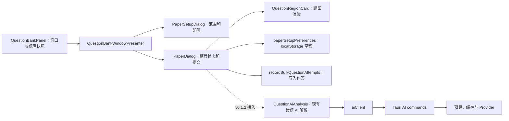

# KyStudy v0.1.2 开发方案

> 状态：待实施
> 基线日期：2026-08-16
> 目标平台：Windows 10/11 x64
> 核心主题：组卷双浏览模式、逐题键盘导航、逐题 AI 解析与组卷可靠性

## 1. 文档结论

v0.1.2 应继续围绕现有“题库 → 组卷 → 作答登记 → 错题复习”闭环做小而完整的增强，不新增独立业务模块。本版必须交付以下结果：

1. 保留现有连续滚动浏览，并新增一次只展示一道题的单题浏览模式；
2. 单题模式提供可见的“上一题/下一题”按钮，以及 `ArrowLeft`/`ArrowRight` 键盘导航；
3. 每道组卷题目都可调用现有 AI 题目解析，继续遵守预览、明确确认、仅发送题目区域和 Token 预算规则；
4. 草稿能够可靠保存浏览模式、当前位置、题型筛选和作答标记，恢复时回到有效题目；
5. 修正当前组卷页“自动暂存”文案与实际行为不一致、固定底栏遮挡题卡、刷新提示不可执行等问题；
6. 将正式版工作区默认放在安装路径旁的数据目录，安装时初始化目录并支持旧 AppData 工作区安全迁移；
7. 完成从 v0.1.1 升级到 v0.1.2 的发布验收，但自动化不得代替用户执行 Release EXE 桌面验收。

当前代码已经把应用、Cargo、Tauri 和便携包脚本的版本号调整为 `0.1.2`，README 也标记为 v0.1.2 preparing；远端已有 `v0.1.1`，尚无 `v0.1.2` Tag。版本号准备不等于功能或发布门禁已经完成。

## 2. 范围与非目标

### 2.1 P0：v0.1.2 必须完成

| 能力         | 交付边界                                                                      |
| ------------ | ----------------------------------------------------------------------------- |
| 双浏览模式   | 连续浏览与单题浏览可随时切换，切换不丢作答状态                                |
| 单题导航     | 只挂载当前题；按钮和左右方向键均可切题；首尾不循环                            |
| 位置与进度   | 显示筛选内位置、全卷题号、已作答数和未作答数                                  |
| 逐题 AI 解析 | 当前题可预览并确认 AI 请求，结果与错误只归属当前题                            |
| 草稿可靠性   | 真实自动暂存，恢复浏览模式、筛选、当前题和作答结果                            |
| 交互修复     | 固定底栏不遮挡内容；刷新行为与提示一致；成功消息使用温和播报                  |
| 数据存储位置 | 安装时初始化安装路径旁的可写数据目录；迁移旧工作区且不默认回落到 C 盘 AppData |
| 测试与发布   | 补齐纯模型测试、目标检查、全量门禁和桌面验收清单                              |

### 2.2 P1：建议同版完成

| 能力           | 价值                                         | 约束                                        |
| -------------- | -------------------------------------------- | ------------------------------------------- |
| 题号总览       | 快速跳到任意题或下一道未作答题               | 可用轻量弹层或折叠区，不新建独立窗口        |
| 连续模式懒加载 | 避免一打开 20–50 道题就并发渲染所有 PDF 区域 | `content-visibility` 不能替代图片生成懒加载 |
| “其他题型”筛选 | 修复已有计数但没有独立筛选入口的不一致       | 不改变本版组卷配额算法                      |
| AI 结果可读性  | 正确换行、长内容滚动、复制解析               | 不把 AI 结果自动写成标准答案                |
| 题图失败恢复   | 单题图片加载失败时提供重试，并保留导航能力   | 不因一题失败阻断整卷                        |

P1 不是 v0.1.2 的默认发布阻塞项。若 P1 未完成，必须在
`V0_1_2_RELEASE_NOTES.md` 的“已知限制”中逐项列出，并在人工验收记录中标记为延期；
不得用“后续优化”等模糊描述隐藏未交付行为。只有在用户明确把某个 P1 提升为发布要求时，
才将其转为 P0 并补充对应的测试和验收场景。

### 2.3 P2：后续版本评估

- 把组卷草稿从 WebView `localStorage` 迁移到 SQLite 并纳入备份；
- 自动计时、每题笔记、用户答案录入和客观题自动判分；
- 将 AI 结果人工确认后写入题目 `analysisMarkdown`；
- 跨设备同步、多人共享、在线题库和批量 AI 解析；
- 根据单题耗时、连续错误和复习结果动态调整组卷权重。

### 2.4 明确不做

- 不移除连续浏览模式；
- 不默认上传题目，不绕过 AI 调用确认；
- 不自动把 AI 输出认定为标准答案，也不让 AI 输出改变错题推荐间隔；
- 不在本版引入新的 AI Provider、模型协议或数据库迁移；
- 不在没有用户确认和备份校验的情况下删除旧 AppData 工作区；
- 不为左右翻题加入循环跳转，避免在首尾题误判当前位置；
- 不在实现过程中启动 Release EXE 或代替用户声明桌面验收通过。

## 3. 当前实现与问题分析

### 3.1 当前调用关系



直接相关实现：

- `src/features/workbook/QuestionBankPaperDialogs.tsx`：组卷设置、练习卷、题型筛选、作答与提交；
- `src/features/workbook/paperSetupPreferences.ts`：配额和练习卷草稿的 WebView 本地存储；
- `src/features/workbook/QuestionBankWindowPresenter.tsx` 与 `questionBankWindowModel.ts`：窗口来源、返回路径和练习卷状态；
- `src/features/review/QuestionRegionCard.tsx`：从 PDF 区域生成题图并提供放大查看；
- `src/features/review/QuestionAiAnalysis.tsx` 与 `QuestionAiAnalysisModel.ts`：AI 预览、确认、执行、缓存提示和输入指纹；
- `src/app/app.css`：练习卷、弹窗、固定底栏和响应式样式；
- `src/shared/tauri/aiClient.ts` 与 `src-tauri/src/application/ai.rs`：现有 AI 契约、预算和缓存。

### 3.2 已具备的基础

- 练习卷已经保存原始题目顺序、按题型筛选、三种作答结果和已写入结果；
- 草稿已经能保存题目 ID、生成规则、当前作答和已写入作答；
- 编辑题目或校正区域后会回到同一练习卷组件，父级状态不会被整体清空；
- AI 解析已经实现“截取题目区域 → 调用预览 → 用户确认 → 执行 → 本地缓存”的完整链路；
- 后端请求指纹包含提示词、模型和图片内容，重复请求可以命中本地缓存；
- 弹窗已有焦点恢复、关闭确认、滚动锁定和 `prefers-reduced-motion` 基础支持；
- 长列表题卡已有 `content-visibility: auto`，可减少离屏布局和绘制成本。

### 3.3 当前关键缺口

#### A. 练习卷只能全量纵向渲染

`PaperDialog` 对 `visiblePaperQuestions` 直接执行 `map`，没有当前题状态或前后导航。题型筛选只改变整组列表，不能定位某一题。

#### B. `content-visibility` 没有阻止题图生成

每个 `QuestionRegionCard` 挂载后都会立即执行 `renderRegions`。因此连续模式即使跳过离屏布局，仍可能同时打开 PDF、裁剪多个区域并创建多个 Blob URL。单题模式必须只挂载当前题；连续模式的图片生成懒加载另列为 P1。

#### C. “自动暂存”与实际行为不一致

当前选择“做对/不全对/做错”只更新 React state，并不会立即写入草稿。草稿只在显式暂存、保存记录、刷新生成或初次生成等路径写入。界面显示“本卷已自动暂存”会给用户错误的数据安全预期。

#### D. 当前刷新提示无法按提示完成

只要 `results` 非空就阻止刷新；执行“保存记录”后 `results` 仍然非空，因此“请先保存结果后再刷新组卷”没有可达的后续状态。v0.1.2 必须重新定义刷新语义和提示。

#### E. AI 组件不能直接接收组卷题目类型

`QuestionAiAnalysis` 接收完整 `Question`，而组卷使用 `IndexedQuestion`。后者没有难度、分类来源、创建时间和更新时间等字段。AI 解析实际只需要题目 ID、文档、标题、题型和区域，适合抽取最小共享输入契约，而不是伪造缺失字段。

#### F. 固定底栏遮挡连续模式题卡

截图中“保存记录/提交组卷”固定栏覆盖了下一题内容。连续模式需要明确的底部滚动留白和 `scroll-padding-bottom`；单题模式应把题目导航与提交操作分层，避免两个固定操作区互相遮挡。

#### G. 筛选语义和无障碍语义不完整

当前按钮使用 `role="tab"`，但容器不是完整的 tablist 键盘模型。它们本质上是题型筛选按钮，更适合使用普通按钮加 `aria-pressed`。成功和错误共用 `role="alert"` 也会造成过度播报，应拆分为 `role="status"` 与 `role="alert"`。

#### H. 组卷交互缺少直接测试

目前有组卷算法、草稿和窗口模型的纯函数测试，但没有覆盖当前题钳制、筛选后位置恢复、首尾导航、快捷键守卫、草稿位置迁移等新行为。v0.1.2 应先把这些规则提取成纯模型，再用 Vitest 覆盖。

#### I. 通用关闭确认与草稿语义冲突

当前练习卷把“尚未写入题库的作答”作为 `EditorDialog.dirty`，通用确认文案会提示离开后内容不保留。真实自动暂存完成后，这些作答应该仍可继续，通用“放弃修改”文案将不再准确。v0.1.2 必须让 dirty 表示“尚未成功写入草稿”，而不是“尚未写成 Attempt”。

#### J. 工作区默认落在 AppData，无法控制磁盘占用

当前正式版通过 Tauri `app_data_dir()` 使用 `%APPDATA%\\io.github.kystudy.desktop`，数据库和导入资料副本最终位于系统盘用户目录。随着 PDF、图片和题库增加，C 盘可能持续增长；当前应用也没有安装时的数据目录选择或迁移流程。

v0.1.2 必须把“数据根目录”从固定 AppData 约定提升为安装/启动契约：安装程序初始化安装路径旁的 `data` 目录，首次启动在其中创建工作区；检测到旧 AppData 工作区时先备份、校验并引导迁移，不得静默覆盖或删除。便携版使用 EXE 旁的 `data` 目录，Debug 继续使用独立开发目录，干净预览仍允许显式覆盖数据根目录。

## 4. 目标交互设计

### 4.1 顶部结构

练习卷弹窗保留标题和题型筛选，在自动暂存区域增加浏览模式切换：

```text
本次练习卷                                      返回题库工具  ×
22 道题 · 已作答 2 · 未作答 20

自动暂存：刚刚       [连续浏览] [单题浏览]       [立即保存草稿] [刷新组卷]
题型：[全部 22] [选择题 10] [填空题 6] [解答题 6] [其他 0]

单题模式：  [← 上一题]  筛选内 3/10 · 全卷第 7 题  [下一题 →]
            科目 · 章节 · 题型 · 原题号
            ┌──────────────────────────────┐
            │          当前题题图           │
            └──────────────────────────────┘
            [AI 分析]  [校正区域]  [编辑题目]
            [做对] [不全对] [做错]

                              [保存记录] [提交组卷]
```

模式切换采用两个真实 `<button>`，使用 `aria-pressed` 表示当前模式。首次升级默认保持连续浏览，之后记住本机上次选择，避免改变既有用户习惯。

### 4.2 单题导航规则

1. 当前题用稳定的 `question.id` 保存，不用数组下标作为主状态；
2. `ArrowLeft` 与“上一题”移动到当前筛选集合中的前一题；
3. `ArrowRight` 与“下一题”移动到当前筛选集合中的后一题；
4. 第一题禁用上一题，最后一题禁用下一题，不循环；
5. 题型筛选变化后，如果当前题仍属于新集合则保持当前题，否则跳到新集合第一道未作答题；没有未作答题时跳到第一题；
6. “全部”模式显示原始组卷顺序；题型筛选模式保留每道题在整卷中的原始题号；
7. 点击作答结果只保存标记，不默认自动下一题，避免误触后失去核对机会；
8. 编辑元数据或校正区域返回后，优先恢复原题；题目已不存在时选择下一道有效题；
9. 刷新整卷后回到新卷第一道未作答题，并清理旧卷位置状态；
10. 列表为空时显示空状态，前后按钮同时禁用。

### 4.3 键盘与焦点规则

| 场景                                      | 行为                                |
| ----------------------------------------- | ----------------------------------- |
| 单题题卡或普通按钮获得焦点                | 左右方向键切换上一题/下一题         |
| 连续浏览模式                              | 左右方向键不接管浏览                |
| `input`、`textarea`、`select`、可编辑区域 | 不拦截方向键                        |
| 题图放大查看或内部 `role="dialog"` 打开   | 不触发练习卷切题                    |
| AI 正在执行已确认请求                     | 临时禁用切题，完成或失败后恢复      |
| 带 Ctrl/Alt/Meta 的方向键                 | 不拦截系统或辅助功能快捷键          |
| 首题或尾题                                | 不循环；按钮 disabled；按键无副作用 |

切题后把焦点移动到当前题容器，并通过 `aria-live="polite"` 播报“第 N 题，共 M 题，未作答/已作答”。不要在每次普通点击时把焦点抢回标题。所有图标型按钮必须有可读名称，焦点样式使用现有 `:focus-visible` 体系。

### 4.4 连续浏览规则

- 保留当前题型分段标题和纵向滚动行为；
- 作答、编辑、校正和 AI 入口与单题模式使用同一个题卡组件；
- 底栏之前增加与底栏实际高度匹配的留白，并为内容容器设置滚动留白；
- P1 使用 Intersection Observer 或显式可见状态延迟挂载题图，不能只依赖 CSS `content-visibility`；
- 从单题切回连续模式时，滚动到当前题，而不是回到列表顶部；
- 从连续切到单题模式时，以最接近视口顶部的题作为当前题；若实现成本过高，P0 可退化为最近一次单题位置，并在验收记录中注明。

### 4.5 作答、暂存与提交

- 任一作答变化、模式变化、筛选变化或当前位置变化后，短延迟自动保存草稿；
- 显式“立即保存草稿”负责立刻 flush，并更新“刚刚/具体时间”的状态提示；
- “保存记录”只把尚未写入的作答写入题库，成功后练习卷继续存在；
- “提交组卷”仍要求全部题目已登记，写入剩余记录后清除草稿并关闭练习卷；
- 自动暂存成功后，关闭或返回题库工具会保留草稿，不显示“离开后不会保留”的错误警告；
- 自动暂存失败且内存状态有变化时才启用离开确认，文案必须说明哪些内容会丢失；
- 自动暂存失败不得伪装成功，应显示“自动暂存不可用，请保持窗口打开并使用保存记录”；
- 草稿只保存题目 ID、规则、作答、视图与位置，不保存题图 Blob、AI 请求图片、API Key 或 AI 提示词。

自动暂存必须有独立于 `dirty` 的持久化状态：`idle`、`saving`、`saved`、`failed`。
界面中的“已自动暂存”只能在最近一次写入成功后显示；保存进行中、失败或被新写入取代时，
必须显示对应状态和可执行的下一步。连续修改只允许最后一次快照生效，旧的异步写入不得覆盖新快照；
关闭前应等待最后一次写入完成，失败时保留离开确认并说明具体可能丢失的内容。

刷新规则调整为：

1. 没有作答时可以直接刷新；
2. 只有未写入的临时作答时，刷新前显示明确的放弃确认；
3. 已有写入题库的记录时，不使用“先保存后刷新”文案；禁用刷新并说明应提交本卷或返回后新建组卷；
4. 刷新成功后立刻保存新题目 ID、清空作答与位置，并播报结果。

### 4.6 逐题 AI 解析

每个题卡都显示现有 `QuestionAiAnalysis` 入口，行为保持与错题复习一致：

1. 用户点击“AI 分析”后才裁剪当前题区域；
2. 预览明确显示目标 Provider、预计 Token、图片数量与提示词；
3. 用户点击“确认发送并分析”后才执行请求；
4. 只发送当前题的区域图片，按区域顺序发送，不发送整个 PDF；
5. 结果标记为“AI 参考解析”，不改变当前作答结果、题目状态或复习算法；
6. Provider 缺失、密钥缺失、预算不足、图片缺失和网络错误都在当前题内给出下一步；
7. 当前会话内返回已解析题目时直接恢复该题结果；只缓存文本结果与输入指纹，不在 React 父状态中保留图片 Data URL；
8. 输入指纹变化（题目标题、题型、区域或文档变化）后使旧会话结果失效；
9. 应用重启后的重复请求继续复用现有后端缓存，但仍遵守当前隐私确认契约；
10. AI 执行过程中暂时锁定前后切题，避免请求完成后结果显示到错误题目。

## 5. 技术方案

### 5.1 状态模型

新增纯模型类型：

```ts
type PaperViewMode = "continuous" | "single";

interface PaperViewState {
  mode: PaperViewMode;
  selectedQuestionType: PaperQuestionFilter;
  activeQuestionId?: string;
}

type DraftPersistenceStatus = "idle" | "saving" | "saved" | "failed";
```

推荐新增 `src/features/workbook/paperNavigationModel.ts`，集中实现：

- 根据题型筛选得到当前集合；
- 根据 `activeQuestionId` 解析安全当前位置；
- 前一题/后一题的边界钳制；
- 筛选、题目更新或草稿恢复后的当前题选择；
- 全卷题号与筛选内题号映射；
- 下一道未作答题查找；
- 判断键盘事件目标是否应忽略导航。

`DraftPersistenceStatus`、最近一次成功保存时间、待写入快照版本和保存错误应作为独立的运行时状态，
不能继续复用 `dirty` 表示。保存调度应使用递增快照版本或等价的“最后写入获胜”机制，避免旧的异步
`localStorage` 写入覆盖新状态。

这些行为不得散落在多个 `useEffect` 中。可从 props/state 计算的值在 render 阶段派生，只有稳定的题目 ID、模式和筛选作为真实状态。

### 5.2 组件边界

`QuestionBankPaperDialogs.tsx` 已超过 1,300 行。v0.1.2 不做无关重构，但应把新交互拆成以下最小边界：

| 文件                           | 责任                                               |
| ------------------------------ | -------------------------------------------------- |
| `QuestionBankPaperDialogs.tsx` | 整卷生命周期、保存、提交、刷新与子窗口切换         |
| `PaperQuestionCard.tsx`        | 单道题元数据、题图、AI、编辑/校正入口和作答按钮    |
| `PaperQuestionNavigator.tsx`   | 模式切换、进度、前后按钮、快捷键提示和可选题号总览 |
| `paperNavigationModel.ts`      | 无 React 依赖的导航与恢复规则                      |
| `paperSetupPreferences.ts`     | 草稿序列化、迁移、校验和存储失败处理               |

连续和单题模式必须复用 `PaperQuestionCard`，避免两套作答与 AI 逻辑漂移。单题模式只渲染当前 `PaperQuestionCard`，不能把整卷题卡隐藏在 CSS 后继续挂载。

### 5.3 AI 输入契约复用

在 `QuestionAiAnalysisModel.ts` 定义最小输入：

```ts
interface QuestionAiSubject {
  id: string;
  documentId: string;
  documentTitle: string;
  title: string;
  questionType?: QuestionType;
}
```

`QuestionAiAnalysis` 和指纹函数改为接收该最小类型。完整 `Question` 与 `IndexedQuestion` 都天然满足它，不需要给组卷题目伪造 `updatedAt`、难度或分类字段，也不需要修改 Rust DTO。

为保留当前会话结果，可给 `QuestionAiAnalysis` 增加可选的受控接口，例如 `initialResult`、`onResultChange` 和 `onBusyChange`。错题复习不传这些属性时维持现状；组卷按“题目 ID + 输入指纹”保存纯文本结果。任何待确认请求中的图片数据仍由子组件持有并在取消或卸载时释放。

### 5.4 草稿 schema

推荐新增 `kystudy.paper-draft.v2`，并兼容读取现有 `kystudy.paper-draft.v1`。新增字段：

```ts
interface SavedPaperDraftV2 {
  questionIds: string[];
  recipe: PaperDraftRecipe;
  results?: Record<string, AttemptResult>;
  recordedResults?: Record<string, AttemptResult>;
  viewMode: PaperViewMode;
  selectedQuestionType: PaperQuestionFilter;
  activeQuestionId?: string;
  savedAt: number;
}
```

迁移规则：

- 优先读取 v2；没有 v2 时读取 v1；
- v1 默认 `continuous`、`all`，当前题取第一道未作答题；
- 保存成功后写 v2，并删除已成功迁移的 v1；
- 过滤已经不存在的题目 ID 与作答记录；
- `activeQuestionId` 无效时取第一道未作答题，再回退第一题；
- JSON 损坏、存储禁用或容量不足时不崩溃，并返回可显示的存储状态；
- 自动保存采用短延迟合并，显式暂存、关闭前和保存记录成功后立即 flush。

草稿读写 API 应返回可判定的结果，而不是继续吞掉异常后返回 `void`。至少需要区分：
写入成功、写入进行中、存储不可用/容量不足，以及 JSON 读取损坏。写入成功后才能更新
`savedAt` 和“已保存”提示；失败时必须保留内存中的当前练习卷，并让关闭确认知道草稿仍未落盘。

### 5.5 样式与响应式

在 `src/app/app.css` 中增加独立的练习卷导航样式，不复用语义不符的通用 tab 样式。最低要求：

- 1280×960、1366×768 和窄窗口下，当前题、AI 区、作答按钮与底栏都可到达；
- 固定底栏不覆盖题图、AI 确认区、错误信息或作答按钮；
- 长标题、长来源名和长 AI 文本可换行，不撑出横向滚动；
- 题号使用等宽数字；禁用、hover、active、focus-visible 状态可区分；
- 动画仅使用 `transform`/`opacity`，并在 reduced-motion 下关闭；
- 触摸目标保持至少约 40–44 px，高频前后按钮不得只显示无标签图标；
- 单题切换不使用大幅滑屏动画，避免长公式题产生眩晕和布局抖动。

### 5.6 数据根目录与安装器契约

数据根目录必须由启动时解析器统一决定，所有 SQLite 仓库、Blob 资料、OCR 组件、缓存和备份恢复都从同一个根目录派生，不能由各模块分别读取 AppData。目标规则如下：

| 场景           | 默认数据根目录                             | 说明                                             |
| -------------- | ------------------------------------------ | ------------------------------------------------ |
| NSIS 安装版    | `<安装目录>\\data`                         | 安装时创建；首次启动初始化 `workspaces\\default` |
| Windows 便携版 | `<kystudy.exe 所在目录>\\data`             | 便携目录整体移动后数据仍随程序移动               |
| Debug          | `%APPDATA%\\io.github.kystudy.desktop-dev` | 与正式版隔离，保留开发数据安全边界               |
| 干净预览       | `KYSTUDY_APP_DATA_DIR` 指定的绝对路径      | 仅用于测试/演示，不修改正常工作区                |

“不默认占用 C 盘”的含义是数据跟随用户选择的安装盘：如果用户把 KyStudy 安装到 C 盘，数据也会位于该安装目录旁；安装器不应擅自把程序或数据搬到另一块盘。安装界面应明确展示“程序与数据目录”，并允许用户在安装时选择 D/E 等目标位置。

安装器和启动器必须满足：

1. 安装阶段只创建数据目录、权限和版本标记；数据库由首次启动按当前迁移链初始化，避免安装器复制运行时数据库；
2. 安装目录位于 `Program Files` 或当前用户没有写权限时，安装器必须提前检测并给出可执行选择：授予当前用户对 `data` 子目录的最小写权限、选择其他数据目录，或改用用户可写的安装位置；不得让应用以管理员权限长期运行，也不得静默回落到 C 盘 AppData；
3. 已有 `%APPDATA%\\io.github.kystudy.desktop` 时，首次启动显示迁移向导：先生成可验证备份，再复制/迁移到目标 `data`，校验数据库和 Blob 数量/哈希，成功后保留旧目录为可回退备份；目标目录非空时禁止覆盖；
4. 更新只替换程序文件，不删除或覆盖 `data`；卸载默认保留数据，并提供明确的“同时删除数据”选项和二次确认；
5. 数据目录路径、迁移状态、备份位置和失败原因必须可在设置/诊断中查看，但不把 API Key、题目正文或绝对路径写入普通日志；
6. 目录解析必须继续支持显式绝对路径覆盖，并拒绝相对路径，确保演示脚本和自动化测试不会污染用户工作区。

## 6. 实施批次

### 批次 A0：数据根目录与迁移基础

- 抽取统一数据根目录解析器，覆盖安装版、便携版、Debug 和显式预览覆盖；
- 让所有 SQLite、Blob、OCR、缓存和备份仓库从同一根目录派生；
- 完成安装器数据目录创建、写权限检查、版本标记和卸载保留策略；
- 实现旧 AppData 工作区的备份、校验、迁移、失败回退和重复启动幂等性；
- 增加安装路径不可写、目标目录非空、更新覆盖和多用户边界测试。

完成标准：新安装不会默认创建 C 盘 AppData 工作区；已有工作区迁移可验证、可回退，且 Debug、Release、便携版数据边界清晰。

### 批次 A：导航模型与草稿契约

- 新增纯导航模型及测试；
- 扩展窗口/草稿状态，完成 v1 → v2 读取兼容；
- 定义首尾、筛选、缺题和未作答回退规则；
- 让真实自动暂存覆盖作答、模式、筛选和位置。

完成标准：不接 UI 也能通过单元测试证明所有状态转换。

### 批次 B：双浏览模式 UI

- 提取共享题卡；
- 加入模式切换、前后按钮、进度和方向键；
- 单题模式只挂载当前题；
- 修复连续模式底栏遮挡与滚动定位；
- 调整筛选按钮、消息播报和焦点行为。

完成标准：不接 AI 时，双模式、编辑/校正返回和草稿恢复闭环可用。

### 批次 C：组卷 AI 解析

- 抽取 AI 最小输入契约；
- 在共享题卡接入 `QuestionAiAnalysis`；
- 增加会话级结果恢复和忙状态通知；
- 验证图片顺序、预算阻断、Provider 缺失、缓存命中和输入变化失效。

完成标准：每一道题都能独立解析，任何结果不会串题或改变作答状态。

### 批次 D：可靠性与 P1 候选收尾

- 修正刷新逻辑与文案；
- 实现题号总览/下一未作答题；
- 评估连续模式题图懒加载；
- 增加题图失败重试和 AI 长文本处理；
- 执行一次目标交叉审查，只修复本批次相关问题；未完成的 P1 按第 2.2 节规则记录延期。

完成标准：P0 的长卷、错误路径和窄窗口没有阻断性问题；P1 是否同版交付单独记录，不改变 P0 发布门禁。

### 批次 E：发布准备

- 更新 PRD 的本地拼卷与 AI 验收场景；
- 新增 `V0_1_2_RELEASE_NOTES.md`，记录用户可见变化与已知限制；
- 确认所有版本号、锁文件、Tauri 配置、便携包脚本和 updater 资产一致；
- 按仓库验证阶梯执行最终门禁；
- 在 D 盘或其他非系统盘完成一次安装路径旁数据目录的干净安装和升级验收；
- 复核卸载不会误删工作区，且用户主动选择删除数据时有二次确认；
- 生成候选资产与 SHA-256；
- 确认发布工作流复用不可变的 `ocr-v0.1.0` 资产，不在普通应用版本中重新构建或上传 OCR；
- 用正式 OCR 下载地址和 SHA-256 完成一次 Release 构建配置检查，确认清单被编译进应用；
- 由用户完成 v0.1.1 → v0.1.2 自动更新、干净安装、已有工作区升级和桌面交互验收；
- 确认正式 Release 已从 Draft 发布，公开 `latest.json` 可访问且更新失败不会覆盖当前工作区；
- 只有候选提交与验收闭合后才创建 `v0.1.2` Tag/GitHub Release。

## 7. 自动化测试计划

### 7.1 `paperNavigationModel.test.ts`

至少覆盖：

- 连续/单题模式默认值和恢复值；
- 前一题、后一题、首题、尾题和空集合；
- 题型筛选后保持当前题；
- 当前题不在新筛选时选择第一道未作答题；
- 题目编辑后 ID 保持，题目删除后安全回退；
- 全卷题号与筛选内题号正确；
- 输入控件、可编辑区、内部弹窗和带修饰键事件不触发快捷键。

### 7.2 `paperSetupPreferences.test.ts`

至少覆盖：

- v2 草稿完整往返；
- v1 草稿迁移且不丢题目、规则与作答；
- 无效模式、筛选和当前题回退；
- 已删除题目及其 results/recordedResults 被过滤；
- 存储读写抛错时安全降级；
- 保存状态从 `saving`、`saved` 到 `failed` 的转换，以及旧写入不能覆盖新快照；
- 自动保存合并与显式 flush 的纯逻辑（若提取调度器）。

### 7.3 `QuestionAiAnalysisModel.test.ts`

至少覆盖：

- `Question` 与 `IndexedQuestion` 所需字段均可形成相同格式提示词；
- 标题、题型、区域坐标或顺序变化会改变指纹；
- 与 AI 无关的组卷统计变化不会使指纹失效；
- 图片数量和“信息不足时不猜测”规则仍出现在提示词中。

### 7.4 关联回归

- `questionBankWindowModel.test.ts`：练习卷返回来源与新增视图状态不丢失；
- `QuestionRegionCard.test.ts`：放大查看时方向键不冒泡到练习卷导航（需要时新增纯守卫测试）；
- `reviewFeedback.test.ts` 与现有 AI 测试：错题复习快捷键和 AI 行为不回归；
- `browserPreviewBackend.test.ts`：浏览器预览模式仍能打开题库快照和练习卷；
- `sqlite_workspace.rs`：使用 v0.1.1 等价迁移历史升级到最新 schema，验证 checksum、数据保留和失败回滚；
- `lib.rs` 与安装器 smoke test：验证安装版、便携版、Debug 和显式数据目录覆盖的解析结果，以及不可写目录的安全失败。

## 8. 人工验收矩阵

### 8.1 基本导航

1. 生成包含选择、填空、解答三种题型且不少于 10 道题的练习卷；
2. 连续模式内容与 v0.1.1 一致，底栏不遮挡最后一道题；
3. 切换单题模式后只显示一题，题号和总数正确；
4. 点击前后按钮、按左右方向键，顺序一致；
5. 首题无法上一题，尾题无法下一题，均不循环；
6. 切换题型筛选，当前位置和全卷题号无歧义；
7. 切回连续模式，作答结果和当前位置仍在。

### 8.2 快捷键冲突

1. 放大题图后按左右方向键，不切换练习卷题目；
2. 编辑表单、选择框和可编辑文本内按方向键，不切题；
3. AI 确认区操作时不会把结果发送或显示到另一题；
4. 使用 Tab 可遍历模式、筛选、前后、AI、编辑、作答和底栏按钮；
5. 焦点环清晰，切题播报不重复轰炸屏幕阅读器。

### 8.3 作答与草稿

1. 标记多道题后不点“立即保存草稿”，等待自动暂存完成后关闭，再次继续组卷；
2. 浏览模式、题型筛选、当前题和作答标记恢复；
3. 草稿中某题已从题库移除时，仍能打开剩余题目；
4. 保存部分记录后继续作答，不重复写入未变化题目；
5. 全部登记后提交，草稿清除且题库状态/错题队列更新；
6. 模拟草稿存储失败，确认离开警告不会声称内容已经保存；
7. 验证无作答刷新、未保存作答刷新确认、已有写入记录禁止刷新三条路径。

### 8.4 AI 解析

1. 为至少两道不同题分别执行 AI 解析，结果不串题；
2. 确认预览只包含当前题区域数量和当前题提示词；
3. 取消预览不会产生调用记录；
4. 返回已解析题目时会话内结果仍可查看；
5. 重复执行相同请求命中缓存并显示 0 Token；
6. 修改题目区域后旧结果失效；
7. 无 Provider、无密钥、预算不足、网络失败、PDF 缺失时都有可执行的下一步；
8. AI 结果不改变“做对/不全对/做错”选择和错题推荐。

### 8.5 布局与性能

1. 在 1280×960、1366×768 和窄窗口分别检查完整操作路径；
2. 长公式、跨页题、超长章节名和长 AI 输出不产生横向溢出；
3. 单题模式打开 50 道题练习卷时只渲染当前题区域；
4. 快速连续按方向键没有旧图片闪现、Blob URL 泄漏或明显卡顿；
5. reduced-motion 下没有滑屏或旋转动画。

### 8.6 升级、数据隔离与发布

1. 使用正式 v0.1.1 工作区升级到 v0.1.2，原有题库、计划、作答记录和设置均可读取；
2. 升级过程中不出现“工作区数据库升级记录不一致”，失败时不覆盖原数据库并保留诊断信息；
3. 在隔离的 AppData 下做干净安装，启动后工作区为空，且不会读取开发版工作区数据；
4. 验证 `latest.json` 公开可访问、版本为 `0.1.2`、签名校验通过，并从已安装的 v0.1.1 完成更新；
5. 更新失败或用户取消时，当前 v0.1.1 仍可启动，工作区数据和设置不受影响；
6. 在线 OCR 下载复用 `ocr-v0.1.0` 固定资产，SHA-256 正确时可安装，校验失败时回退到本地安装。

### 8.7 数据位置与迁移

1. 将正式版安装到非系统盘，例如 `D:\Apps\KyStudy`，首次启动后确认数据位于 `D:\Apps\KyStudy\data`，而不是 `%APPDATA%`；
2. 导入 PDF、图片和题库后，确认 SQLite、Blob 和 OCR 组件均落在同一数据根目录，C 盘没有新增等量资料副本；
3. 从旧 `%APPDATA%\\io.github.kystudy.desktop` 工作区启动迁移，确认迁移前自动备份、迁移后数据数量/哈希一致、重复启动不会重复迁移；
4. 模拟目标目录非空、数据库损坏、磁盘空间不足和权限不足，确认不会覆盖目标或删除源数据，并显示下一步；
5. 更新 v0.1.1 → v0.1.2 后确认程序文件替换不会删除 `data`，卸载默认保留数据，主动删除数据需要单独确认；
6. Debug、正式安装版和便携版分别启动，确认三者不会读取彼此的工作区；
7. 在 `Program Files` 等不可写安装位置验证安装器权限处理，不允许应用通过管理员权限长期运行，也不允许静默回落到 C 盘。

## 9. 验证门禁

实现期间按改动范围执行：

```powershell
pnpm check:target -- src/features/workbook/QuestionBankPaperDialogs.tsx src/features/workbook/PaperQuestionCard.tsx src/features/workbook/PaperQuestionNavigator.tsx src/features/workbook/paperNavigationModel.ts src/features/workbook/paperNavigationModel.test.ts src/features/workbook/paperSetupPreferences.ts src/features/workbook/paperSetupPreferences.test.ts src/features/review/QuestionAiAnalysis.tsx src/features/review/QuestionAiAnalysisModel.ts src/features/review/QuestionAiAnalysisModel.test.ts src/app/app.css
pnpm audit:css
```

批次准备交付后，只按以下顺序执行一次完整门禁：

```powershell
pnpm check
pnpm audit:css
cargo fmt --all --manifest-path src-tauri\Cargo.toml -- --check
cargo test --locked --manifest-path src-tauri\Cargo.toml
cargo clippy --locked --all-targets --manifest-path src-tauri\Cargo.toml -- -D warnings
pnpm tauri build --no-bundle
```

Release 构建还必须在正式 OCR 环境变量下执行一次配置检查，至少确认以下两个值被注入构建：

```powershell
$env:KYSTUDY_OCR_DOWNLOAD_URL = 'https://github.com/Trey5-7e/KyStudy/releases/download/ocr-v0.1.0/kystudy-ocr-worker-v0.1.0.zip'
$env:KYSTUDY_OCR_DOWNLOAD_SHA256 = '<已核验的 64 位 SHA-256>'
```

发布工作流必须复用该不可变资产，不得在普通应用版本中重新构建或上传 OCR。若 OCR 组件发生变化，
应创建新的独立 `ocr-v*` Release，并同步更新应用构建清单。

历史上出现过的 Rust 回归测试 `latest_shift_supersedes_the_previous_undo_token` 和
`cross_window_row_conflict_rolls_back_the_entire_shift_undo` 必须在全量 `cargo test --locked` 中清零；
任一失败都属于发布阻塞，不得用前端测试通过替代。

任一步失败即停止，修改失败原因后只重跑受影响检查；批次重新达到交付状态后再决定是否重启最终门禁。不得启动构建出的 Release EXE。

## 10. 发布检查清单

- [ ] P0 功能与回归测试完成；
- [ ] P1 未完成项已明确写入发布说明，不以模糊文案隐藏；
- [ ] `package.json`、`Cargo.toml`、`Cargo.lock`、`tauri.conf.json` 和便携包脚本均为 `0.1.2`；
- [ ] updater 配置仍指向签名的 GitHub `latest.json`；
- [ ] OCR 组件继续复用已发布的 `ocr-v0.1.0` 资产与固定 SHA-256；
- [ ] OCR 正式构建环境变量已注入，且应用内可读取固定下载地址与摘要；
- [ ] `pnpm check`、`pnpm audit:css`、Rust fmt/test/clippy 和 `tauri build --no-bundle` 通过；
- [ ] NSIS、签名文件、updater JSON 和 Windows x64 portable ZIP 由同一候选提交生成；
- [ ] 发布说明记录文件名、字节数与 SHA-256；
- [ ] 用户在隔离 AppData 下完成干净安装；
- [ ] 用户使用已有 v0.1.1 工作区完成升级，数据库、设置和学习记录保持可读；
- [ ] 用户从正式 v0.1.1 验证自动更新到 v0.1.2；
- [ ] GitHub Release 已从 Draft 发布，公开 `latest.json` 返回 v0.1.2；
- [ ] 更新失败/取消不会覆盖当前版本或工作区数据；
- [ ] 安装版和便携版默认数据根目录均位于程序旁的 `data` 目录，不再默认使用 C 盘 AppData；
- [ ] 旧 AppData 工作区已完成备份、校验和迁移，失败时源数据仍可恢复；
- [ ] 安装目录无写权限、更新和卸载场景均不会覆盖或删除工作区；
- [ ] 用户完成连续/单题切换、键盘导航、AI 解析、草稿恢复和提交组卷桌面验收；
- [ ] 工作树干净且候选提交固定后，再创建 `v0.1.2` Tag 和 GitHub Release。

## 11. 风险与处理

| 风险                          | 影响                             | 处理                                                                               |
| ----------------------------- | -------------------------------- | ---------------------------------------------------------------------------------- |
| 方向键与题图放大/表单冲突     | 意外切题或丢失上下文             | 使用事件目标守卫、内部 dialog 守卫和修饰键守卫                                     |
| 只保存数组下标                | 筛选或编辑后跳到错误题目         | 始终保存稳定 `question.id`，索引只作派生值                                         |
| AI 请求期间切题               | 结果串题或用户误以为请求取消     | 执行期间锁定导航；用 request ID 和输入指纹校验结果                                 |
| 把图片数据提升到父状态        | 内存占用和隐私边界扩大           | 父级只保存文本结果与指纹，图片留在 AI 子组件生命周期内                             |
| v1 草稿直接废弃               | 升级后丢失未完成练习卷           | v2 优先、v1 兼容读取、成功写入后迁移                                               |
| 连续模式仍并发渲染全部题图    | 大卷打开慢、内存峰值高           | P0 单题只挂载当前题；P1 连续模式按可见性挂载                                       |
| 已保存结果再次修改            | 可能被记录为新的 Attempt         | 保持现有“变化即新增尝试”语义前必须在文案中说明；若要纠正历史记录，另开数据语义任务 |
| 自动暂存与 dirty 混为一谈     | 关闭提示错误或草稿被误删         | dirty 只表示草稿写入失败；Attempt 写入状态单独展示                                 |
| 固定底栏高度变化              | 末题或 AI 错误被遮挡             | 使用布局变量/实际结构留白，并覆盖窄窗口与长内容验收                                |
| 旧工作区升级失败              | 用户无法读取已有题库或学习记录   | 使用 v0.1.1 数据 fixture 做升级验收；失败时保留原数据库并输出诊断信息              |
| 正式版读取开发工作区          | 用户看到开发数据或覆盖个人数据   | 验证正式/开发 AppData 隔离，并执行干净安装启动验收                                 |
| Release 仍为 Draft 或清单过期 | 自动更新不可见或下载 OCR 失败    | 发布前检查公开 `latest.json`、版本号、签名和不可变 OCR URL/SHA-256                 |
| 已知 Rust 回归未清零          | 计划/撤销等核心数据行为不可靠    | 将相关测试列为发布阻塞，修复后再执行完整 Rust 门禁                                 |
| 安装目录无写权限              | 启动失败、数据写入异常或被迫提权 | 安装阶段检查权限并授予数据子目录最小权限、提示改目录或安全终止，不静默回落 AppData |
| 更新/卸载误删安装旁数据       | 用户资料丢失                     | 将 `data` 作为受保护用户数据处理，更新只替换程序文件，卸载默认保留并提供显式删除   |
| 旧 AppData 迁移中断           | 新旧工作区不一致或重复迁移       | 先备份再复制，校验数据库/Blob，使用幂等标记和失败回滚保留源目录                    |
| 多用户共享安装目录            | 用户之间读写或泄露学习资料       | v0.1.2 明确单用户基线；多用户安装必须按用户隔离数据目录或阻止共享写入              |
| 当前工作树已有发布准备改动    | 覆盖用户未提交工作               | 实现时逐文件看 diff，保留现有版本/OCR/README 改动，不做整树回退                    |

## 12. 完成定义

v0.1.2 只有在以下条件全部满足时才可称为发布候选：

- 用户可以在同一张练习卷内稳定使用连续和单题两种模式；
- 鼠标与键盘均能完成逐题浏览，首尾、筛选、编辑返回和草稿恢复行为一致；
- 每题 AI 解析遵守既有隐私、预算、缓存和错误边界，结果不串题；
- 自动暂存名副其实，固定底栏不再遮挡内容，刷新提示存在可执行路径；
- v0.1.1 工作区可安全升级，正式版与开发版数据保持隔离，自动更新失败有安全回退；
- 正式版和便携版的数据默认保存在程序旁的 `data` 目录，旧 AppData 工作区可安全迁移，更新和卸载不会误删数据；
- 目标测试、完整前端门禁、Rust 门禁和无 bundle Tauri 构建通过；
- 发布资产、说明、哈希和版本号来自同一候选提交；
- 最终桌面验收由用户完成并作为后续证据记录，历史 v0.1.0/v0.1.1 验收文档不被改写。
