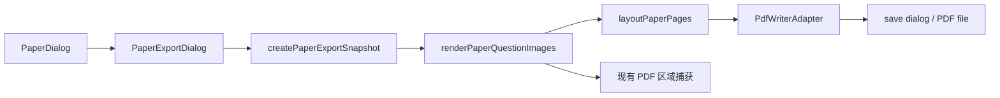

# KyStudy v0.1.3 开发方案

> 状态：v0.1.3 收口中；独立 AI 对话暂缓至后续版本（计划 v0.1.4）
> 基线日期：2026-08-17
> 目标平台：Windows 10/11 x64
> 本版主题：组卷 PDF 导出、可打印答题卷、解答题答题留白、AI 解析可读化与版本更新检查

## 1. 文档结论

用户所称的“1.3 版本”沿用仓库版本约定记为 `v0.1.3`。本版首先完成一条可交付的打印闭环：

```text
题库 → 生成练习卷 → 检查题目 → 导出设置 → 生成/预览 PDF → 保存或打印 → 纸面作答
```

v0.1.3 的核心交付不是把当前练习卷对话框直接打印出来，而是根据已生成的题目顺序建立一个稳定的“试卷快照”，使用专用排版渲染器生成接近纸质试卷的版式。交互按钮、AI 解析、作答登记状态和题库管理信息不得进入打印内容。

本版必须达到以下结果：

1. 组卷完成后可以从练习卷入口触发“导出 PDF”；
2. 默认生成 A4 纵向试卷，题号、题图和题目顺序与当前组卷一致；
3. `solution`（解答题）在题目后附带可书写的答题区，答题区与下一道题之间保持明确间隔；
4. PDF 生成失败、题图缺失或原 PDF 不可读取时不得生成静默不完整的试卷，用户能看到可行动的错误；
5. 导出不会修改组卷草稿、作答记录或题库数据；
6. 完成自动化验证和一次 Release 门禁，桌面 EXE 的最终打印体验仍由用户执行验收。

本文件是开发基线，不是最终需求冻结单。新增需求应先补充“范围与验收”或“待决策项”，再进入实现，避免在实现中隐式扩大版本边界。

## 2. 范围与非目标

### 2.1 P0：v0.1.3 发布必须完成

| 能力       | 交付边界                                                                                                                                              |
| ---------- | ----------------------------------------------------------------------------------------------------------------------------------------------------- |
| 导出入口   | 练习卷已生成且至少有一道题时显示并启用“导出 PDF”；空卷、正在刷新或导出中时禁用                                                                        |
| 试卷快照   | 固定导出时的题目 ID、题号、题型、题图区域和顺序；导出过程中题库刷新不改变本次产物                                                                     |
| 纸张版式   | A4 纵向；固定可打印边距；不写入试卷标题、姓名、班级、日期、题号文本或页脚；题目不显示编辑、AI、作答按钮                                               |
| 题目内容   | 按组卷顺序输出题型标题、题图和题型分段；同一道题的多个区域按 `sortOrder` 连续排列，并保持比例，不拉伸变形                                             |
| 解答题留白 | `solution` 题按当前记忆设置附带 4/8/12 行横线或等高空白答题区；默认首次为 8 行横线，最后一道解答题也必须保留                                          |
| 分页规则   | 题干图不在中间截断；题目与答题区尽量保持在同页；空间不足时只允许在答题线之间分页，并在续页标识“答题区（续）”                                          |
| 保存与打印 | 通过系统保存位置写出 `.pdf`；如底层实现使用系统打印对话框，必须能选择 PDF 打印机并明确提示保存路径                                                    |
| 失败处理   | 任一题图无法加载、区域数据非法或写入失败时停止生成，列出题号和修复建议，不产出假成功文件                                                              |
| 兼容性     | PDF 导出不新增组卷数据迁移；独立 AI 对话暂不进入 v0.1.3 发布包，后续版本可在保留现有数据的前提下单独迁移；`localStorage` 组卷草稿仍可恢复、提交和清理 |
| 验证与发布 | 补齐模型/组件/导出链路测试，执行目标检查、完整前端检查、Rust 门禁和 `tauri build --no-bundle`                                                         |

“导出完成”必须以目标文件确实写入用户选择的位置为准；只打开浏览器打印预览而没有保存或打印成功反馈，不算完成。

#### 2.1.1 AI 解析（v0.1.3）；独立 AI 对话延期

> v0.1.3 仅交付题目 AI 解析的可读化、复制、历史和来源隔离。独立 AI 对话因当前实现仍有较大稳定性与交互问题，已从本版主导航、题目入口和发布门禁中撤下，暂缓至后续版本（计划 v0.1.4）；现有实现代码和设计文档保留，后续重新验收后再开放。

| 能力          | v0.1.3 交付边界                                                                                                                    |
| ------------- | ---------------------------------------------------------------------------------------------------------------------------------- |
| 解析结果渲染  | 题目 AI 解析和规划 AI 回复统一按安全 Markdown 渲染，支持标题、加粗、列表、表格、代码块和链接；不得继续把 `**答案**` 等标记原样显示 |
| 数学公式      | 支持行内/块级 LaTeX（`$...$`、`$$...$$`、`\\(...\\)`、`\\[...\\]`）；公式使用 KaTeX 渲染，解析失败时降级显示原文，不得阻断整条回复 |
| 解析提示词    | 固定输出“结论、解题思路、关键步骤、易错点/自检”结构；要求公式使用 LaTeX 分隔符，不把公式放入代码反引号；不要求模型返回 HTML        |
| 结果操作      | 保留重新解析、历史解析和复制功能；新增复制 Markdown/纯文本的明确入口；请求失败时保留旧结果但显示失败原因和重试入口                 |
| 独立对话入口  | 延期至后续版本；v0.1.3 不提供主导航入口、题目上下文带入或对话操作，保留现有设计与实现代码作为后续开发基础                          |
| 对话能力      | 延期至后续版本；多轮文本对话、重试、停止、消息复制和题目上下文需重新完成稳定性与桌面验收                                           |
| Provider 复用 | 延期至后续版本；恢复开发时继续复用当前 Provider、模型、Windows 凭据和 Rust 网络层                                                  |
| 持久化        | 延期至后续版本；恢复开发时继续评估 SQLite 消息持久化和临时数据隔离                                                                 |
| 发布边界      | 不属于 v0.1.3 发布边界；真正的增量输出、工具调用和语音能力继续列入更后续版本                                                       |

AI 解析可读化是本次截图反馈对应的直接修复；独立 AI 对话不纳入 v0.1.3 发布包，必须保持入口关闭并在发布说明中明确延期，不能交付一个只能显示半成品的入口。

#### 2.1.2 软件更新检查（P0，纳入 v0.1.3 发布）

当前仓库已经具备 Tauri updater、GitHub Release endpoint、签名公钥、手动检查和 24 小时自动检查的基础实现。本版将其纳入正式发布门禁，重点保证“检查、确认、下载、签名校验、安装、重启”的完整闭环，而不是只验证按钮存在。

| 能力     | v0.1.3 交付边界                                                                                                                   |
| -------- | --------------------------------------------------------------------------------------------------------------------------------- |
| 手动检查 | 设置 → 关于 → 软件更新提供“检查更新”；检查中禁用重复点击，并显示无更新、发现新版本或可行动错误                                    |
| 自动检查 | 仅 Release 构建启用；默认每 24 小时最多检查一次；开发构建不请求发布服务；用户可以关闭启动时自动检查                               |
| 更新信息 | 显示当前版本、目标版本、发布日期和发布说明；不把下载地址、签名内容或内部路径直接暴露给普通用户                                    |
| 用户确认 | 发现更新后只展示“下载并安装”，不静默下载、不静默安装；用户确认前不改变当前运行版本                                                |
| 下载进度 | 显示已下载字节和百分比；未知文件大小时显示不确定进度；下载失败允许重试，不清除当前版本状态                                        |
| 安装结果 | 安装前完成 Tauri updater 签名校验；安装完成显示重启提示；不宣称已经切换版本，直到用户重新启动并看到新版本号                       |
| 安全边界 | 仅使用配置中的 HTTPS GitHub Release endpoint；私钥只存在 CI Secret；更新包、`latest.json` 和签名文件必须成套发布                  |
| 兼容失败 | 无网络、超时、无效 manifest、签名失败、版本不兼容和下载失败均映射为中文可行动提示，不显示原始响应或密钥                           |
| 发布验证 | v0.1.3 Release 必须验证安装包、`.sig`、`latest.json`、版本号和 SHA-256 manifest 的一致性；草稿 Release 未复核前不得作为正式更新源 |

更新检查属于 v0.1.3 的发布能力，不新增业务数据库表；自动检查开关和最近检查时间可以继续使用现有受控 `localStorage` 偏好，不保存更新包内容。

### 2.2 P1：资源允许时同版完成

| 能力       | 价值                                                  | 约束                                                         |
| ---------- | ----------------------------------------------------- | ------------------------------------------------------------ |
| 导出预览   | 导出前显示页数估算、缩略图和答题区效果                | 预览使用同一个快照和布局结果，不另做一套排版逻辑             |
| 答题区选项 | 标准 4/8/12 行，或按题目分值计算留白                  | v0.1.3 至少保留默认 8 行；没有分值数据时不能伪装成按分值计算 |
| 试卷字段   | v0.1.3 按当前验收不提供姓名、班级、日期和试卷标题字段 | 后续版本如恢复字段，必须单独验证不写入题库或组卷草稿         |
| 其他主观题 | `other` 题可选择是否附带 4 行答题区                   | 不影响 `solution` 的默认留白规则                             |
| 重新导出   | 在当前练习卷中使用上次设置再次导出                    | 只复用设置，不复用过期的图片 Blob 或旧 PDF 文件              |

P1 未完成时不应隐藏限制，需在发布说明中逐项列出。若用户把某一项提升为发布阻塞项，应同步提升为 P0 并补充验收案例。

### 2.3 P2：后续版本评估

- 自定义纸张尺寸、横向试卷、页边距、字体和页眉页脚；
- 每题按分值或用户指定高度生成答题区；
- 选择题答题卡、独立答题纸和“试题卷/答案卷”双份导出；
- 试卷模板、学校/班级抬头、Logo、水印和密封线；
- 批量导出多份不同题目顺序的试卷；
- 直接导出答案解析或教师版，并与学生版权限/文件命名隔离；
- 导出历史、固定版本快照和跨设备同步。

### 2.4 明确不做

- 不把 AI 解析结果、标准答案或题库内部路径写入学生试卷；
- 不把当前练习卷的“做对/不全对/做错”状态打印出来；
- 不在本版引入在线排版服务、云端上传或新的账号体系；
- 不因为导出而改变现有题图坐标、题库索引和组卷配额算法；
- 不在没有用户确认的情况下覆盖已有 PDF 文件；
- 不在本版把 AI 回复转换成标准答案、自动判分或自动修改题库；
- 不在 React 中直接请求 Provider，不把 API Key 放入浏览器网络层、localStorage、对话正文或错误日志；
- 不在本版自动判断模型是否支持视觉、公式推理或上下文长度；
- 不直接嵌入完整 Chatbox 等桌面 AI 客户端，开源项目只作为 UI/交互和架构参考；
- 不在本版强制引入流式协议、工具调用、语音输入或联网搜索；
- 不在实现过程中启动 Release EXE，也不代替用户声明桌面打印验收通过。

## 3. 当前实现与约束

### 3.1 已有基础

- `PaperSetupDialog` 根据题库范围和题型配额生成题目顺序；
- `PaperDialog` 保存练习卷题目、组卷规则、作答结果、浏览模式和当前题位置；
- `IndexedQuestion` 已包含题目 ID、题型、题号、标题、题图区域和原始顺序；
- `QuestionRegionCard` 的 `renderRegions` 已能通过现有 PDF 阅读链路把区域渲染成 PNG；
- `QuestionRegion` 使用相对 PDF 页面的坐标和 `sortOrder`，可作为导出输入；
- 现有草稿保存于 `paperSetupPreferences.ts` 的 WebView `localStorage`，本版不迁移到 SQLite。
- AI Provider 已支持 OpenAI、智谱、千问、豆包和 DeepSeek 的协议适配、模型列表发现、凭据回退和连接测试；
- 题目 AI 分析已经具备图片捕获、预览确认、重新解析、历史记录和结果缓存；
- 规划模块已经具备对话列表、上下文选择、消息持久化和 Rust 后端执行链路，可作为通用 AI 对话的基础。
- `tauri-plugin-updater`、GitHub Release endpoint 和签名公钥已经配置；
- `AboutSettings` 已提供手动检查、Release 构建自动检查、24 小时节流、下载进度、签名错误提示和“下载并安装”入口；
- 发布工作流已经生成签名 Windows 安装包、`.sig`、`latest.json` 和 SHA-256 release manifest，但仍需要作为 v0.1.3 的正式验收对象。

### 3.2 直接相关文件

- `src/features/workbook/QuestionBankPaperDialogs.tsx`：组卷设置、练习卷状态、提交和导出入口；
- `src/features/workbook/PaperQuestionCard.tsx`：交互态题卡，不直接作为打印模板；
- `src/features/workbook/paperSetupPreferences.ts`：草稿和组卷设置的持久化；
- `src/features/workbook/questionBankModel.ts`：组卷题目筛选、排序和配额模型；
- `src/features/review/QuestionRegionCard.tsx`：题图区域渲染，可抽取共享的 PNG/字节生成能力；
- `src/features/library/pdf/PdfReader.tsx`：PDF 区域捕获和渲染；
- `src/shared/tauri/resourceClient.ts`：本地 PDF 资源读取描述和受控协议 URL；
- `src/features/review/QuestionAiAnalysis.tsx`：题目 AI 解析的预览、确认、缓存结果和错误状态；
- `src/features/review/QuestionAiAnalysisModel.ts`：题目上下文、提示词和源指纹；
- `src/features/planning/PlanningChatPanel.tsx` 及 `src/features/planning/planning-chat/*`：现有对话列表、线程、上下文和输入组件；
- `src/features/settings/AboutSettings.tsx`、`src/shared/tauri/updateClient.ts`：版本展示、手动/自动检查、下载进度和更新错误映射；
- `src-tauri/tauri.conf.json`、`src-tauri/tauri.release.conf.json`、`.github/workflows/publish-windows.yml`：更新 endpoint、签名构建和 Release 上传链路；
- `scripts/check-release-version.ps1`、`scripts/write-windows-release-manifest.ps1`、`scripts/test-windows-release-manifest.ps1`、`scripts/test-release-smoke.ps1`：版本一致性、发布资产清单和启动 Smoke 验证；
- `src/shared/tauri/aiClient.ts`、`src/shared/tauri/planningChatClient.ts`：前端 Tauri AI 契约和错误映射；
- `src-tauri/src/application/ai.rs`、`src-tauri/src/application/planning_chat.rs`：Provider 选择、Token 预算、调用和对话编排；
- `src-tauri/src/infrastructure/ai_services.rs`、`src-tauri/src/infrastructure/sqlite_ai.rs`、`src-tauri/src/infrastructure/sqlite_planning_chat.rs`：Rust 网络网关、调用记录和对话存储；
- `src-tauri/src/commands`、`src-tauri/src/application`：如采用后端写文件或原生打印能力，新增命令应放在对应层，不从组件直接访问文件系统。

### 3.3 当前缺口

1. 练习卷目前是面向屏幕交互的对话框，包含工具栏、AI 解析和作答按钮，没有打印专用 DOM；
2. 题图渲染主要服务于屏幕预览，导出需要独立的分辨率、生命周期和错误汇总策略；
3. 项目目前没有 PDF 写出契约，只有 PDF 阅读和区域截图能力；
4. 题目数据没有分值字段，因此本版不能声称按分值自动计算答题空间；
5. 组卷没有稳定的持久化 `paperId`，导出快照应以当前内存题目列表和生成时间作为一次性身份，不擅自新增数据库实体。
6. 题目 AI 结果和规划对话目前以普通文本节点显示，Markdown 和数学公式没有统一渲染层；
7. 题目分析缓存没有记录 Provider/模型来源，切换 Provider 后可能继续看到旧的离线解析；本版需要在缓存命中信息或结果元数据中补齐来源边界；
8. 当前 AI 网关以完整响应为主，没有增量事件协议；本版对话先采用完整响应，不能在界面上伪装成流式输出。
9. 更新检查基础代码已经存在，但缺少纳入 v0.1.3 的完整自动化覆盖和真实签名 Release 验收记录；
10. 更新安装完成后的“需要重启”状态只由用户桌面验收确认，自动化不能替代重新启动并核对版本号。

## 4. 用户流程与交互设计

### 4.1 入口

在 `PaperDialog` 的标题操作区或底部操作区增加“导出 PDF”。按钮旁显示题目数量；导出过程中显示“正在生成第 N/M 题”，并禁用刷新、提交和关闭等可能破坏快照的操作。关闭导出进度时应先确认取消，已生成的临时资源必须清理。

### 4.2 导出设置

第一版设置面板至少展示以下内容：

```text
试卷标题：[练习卷]
纸张：A4 纵向（v0.1.3 固定）
姓名/班级/日期：[可选填写]
解答题答题区：[标准 8 行]
预计页数：生成布局后显示

[取消] [生成并保存 PDF]
```

设置面板不允许修改题目顺序。用户返回练习卷后，当前题目、作答状态和草稿位置保持不变。

### 4.3 保存反馈

- 默认文件名：`<安全化试卷标题>-YYYYMMDD.pdf`；标题为空时使用 `练习卷-YYYYMMDD.pdf`；
- 文件名去除 Windows 不允许的字符、控制字符和末尾句点/空格；
- 目标文件已存在时由保存对话框或明确确认处理，不静默覆盖；
- 成功消息包含文件名和保存位置，并提供“打开所在文件夹”（若已有 opener 能力可复用）；
- 取消保存不提示错误，也不清除当前练习卷；
- 失败消息包含“重试导出”和“返回检查题目”两个可行动入口。

### 4.4 AI 解析结果展示

题目页面的 AI 解析卡片保留现有“预览 → 确认 → 结果”的安全流程，但结果区域改为阅读型内容：

```text
AI 参考解析                         本次 5,920 Token
来源：智谱 GLM · 已验证为当前 Provider

结论
取得极小值：-e/2

解题思路
先求一阶偏导，判断驻点；再用二阶偏导或 Hessian 判别驻点类型。

关键步骤
1. ...
2. ...

[复制 Markdown] [复制纯文本] [重新解析]
```

具体规则：

- `cacheHit` 结果显示“已保存解析”，同时显示来源 Provider/模型快照；来源不明的旧记录显示“历史解析”；
- 当前 Provider 或模型改变后，旧缓存不得静默当作新 Provider 的结果；用户可查看旧结果，但普通“AI 分析”应要求重新确认；
- 请求失败时不清除已经显示的结果，在结果下方显示错误和“重试”入口；
- 解析器不执行 HTML、脚本或未经过允许列表的 URL；
- 过长回答保持卡片最大高度并提供内部滚动，不能撑破题目页面布局；
- 复制纯文本应去掉 Markdown 标记，复制 Markdown 应保留原始 AI 回复。

### 4.5 独立 AI 对话工作区（后续版本设计，v0.1.3 不开放）

> 本节仅保留后续版本的设计草案。v0.1.3 不显示入口、不接收题目上下文，也不把该工作区纳入发布验收。

后续版本计划将“新窗口”实现为主应用内的独立 AI 工作区/子窗口，复用现有导航和窗口模型，不立即新增第二个 Tauri 原生窗口。原因是当前 Tauri 配置只有 `main` 窗口，原生多窗口会额外引入权限、状态同步和生命周期问题。

工作区布局：

```text
┌──────────────┬─────────────────────────────────────┐
│ 对话列表      │ 当前对话标题          Provider/模型 │
│ + 新建对话     ├─────────────────────────────────────┤
│ 重命名/删除    │ 用户消息                             │
│                │ AI 回复（Markdown + 数学公式）      │
│                │ ...                                  │
│                ├─────────────────────────────────────┤
│                │ [引用题目] [附件/上下文] [输入框] [发送] │
└──────────────┴─────────────────────────────────────┘
```

首版交互契约：

- 后续版本恢复后，从主导航或工具中心进入“AI 对话”；
- 可以新建、切换、重命名和删除本地对话；
- 发送前显示当前 Provider、模型、预计 Token 和上下文来源；
- 支持“引用当前题目”，将题目标题、题目图片和当前解析作为一次性上下文，不自动把整本题库发送出去；
- 用户消息和 AI 回复按顺序显示，AI 回复使用与题目解析相同的 Markdown/LaTeX 渲染器；
- 支持复制、重试、重新生成和清空当前输入；
- 关闭或切换页面不丢失已经保存的消息；
- API Key、完整请求体和临时图片只存在 Rust 调用栈或受控临时资源生命周期内，不进入前端持久化。

### 4.6 软件更新检查交互

更新入口位于“设置 → 关于 → 软件更新”，不放在学习流程中强制打断用户：

```text
软件更新
当前版本 v0.1.3                         [检查更新]
启动时自动检查更新                       [开]

无更新：已是最新版本
有更新：发现新版本 v0.1.4 · 日期
        发布说明摘要
        [下载并安装]
下载中：正在下载更新… 42%
完成：更新已安装，请重新启动 KyStudy
```

交互规则：

- 开发构建显示“开发构建不参与自动更新”，检查按钮不可用，不请求 GitHub Release；
- Release 构建手动检查不受 24 小时节流限制，但同一时刻只能有一个检查请求；
- 自动检查失败保持静默，不弹窗打断学习；用户手动检查失败必须显示错误和重试入口；
- 发现更新后不自动下载或安装，用户点击“下载并安装”后才开始传输；
- 下载期间显示进度并禁用重复安装；关闭设置页面时释放待安装更新句柄；
- 安装成功只显示“需要重启”，应用不得自行宣称已经运行新版本；
- 签名校验失败、manifest 版本异常或更新包损坏时，显示安全错误并禁止继续安装；
- 所有状态需要支持键盘焦点、屏幕阅读器 `role=status`/`role=alert` 和窄窗口布局。

## 5. PDF 内容与排版规范

### 5.1 页面规格

- 页面：A4 纵向，210 × 297 mm；
- 建议内容边距：上下 15 mm、左右 18 mm；具体值集中在布局常量中，不散落在 CSS 和渲染代码；
- 正文最小字号建议不低于 10.5 pt，题号和标题使用更高层级；
- 页脚显示当前页/总页数，不显示本地路径、题库 ID 或内部调试信息；
- 页面背景为白色，打印内容不依赖应用主题色和深色模式。

### 5.2 题目块

每道题按照以下结构排版：

```text
题号（加粗）
题目区域 1
题目区域 2 ...
（仅 solution/配置启用时）答题区横线
```

题图使用现有区域的保存顺序，保持原始宽高比，并限制在内容宽度内；不为了填满整页而强行放大低分辨率图片。没有有效区域的题目不能被静默跳过：导出前显示题号、原题号和修复入口。

### 5.3 解答题留白

- `questionType === "solution"` 时默认添加 8 条横线，每条建议 8 mm 高，答题区总高度约 64 mm；
- 答题区上方保留“答题区”标签，横线之间留出普通硬笔书写空间；
- 答题区是题目块的一部分，下一道题不能紧贴上一道题的最后一条线；
- 一道题跨页时不截断题图；若答题区跨页，续页显示“第 N 题答题区（续）”，并继续绘制横线；
- 最后一题同样保留答题区，不能因为后面没有题目而省略；
- `blank` 题默认不添加大块解答区，除非 P1 设置明确打开；
- 当前没有分值数据，任何“按分值分配答题空间”的实现只能作为后续扩展，不得作为本版默认行为。

### 5.4 页眉信息

默认页眉包含试卷标题和三个可选填写框：姓名、班级、日期。没有填写的字段保留空线，不打印 `undefined`、内部 ID 或来源文件绝对路径。题目来源科目/练习册信息只在用户明确选择“显示题目元数据”时加入，默认不显示，避免试卷过于拥挤。

## 6. 技术方案

### 6.1 推荐的分层结构



建议新增以下职责，而不是继续扩大 `PaperQuestionCard`：

- `paperExportModel.ts`：快照、设置、题目有效性、文件名安全化和可测试的默认值；
- `paperExportLayout.ts`：使用 mm/pt 等单一内部单位计算题目块、答题线和分页；
- `paperExportRenderer.ts`：按序渲染题图、汇总进度、释放 Blob/对象 URL；
- `PaperExportDialog.tsx`：设置、进度、错误和保存反馈；
- `PdfWriterAdapter`：封装最终 PDF 生成方式。具体采用浏览器打印 CSS、前端 PDF 库或 Tauri/Rust 写出能力，必须经过 6.2 的 Spike 决策后固定。

导出模型只接收最小字段：题目 ID、题号、题型、区域、标题、文档 ID 和排序信息。不得把完整题库快照或 AI 历史传给 PDF 写出层。

### 6.2 必做技术 Spike：确定 PDF 写出方式

当前依赖中已有 PDF.js 阅读和区域截图，但没有 PDF 生成器。实现前需要用一个包含中文、公式、长题图和多道解答题的 fixture 验证以下路线：

| 路线                             | 优点                                         | 风险/验证点                                                   |
| -------------------------------- | -------------------------------------------- | ------------------------------------------------------------- |
| 专用打印 DOM + 系统打印/另存 PDF | 中文字体和 CSS 分页较自然，复用 WebView 渲染 | WebView 的分页差异、保存成功回执、无法只依赖 `window.print()` |
| 前端 PDF 库                      | 可生成字节并走现有保存流程，布局可单测       | CJK 字体嵌入、长图内存、分页和字体授权                        |
| Tauri/Rust PDF 写出              | 文件写入和大文件控制更清晰                   | 新增 crate、字体打包、前后端图片传输和跨平台一致性            |

Spike 的决策门槛：

1. 能生成真实 `.pdf` 文件，而不是仅有 HTML 打印预览；
2. 中文、数学符号和题图在 Windows 默认打印流程中可读；
3. 一道长解答题能按规范分页，答题线不消失；
4. 20 道题、至少 40 个区域的生成不会持续无界增长内存；
5. 取消、失败和重试均能释放临时资源；
6. 字体和新增依赖的许可证可以进入 `DEPENDENCY_LICENSES.md` 审计。

推荐优先验证“专用打印 DOM + 可确认的系统另存 PDF”作为最小实现；如果 WebView 无法提供稳定保存回执，则转向具有明确字节输出的 PDF writer。无论选择哪条路线，产品验收都以用户最终得到可打开的 PDF 文件为准。

### 6.3 生成链路

1. 从当前 `PaperDialog` 状态复制题目 ID、顺序和题目字段，冻结 `PaperExportSnapshot`；
2. 校验题目区域页码、坐标、宽高和排序；把无效项一次性汇总给用户；
3. 按题目顺序串行或限流渲染 PNG，使用导出专用分辨率，不复用屏幕预览的低分辨率 Blob；
4. 将题图尺寸换算到 A4 内容宽度，按题目块和答题区规则分页；
5. 写出 PDF 临时内容，完成页数、字节数和文件可读性检查；
6. 通过 Tauri 对话框选择目标路径并原子写入；
7. 成功后释放所有临时 URL、PDF session 和 canvas 资源，返回练习卷；失败则保留练习卷状态并允许重试。

导出过程不得为了进度而并发打开整本 PDF；并发上限、临时文件目录和最大单题图片尺寸应集中定义并可测试。

### 6.4 数据契约与持久化

本版不新增数据库表。导出设置可以按版本保存为本地偏好，例如 `kystudy.paper-export-settings.v1`，建议字段如下：

```ts
type PaperExportSettings = {
  title: string;
  solutionAnswerLines: 4 | 8 | 12;
  studentName?: string;
  className?: string;
  examDate?: string;
};
```

`PaperExportSnapshot` 只在本次导出生命周期内存在，不写入题库；保存的 PDF 也不反向成为资料资源。若未来需要重新导出同一版本，应另建持久化快照契约，不能依赖已经变化的题库区域。

### 6.5 AI Provider 协议与模型发现增强

v0.1.3 同步纳入 AI 配置可用性增强：用户可以为不同厂商选择对应协议，并在编辑 Provider 时手动获取模型 ID。模型列表只存在当前编辑会话，不写入数据库、localStorage、调用历史或缓存；API Key 继续只由 Rust 后端携带，新建配置允许使用表单中的临时密钥，编辑已有配置且表单留空时回退到 Windows 凭据管理器。

| Provider        | 协议                         | 默认 API 根地址                                     | 调用路径                     | 模型列表策略                                                                    |
| --------------- | ---------------------------- | --------------------------------------------------- | ---------------------------- | ------------------------------------------------------------------------------- |
| OpenAI          | Responses API                | `https://api.openai.com/v1`                         | `<baseUrl>/responses`        | `<baseUrl>/models`                                                              |
| 智谱 GLM        | Chat Completions             | `https://open.bigmodel.cn/api/paas/v4`              | `<baseUrl>/chat/completions` | 当前不承诺标准 `/models`，允许手动填写                                          |
| 阿里云百炼/千问 | OpenAI 兼容 Chat Completions | `https://dashscope.aliyuncs.com/compatible-mode/v1` | `<baseUrl>/chat/completions` | DashScope 默认调用 `/api/v1/deployments/models`，兼容自定义地址仍尝试 `/models` |
| 豆包/火山方舟   | Responses API                | `https://ark.cn-beijing.volces.com/api/v3`          | `<baseUrl>/responses`        | 当前不承诺标准 `/models`，允许手动填写                                          |
| DeepSeek        | OpenAI 兼容 Chat Completions | `https://api.deepseek.com`                          | `<baseUrl>/chat/completions` | `<baseUrl>/models`                                                              |

Chat Completions 统一发送文本/图片消息、`max_tokens` 和 `stream: false`，Responses Provider 使用现有的 `input`/`max_output_tokens` 契约。模型列表只帮助填写 ID，不根据名称猜测文本、视觉、embedding、上下文长度或最大输出能力；最终可用性仍以连接测试和实际调用为准。模型列表错误至少区分认证失败、限流、不可用、接口不支持、空列表、格式非法和响应过大，且不向前端传播原始响应或密钥。

本项需要数据库迁移 v26，在 `ai_provider_config.provider_protocol` 保存协议标识，同时保留旧 `provider_type` 值以兼容历史 CHECK 约束；不增加模型列表持久化字段。

### 6.6 AI 解析渲染与独立对话技术方案

#### 6.6.1 开源组件选择

本版采用“轻量 Markdown 渲染组件 + 可替换的对话 UI 运行时”策略：

| 组件/项目                                | 用途                                                | 本版决定                                                                                       |
| ---------------------------------------- | --------------------------------------------------- | ---------------------------------------------------------------------------------------------- |
| `react-markdown`                         | 将 Markdown 安全转换为 React 节点，支持自定义组件   | P0 采用，作为题目解析和对话的统一渲染入口                                                      |
| `remark-gfm`                             | 表格、任务列表、删除线等 GFM 语法                   | P0 采用                                                                                        |
| `remark-math` + `rehype-katex` + `katex` | 识别并渲染 LaTeX 公式                               | P0 采用，补齐中文数学题的可读性                                                                |
| `rehype-sanitize`                        | 限制 HTML、链接和属性，降低不可信回复的渲染风险     | P0 采用，禁止执行 HTML/脚本                                                                    |
| `assistant-ui`                           | 对话线程、消息、输入框、重试和重新生成等 React 原语 | P0 做小范围 Spike；若与现有 CSS/状态模型冲突，保留现有组件结构并只借鉴交互，不强行引入整套主题 |
| `streamdown`                             | 面向流式 Markdown 的增量渲染                        | 不纳入 P0；当前 Rust 网关返回完整响应，待流式协议确定后评估                                    |
| Chatbox、OpenYoke                        | 桌面 AI 对话的交互和 Tauri 架构参考                 | 不直接复制代码或嵌入完整应用；仅记录 UX 和许可证参考                                           |

上述项目均需在安装前核对实际版本、许可证和依赖树，并更新 `docs/DEPENDENCY_LICENSES.md`。不得因为引入 UI 项目而把 API Key 请求移回浏览器层。

调研参考：[`assistant-ui`](https://github.com/assistant-ui/assistant-ui)（MIT，React 对话原语和 custom runtime）、[`react-markdown`](https://github.com/remarkjs/react-markdown)（MIT，安全 Markdown React 渲染）、[`Streamdown`](https://github.com/vercel/streamdown)（面向 AI 流式 Markdown 的后续候选）、[`Chatbox`](https://github.com/chatboxai/chatbox)（GPLv3，桌面 AI 客户端交互参考）和 [`OpenYoke`](https://github.com/saicv8/OpenYoke)（MIT，Tauri/Rust `invoke` 与本地对话架构参考）。这些链接用于方案评估，不代表本版直接复制其代码或运行时。

#### 6.6.2 统一 Markdown/LaTeX 渲染层

新增共享组件：

- `src/shared/components/MarkdownRenderer.tsx`：接收只读字符串，统一配置 `remark-gfm`、`remark-math`、`rehype-katex` 和 `rehype-sanitize`；
- `src/shared/components/markdown.css`：标题、段落、列表、表格、代码、引用、KaTeX 和长内容滚动样式；
- 自定义 `a`、`img`、`code`、`table` 组件，限制外部 URL 协议和图片来源；
- `QuestionAiAnalysis.tsx`、规划对话 `Thread.tsx` 和新 AI 对话线程必须复用该组件，不允许各自实现 Markdown 解析；
- 解析异常只影响当前块，显示可复制的原始文本并保留整条回复；
- 结果复制提供原始 Markdown 和去标记纯文本两种模式。

提示词契约同步修改：要求中文分节、结论先行；数学表达式必须使用 `$...$`/`$$...$$` 或 `\\(...\\)`/`\\[...\\]`；禁止用代码反引号包裹公式；不生成 HTML、脚本和伪造引用。渲染器不负责修正模型的数学推导，数学正确性仍需用户核对。

#### 6.6.3 题目分析缓存来源隔离

现有 `question_ai_analysis` 只按题目和源指纹取缓存，无法区分离线 Provider、智谱或其他模型。v0.1.3 需要补齐以下契约：

1. 执行题目分析时由后端读取当前激活 Provider 和模型；
2. 缓存查询条件同时包含 `question_id`、源指纹、`provider_config_id` 和 `model_profile_id`；
3. 缓存命中结果返回来源 Provider/模型和 `cacheHit`，旧记录没有来源时标记为“历史解析”而非当前 Provider 结果；
4. 切换 Provider 或模型后，普通“AI 分析”不得命中旧来源；“重新解析”仍强制绕过缓存；
5. 失败请求不覆盖上一次成功结果，但必须把失败状态和可重试操作显示在当前卡片中；
6. 迁移不得删除历史 AI 回复；历史表增加来源字段或允许来源为空。

建议在迁移 v27 中完成来源字段和索引调整，不把 API Key 或完整 Provider 原始响应写入数据库。

#### 6.6.4 独立 AI 对话工作区（延期至后续版本）

> 以下文件和契约作为后续版本开发基础保留，不属于 v0.1.3 的用户入口或发布门禁。

前端新增：

- `src/features/ai-chat/AiChatPanel.tsx`：工作区容器、对话列表、消息线程、输入和上下文栏；
- `src/features/ai-chat/aiChatModel.ts`：输入校验、消息裁剪、引用题目上下文和发送状态机；
- `src/features/ai-chat/ai-chat.css`：桌面宽屏、窄窗口和键盘焦点样式；
- `src/shared/tauri/aiChatClient.ts`：列表、新建、重命名、删除、预览和执行命令契约；
- `src/app/navigation.ts`、`AppNavigation.tsx`、`AppPageContent.tsx`：后续版本恢复 `ai-chat` 应用视图和导航入口时使用。

后端新增或扩展：

- `src-tauri/src/application/ai_chat.rs`：通用对话输入、历史限制、上下文组合、预览确认和消息保存；
- `src-tauri/src/commands/mod.rs`：`list_ai_chat_conversations`、`create_ai_chat_conversation`、`rename_ai_chat_conversation`、`delete_ai_chat_conversation`、`preview_ai_chat`、`execute_ai_chat`；
- `src-tauri/src/infrastructure/sqlite_planning_chat.rs` 或独立 `sqlite_ai_chat.rs`：复用 `ai_message` 的 Markdown 内容契约，按对话类型隔离规划对话和通用对话；
- `src-tauri/migrations/0027_ai_chat.sql`：增加对话类型/来源所需字段和索引；如重建带 CHECK 的 AI 调用表，必须保留现有数据并增加 `general_chat` purpose；
- `src-tauri/src/infrastructure/ai_services.rs`：继续复用现有 Provider gateway，不新增前端直连路径。

对话请求建议采用以下边界：

```text
前端输入/引用题目
  → Tauri preview_ai_chat（预算、Provider、模型、上下文摘要）
  → 用户确认发送
  → Tauri execute_ai_chat
  → Rust 组合有限历史和临时图片
  → 现有 AiUseCases / Provider Gateway
  → 保存 ai_call + ai_message
  → 返回 Markdown 回复和来源元数据
```

首版每次最多带最近 8 条消息和固定字符上限；题目图片只在当前调用中存在，不保存到对话表。完整响应返回前端后才显示为“已完成”，不得把定时器拼接文字冒充流式输出。真正的 AbortSignal/HTTP 中止和增量事件列入后续流式版本。

### 6.7 软件更新检查与 Release 契约

#### 6.7.1 运行时检查层

- `src/shared/tauri/updateClient.ts` 继续封装 `tauri-plugin-updater`，React 只接收安全的版本、日期、说明和进度字段；
- 检查超时固定为 30 秒，下载/安装超时固定为 120 秒；超时、签名失败和一般网络错误必须映射为稳定中文提示；
- 更新对象在关闭设置页或组件卸载时调用 `close()`，避免持有待安装资源；
- 自动检查状态只记录“最近检查时间”和用户开关，不记录完整 manifest、下载响应或安装包内容；
- 自动检查不得调用 `install`，不得在后台静默下载。

#### 6.7.2 配置与签名边界

- `src-tauri/tauri.conf.json` 只保留正式 HTTPS endpoint 和公钥；
- `src-tauri/tauri.release.conf.json` 打开 updater artifact 生成；
- `.github/workflows/publish-windows.yml` 使用 `TAURI_SIGNING_PRIVATE_KEY` 和密码 Secret，仓库和构建日志不得出现私钥；
- 发布必须同时提供 NSIS 安装包、`.sig`、Tauri `latest.json` 和项目 release manifest；
- `latest.json` 的版本、平台、下载地址、签名和安装包必须指向同一 Release；
- `scripts/write-windows-release-manifest.ps1` 输出的 SHA-256 清单用于发布复核，不替代 Tauri updater 的签名校验；
- 任何 manifest 缺字段、版本降级、非 HTTPS 地址、签名缺失或签名不匹配都必须阻断安装。

#### 6.7.3 版本发布契约

v0.1.3 发布前必须同步核对：

1. `package.json` 版本；
2. `src-tauri/Cargo.toml` 版本；
3. `src-tauri/tauri.conf.json` 版本；
4. Release tag、安装包文件名和 `latest.json` 版本；
5. 发布说明中的更新内容、已知限制和重启提示；
6. GitHub Draft Release 复核完成后再转正式 Release。

用户验收必须用已签名 Release 安装包执行一次：检查无更新、发现更新、下载进度、签名校验、安装完成和重启后版本号。开发构建、未签名构建和本地 `tauri dev` 不能作为自动更新验收样本。

## 7. 测试与验收

### 7.1 纯模型测试

- 默认设置、设置版本和非法设置归一化；
- Windows 文件名非法字符、空标题、重复扩展名和日期格式；
- 题目排序、区域 `sortOrder`、跨页题目块和答题线数量；
- 题图缺失、页码越界、负宽高、空题卷等输入会被拒绝；
- 同一快照在相同页面规格下得到稳定的布局结果；
- 导出不会改变原始 `PaperDraftRecipe`、作答结果和题目数组。

### 7.2 组件与链路测试

- 有题时导出入口可用，空卷和导出中状态禁用；
- 设置面板能保存/取消，取消不影响组卷；
- 生成进度按题目推进，失败能显示题号并可重试；
- 成功保存后显示文件名和路径，取消保存不显示错误；
- 不渲染 AI、编辑、校正、作答按钮和内部来源路径；
- 导出后关闭再返回，当前练习卷和草稿仍可恢复。

### 7.3 PDF 视觉验收样本

至少准备以下 fixture，并在目标检查中保留可复现输出：

1. 1 页内含选择题、填空题、解答题；
2. 3 页以上、含多区域题图和连续解答题；
3. 长题图刚好跨页，验证题图不被截断；
4. 最后一题为解答题，验证最后答题区存在；
5. 中文标题、数学符号、低分辨率题图和缺失题图；
6. 20 道题/40 个区域，验证生成时间、内存和取消；
7. Windows 系统打印或 PDF 阅读器打开后，确认 A4 边界、页码、横线和打印书写空间。

### 7.4 发布验收清单

- [ ] 从题库生成一张含至少两道解答题的练习卷；
- [ ] 导出设置显示 A4 和默认 8 行答题区；
- [ ] 保存 PDF 后使用 PDF 阅读器打开，页数和题目顺序正确；
- [ ] 每道解答题后均有可书写区域，题目之间未发生粘连；
- [ ] 打印预览不出现应用按钮、AI 内容、路径和调试文本；
- [ ] 故意移除/损坏一道题图，确认导出阻断且错误可修复；
- [ ] 取消保存、关闭导出、重试导出均不丢失当前组卷；
- [ ] 完成 `pnpm check`、Rust 完整门禁和 `pnpm tauri build --no-bundle`；
- [ ] 用户完成 Release EXE 桌面打印验收后，再更新发布说明中的人工验收状态。

### 7.5 AI Provider 验收清单

- [ ] 协议下拉可以选择 OpenAI、智谱、千问、豆包和 DeepSeek，并显示对应默认 API 根地址；
- [ ] Chat Completions Provider 能发送文本请求，支持视觉模型时能按 OpenAI 兼容图片消息发送；
- [ ] Responses Provider 能发送文本请求并解析响应文本与 usage；
- [ ] 新建 Provider 使用未保存 API Key 获取模型后取消保存，确认密钥和模型列表均未持久化；
- [ ] 编辑已有 Provider 留空 API Key 时能使用已保存凭据获取模型；
- [ ] OpenAI、DeepSeek 以及 DashScope 默认地址的模型列表能去重并按 ID 稳定排序；
- [ ] 智谱或豆包模型列表接口不支持时显示可行动提示，仍可手动填写模型 ID；
- [ ] 错误 API Key、429、5xx、空列表和非法 JSON 均不会显示原始响应或密钥；
- [ ] 返回 embedding、audio 或其他不适配当前调用的模型时不被静默过滤，用户仍可手动修改模型 ID；
- [ ] 连接测试仍是最终可用性依据，未根据模型名称自动填写上下文限制或输出上限。

### 7.6 AI 解析与对话验收清单

> 本清单中的题目 AI 解析条目属于 v0.1.3；独立 AI 对话相关自动化和人工条目暂存为后续版本验收，不作为本版发布阻断条件。

#### 自动化测试

- [ ] Markdown 渲染器正确处理标题、加粗、列表、表格、代码块、链接和空行；
- [ ] LaTeX 行内/块级语法能渲染，非法公式只降级当前块，不导致组件崩溃；
- [ ] 不渲染危险 HTML、`javascript:` 链接或不在允许范围内的图片地址；
- [ ] 题目分析结果和规划对话均使用同一渲染组件，不存在一处渲染、一处原样文本的分叉；
- [ ] 题目分析缓存按 Provider ID、模型 ID 和源指纹隔离；离线结果不会在切换远程 Provider 后命中；
- [ ] 请求失败时旧结果仍可复制，错误提示包含重试入口；成功的新结果会覆盖当前结果并保存来源元数据；
- [ ] AI 对话输入长度、历史条数、上下文图片数量和 Token 预算均有上限；超限请求在网络调用前被拒绝；
- [ ] 创建、切换、重命名、删除对话和消息顺序在前端纯模型测试中稳定；
- [ ] 对话预览与执行之间发生 Provider、模型、消息或上下文变化时，执行被判定为过期；
- [ ] 临时 API Key、图片 data URL 和原始 Provider 响应不会写入 localStorage、错误文本、日志或对话表。

#### 人工验收

1. 使用一个返回 Markdown 和数学公式的模型，确认题目解析显示为排版后的标题、列表和公式，而不是原始 `**`/反引号；
2. 切换离线 Provider 到远程 Provider，确认旧解析标记为历史或要求重新解析；
3. （后续版本）从题目页面打开 AI 对话，确认题目标题、题图和当前解析可以作为上下文发送；
4. （后续版本）连续进行至少三轮追问，确认上下文顺序正确，关闭再打开后消息仍在；
5. （后续版本）重试一次失败请求，确认失败消息不覆盖上一条成功回复；
6. 复制 Markdown 到编辑器，确认公式分隔符和列表结构保留；复制纯文本，确认没有 Markdown 标记；
7. （后续版本）在窄窗口和长回复场景下确认消息滚动、输入框、焦点和错误操作仍可访问；
8. 确认前端网络面板没有 Provider 外部请求，API Key 仅由 Rust 后端使用。

### 7.7 软件更新检查验收清单

#### 自动化测试

- [ ] `updateClient` 正确映射“无更新”和可用更新的版本、日期、说明字段；
- [ ] 检查超时、下载超时、签名/公钥错误和一般网络错误映射为稳定用户提示；
- [ ] 下载进度能处理已知 `contentLength`、未知长度、多个进度事件和 100% 上限；
- [ ] 自动检查只在 Release 构建且超过 24 小时检查间隔时触发；关闭开关或开发构建不会触发；
- [ ] 自动检查失败不显示打断式错误，手动检查失败显示重试入口；
- [ ] 检查中不能重复发起请求，已有更新对象在组件卸载时会关闭；
- [ ] 更新安装只在用户确认后调用，自动检查不会调用下载或安装；
- [ ] 版本号、manifest、安装包和签名文件缺失/不一致时，发布脚本或检查逻辑会阻断；
- [ ] release manifest 中每个 artifact 的文件名唯一、大小和 SHA-256 可复算，且不把 manifest 自身作为输入。

#### 人工验收

1. 在开发构建打开“关于”页，确认显示开发构建提示且不会访问更新服务；
2. 在 Release 构建手动检查一个无更新版本，确认显示“已是最新版本”；
3. 使用 Draft Release 测试发现更新，确认显示目标版本、日期和发布说明；
4. 确认未点击“下载并安装”前不会产生下载；
5. 下载期间确认进度、重复点击防护和关闭页面清理状态；
6. 使用错误签名或损坏更新包，确认安装被阻止且没有降级到不安全安装；
7. 使用有效签名包完成安装，重启后确认设置页版本号已经更新；
8. 检查无网络、GitHub 暂时不可用和超时场景，确认提示可理解且不影响本地学习数据；
9. 确认更新检查不上传工作区内容、题目、AI 对话或 API Key。

### 7.8 发布前未闭环项审计（2026-08-17）

| 项目                                        | 当前证据                                                                                                                                     | 发布判断                                             |
| ------------------------------------------- | -------------------------------------------------------------------------------------------------------------------------------------------- | ---------------------------------------------------- |
| 独立 AI 对话                                | 主导航、路由和题目带入入口已关闭；实现代码保留                                                                                               | 已按决定延期，不阻塞 v0.1.3                          |
| PDF 核心链路                                | 模型、布局、PDF writer、预览和缺图阻断测试已通过；用户已验收打开、预览、保存和答题区                                                         | 已实现；仍需保留最终 Release 资产证据                |
| PDF 视觉 fixture                            | 目前没有将多页、中文、低分辨率题图和跨页答题区样本作为可复现 fixture 入库                                                                    | 发布证据缺口；正式发布前需补样本或记录可复现验收产物 |
| Provider 人工验收                           | 协议、模型列表、密钥边界和错误映射已有自动化覆盖，尚无完整桌面人工记录                                                                       | 非代码阻塞项；发布前需明确是否纳入本版验收           |
| 更新签名资产                                | 本地只有无捆绑 EXE 和 manifest fixture 测试，没有 v0.1.3 NSIS、`.sig`、`latest.json` 正式资产；发布工作流现已增加 tag 与三处版本号一致性校验 | 正式 Release 阻塞项，必须由发布工作流生成并复核      |
| 预览缩略图、Logo/水印、自定义纸张、批量导出 | 当前未实现，发布说明已列为 P1/P2                                                                                                             | 不阻塞 v0.1.3，保持边界透明                          |

## 8. 实施批次与交付物

### M0：需求与技术 Spike

- 固定页面单位、答题线默认值和文件保存语义；
- 用真实题图验证三条 PDF 写出路线，记录字体、分页、内存和许可证结论；
- 交付：Spike 记录、路线决策、fixture 和待补充风险清单。

### M1：导出模型与布局

- 新增快照、设置、文件名和分页纯函数；
- 覆盖题目排序、答题区和异常输入测试；
- 交付：可独立测试的 `paperExportModel` 与 `paperExportLayout`。

### M2：题图渲染与 PDF 写出

- 抽取共享题图字节渲染能力；
- 实现进度、取消、临时资源清理和 `PdfWriterAdapter`；
- 交付：可生成并保存 fixture PDF 的最小链路。

### M3：界面接入与可访问性

- 在 `PaperDialog` 接入导出按钮、设置、错误和成功状态；
- 处理焦点、键盘、关闭确认和窄窗口布局；
- 交付：真实组卷可导出，交互测试通过。

### M4：质量与发布收口

- 完成视觉样本、目标检查、一次交叉审查和发布验收清单；
- 完成更新检查自动化测试、签名 Release 资产复核和版本号一致性检查；
- 更新 `V0_1_3_RELEASE_NOTES.md`（功能实现后再创建），记录已知限制和用户验收项；
- 交付：版本门禁证据和待用户执行的桌面打印验收。

### M5：AI 结果可读化与缓存来源修复

- 引入并审计 Markdown/GFM/LaTeX/安全渲染依赖；
- 实现共享 `MarkdownRenderer`，替换题目解析和规划对话中的原始文本节点；
- 更新题目解析提示词、复制操作、长文本滚动和公式降级显示；
- 完成 v27 缓存来源字段/索引，切换 Provider 或模型后不再命中旧离线结果；
- 交付：截图问题修复、渲染单测、缓存跨 Provider 回归测试和依赖许可证记录。

### M6：通用 AI 对话后端与数据契约

- 固定通用对话输入、消息历史、上下文图片、Token 预算和预览指纹；
- 扩展 AI 调用 purpose 与对话类型，隔离规划对话和通用对话；
- 实现 SQLite 迁移、列表/新建/重命名/删除/预览/执行命令；
- 复用 `AiUseCases`、Provider gateway、Windows 凭据和现有错误码；
- 交付：Rust 应用层/网络层/存储层测试和前端 Tauri 客户端契约。

### M7：AI 对话工作区与题目上下文接入（后续版本）

- 后续版本恢复 `ai-chat` 应用视图和导航入口；
- 实现对话列表、线程、输入框、发送确认、重试、重新生成、复制和删除；
- 从题目解析卡片增加“打开 AI 对话”，支持带入题目标题、图片和当前解析；
- 完成宽屏、窄窗口、键盘焦点、长回复和错误状态适配；
- 交付（后续版本）：通用对话工作区、组件测试、人工验收脚本和截图样本。

### M8：整合、发布门禁与延期开关

- 执行 AI 解析、对话、Provider、PDF 导出之间的回归测试；
- 执行“无更新/有更新/下载/签名失败/安装后重启”更新检查验收，并核对 `latest.json` 和 SHA-256 manifest；
- 完成一次针对缓存隔离、API Key 边界和 Markdown 安全渲染的交叉审查；
- 若对话功能未达到 P0 验收，保留代码但关闭导航入口，并在发布说明中明确延期原因；
- 按工作流执行 `pnpm check`、Rust 完整门禁和 `pnpm tauri build --no-bundle`；
- 交付：统一版本门禁证据、发布说明草案和用户桌面验收清单。

## 9. 待决策项与后续补充入口

以下问题不阻塞本规划文档落地，但在 M0 结束前必须形成明确结论：

1. v0.1.3 的“保存 PDF”是否完全由系统打印对话框完成，还是必须提供无打印机依赖的直接文件写出；
2. 默认 8 行答题区是否符合实际纸面书写习惯，是否需要把单位从“行数”改为“毫米”；
3. 姓名/班级/日期是默认显示空线，还是由导出设置开关控制；
4. 没有题图但有题目标题时，是否允许带警告导出，还是始终阻断；本方案默认阻断，保证不会生成缺题试卷；
5. 是否需要在 v0.1.3 同时支持 `other` 题答题区；
6. AI 对话工作区是默认的应用内子窗口，还是必须作为独立 Tauri 原生窗口发布；本方案默认应用内子窗口，原生多窗口列入后续版本；
7. `assistant-ui` Spike 是否通过现有 CSS、无 Tailwind 主题和 Tauri custom runtime 的兼容性评估；失败时使用现有组件结构，不阻塞 Markdown 渲染和后端对话功能；
8. 通用对话是否复用 `ai_conversation`/`ai_message` 并增加对话类型，还是建立独立表；默认优先复用并通过迁移隔离，避免重复消息模型；
9. 首版是否允许题目图片进入多轮历史；本方案默认图片只在引用该题的当前调用中发送，不持久化图片字节；
10. 自动更新检查默认是否开启；本方案默认开启 24 小时检查，但不下载、不安装，用户可以关闭；
11. 更新安装完成后是否自动重启；本方案默认不自动重启，只提示用户重新启动；
12. v0.1.3 是否使用正式 GitHub Release 作为更新源；本方案默认 Draft Release 复核后转正式 Release，禁止使用未复核的临时地址；
13. 用户补充的新需求应归入 P0/P1/P2 或明确列为非目标，并补充对应测试和验收，不直接改写已经完成的历史门禁记录。

## 10. 版本发布规则

功能实现前不提前修改应用版本号、Release Tag 或发布说明状态。实现批次准备交付后，按 `docs/DEVELOPMENT_WORKFLOW.md` 的顺序执行一次完整门禁；任一门禁失败先修复原因，再按受影响范围重跑。发布说明应区分自动化证据与用户桌面验收，不能用自动化测试替代“实际打开 PDF 并打印书写”或“安装签名更新并重启核对版本”的验收。v0.1.3 正式发布前必须复核 GitHub Release、`latest.json`、安装包签名和 SHA-256 manifest，避免把未签名或版本不一致的资产作为更新源。
