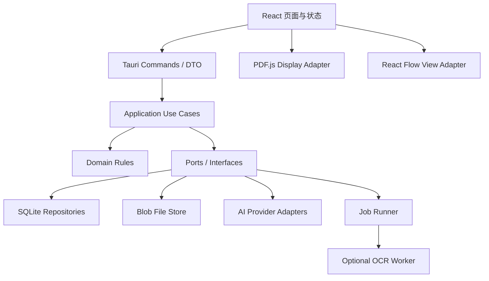
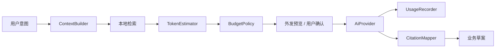
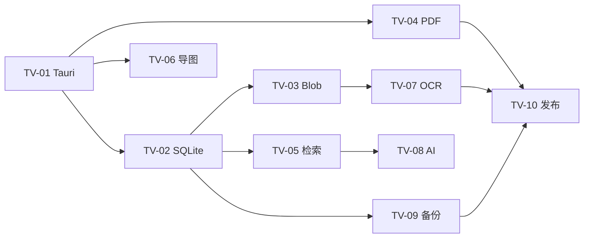

# KyStudy 技术架构与验证计划

| 项目     | 内容                                                 |
| -------- | ---------------------------------------------------- |
| 文档版本 | 0.1                                                  |
| 对应 PRD | 0.1                                                  |
| 更新日期 | 2026-07-22                                           |
| 状态     | 验证前方案，不代表最终依赖版本                       |
| 架构方向 | Tauri 桌面端 + React/TypeScript + Rust 核心 + SQLite |

## 1. 目的

在正式搭建工程前，通过小规模、可丢弃的技术实验回答最不确定的问题。验证阶段不实现完整产品，不追求视觉效果，也不提前建设通用框架。

需要优先证明：

1. 大型本地 PDF 能否在 Tauri WebView 中稳定阅读和区域标记；
2. SQLite 是否能承担正式数据、后台任务和中文全文检索；
3. React Flow 是否适合思维导图编辑和大节点量；
4. OCR 能否以可接受的安装体积和速度处理中文扫描资料；
5. AI 上下文裁剪、引用和 Token 预算能否在不同提供商之间保持一致；
6. 本地文件、密钥、备份和迁移是否具备清晰的安全边界。

## 2. 已确认的外部能力

截至 2026-07-18，官方资料表明：

- Tauri 2 官方 SQL 插件支持 SQLite 和迁移；文件系统插件使用路径权限范围限制访问；Stronghold 插件可用于安全秘密存储；
- PDF.js 提供显示层和 Viewer，可获取页面并按 viewport 渲染，页面坐标需要处理缩放、旋转和 PDF/Canvas 原点差异；
- SQLite FTS5 提供全文检索，并包含 `unicode61`、`trigram` 等 tokenizer；
- React Flow 是 MIT 许可的节点编辑组件，提供拖拽、缩放、选择、节点与边等基础能力；
- PaddleOCR 提供本地 OCR 与文档解析能力，但安装方式、模型体积、公式效果和 Windows 打包仍需实测；
- XMind 官方可导出 OPML、Markdown、PDF、SVG 等格式，因此“结构化导入”和“图片识别导入”应作为两条独立路径。

具体版本只在进入实现里程碑时锁定，并记录在依赖清单与架构决策中。

## 3. 架构原则

### 3.1 模块化单体

KyStudy 是一个本地桌面应用，不引入本地 HTTP 微服务、消息中间件和远程数据库。所有核心模块打包在同一个应用中，通过明确接口协作。



### 3.2 依赖方向

- 页面可以依赖应用 DTO，不能直接依赖 SQLite 行结构；
- Tauri Command 只做输入校验、调用用例和返回结果；
- Application 层编排事务、权限、预算和多个模块；
- Domain 层包含纯业务规则，不进行文件、数据库、网络和 UI 操作；
- Infrastructure 实现 Repository、文件存储、AI、OCR 和安全存储接口；
- 底层实现不能反向导入页面或 Command。

### 3.3 单一职责

不创建一个负责所有事情的 `AIService`、`DocumentService` 或 `StudyManager`。建议拆分为：

| 领域 | 组件职责                                                                          |
| ---- | --------------------------------------------------------------------------------- |
| 资料 | `DocumentImporter`、`PdfTextExtractor`、`Chunker`、`SearchIndexer`                |
| AI   | `ContextBuilder`、`BudgetPolicy`、`AiProvider`、`UsageRecorder`、`CitationMapper` |
| 复习 | `ReviewPolicy`、`ReviewQueueBuilder`、`ReviewRepository`                          |
| 习题 | `QuestionRegionMapper`、`AttemptRecorder`、`MistakeUpdater`                       |
| 导图 | `MapEditorUseCases`、`MindMapImporter`、`MapDraftApplier`                         |
| 文件 | `BlobStore`、`IntegrityChecker`、`BackupService`                                  |

这些是职责边界，不要求每个名称立刻对应一个类。简单纯函数可以直接承担 Review 计算、坐标转换和预算判断。

### 3.4 组合优于继承

- AI 提供商通过小接口组合能力，不构建多层 Provider 继承树；
- OCR、全文检索和向量检索是可替换适配器；
- 复习规则作为策略对象或纯函数注入队列生成器；
- 文件解析流水线显式组合步骤，不使用难以追踪的装饰器链；
- 只有出现三个以上真正相同的实现后才抽象注册中心或插件系统。

## 4. 运行时边界

### 4.1 WebView（React + TypeScript）

负责：

- 页面渲染和交互状态；
- PDF.js Canvas/Text Layer 展示；
- 题目框选和坐标采集；
- React Flow 导图画布；
- 调用 Tauri Command；
- 显示后台任务、AI 流式结果和 Token 状态。

不负责：

- 直接拼接 SQL；
- 读取明文 AI 密钥；
- 决定复习优先级和正式调度日期；
- 直接写入应用数据目录中的任意路径；
- 绕过预算策略调用外部 AI。

### 4.2 Rust 核心

负责：

- 用例编排和事务边界；
- SQLite Repository 与迁移；
- Blob 存储、哈希、完整性和备份；
- 复习与任务等核心业务规则；
- AI 提供商调用、预算检查、缓存和用量记录；
- Tauri 权限与安全存储；
- 后台任务调度和恢复。

Rust 核心是否承担 PDF 文字提取需要通过实验决定。首选让 PDF.js 负责显示和基础文字层，后端只接收结构化页面文本；若 WebView 索引大型文档性能不足，再评估 Rust PDF 解析库。

### 4.3 可选 OCR Worker

TV-07 已有条件通过并接受 [ADR-006](../../adr/006-ocr-deployment.md)。Windows 首批采用可选的
受控本地 sidecar，当前候选为 RapidOCR 3.9.2、PP-OCRv6 small 与 ONNX Runtime 1.27.0
CPU。组件只在用户触发 OCR 时启动，批次结束后退出；模型随组件提供，不在首次识别时
下载；当前 246.18 MiB 打包目录不进入最小安装包。

OCR 输出统一转换为页码/区域、文本、置信度和归一化文字框。Rust 只在内部向 Worker
传递受控路径，WebView DTO 不接收绝对路径或原始引擎错误。原图始终保留，公式、矩阵和
复杂表格在不可靠时降级为区域图片；OCR 失败、取消或缺失不影响 PDF 阅读与手动框选。
外部 OCR API 将来只能作为同一 Port 后由用户显式选择的方案，不做静默回退。

## 5. 建议工程边界

此结构只描述职责，不在验证前创建所有空目录。

```text
src/
  app/                 # React 入口、路由、组合
  features/            # today, planner, library, mindmap, workbook, review
  shared/              # UI 组件、格式化、DTO 客户端

src-tauri/src/
  commands/            # 薄 IPC 入口
  application/         # 用例与事务编排
  domain/              # 纯业务规则和值对象
  infrastructure/      # SQLite、文件、AI、安全存储、任务执行器
  bootstrap/           # 依赖组合与应用启动
```

领域模块内部再按实际规模组织。没有出现复杂度前，不为每张表建立单独 Service、Factory 和 Interface。

## 6. Tauri Command 设计规则

Command 是前后端边界，不是数据库 CRUD 的一一映射。

推荐按用户意图设计：

- `import_resource`
- `create_task`
- `confirm_plan_version`
- `mark_question_region`
- `record_attempt`
- `generate_daily_review_queue`
- `submit_review_result`
- `start_ai_planning_turn`
- `create_backup`

不推荐暴露：

- `execute_sql`
- `update_any_entity`
- `write_file_by_absolute_path`
- `call_model_raw`

Command 输入和输出使用稳定 DTO，不返回数据库模型、Rust 内部错误栈或提供商原始响应。

## 7. 后台任务模型

导入、OCR、索引和 AI 分析可能跨越数秒或数分钟，需要统一但简单的任务机制。

### 7.1 首批任务类型

- 文件复制与哈希；
- PDF 元数据和文字层提取；
- OCR；
- 全文索引重建；
- AI 文档分析；
- 备份和恢复验证。

### 7.2 状态机

`pending → running → succeeded / failed / canceled`

规则：

- 任务开始、进度和结果持久化到 SQLite；
- 应用异常退出后，未完成任务进入 `interrupted` 或重新排队；
- 可重试任务使用有限次数与明确退避，不无限循环；
- 文件导入先写临时文件，校验完成后原子移动到 Blob 位置；
- UI 通过事件接收进度，但数据库是最终状态来源；
- 暂不引入通用分布式队列。

## 8. 文件存储设计

### 8.1 目录建议

```text
app-data/
  workspaces/<workspace-id>/
    kystudy.sqlite3
    blobs/ab/<sha256>.<ext>
    cache/render/
    cache/ocr/
    cache/index/
    backups/
    logs/
```

数据库只保存相对 `storage_key`，不保存依赖某台电脑的绝对路径。

### 8.2 导入流程

1. 文件选择器返回用户授权路径；
2. 复制到工作区临时目录并流式计算 SHA-256；
3. 检查重复 Blob；
4. 校验大小与哈希；
5. 原子移动到内容寻址位置；
6. 在事务中创建 Blob 和 ResourceDocument；
7. 创建后台解析任务；
8. 失败时清理临时文件，不留下半条正式资料。

### 8.3 权限

Tauri 文件权限只开放应用数据目录和用户通过选择器明确授权的文件。前端不获得通用磁盘读写权限。

## 9. SQLite 设计方向

### 9.1 连接与事务

- 启用外键约束；
- 验证 WAL 模式在 Windows、备份和崩溃恢复中的表现；
- 写操作通过后端 Repository 和应用事务；
- 后台索引避免长事务阻塞用户记录任务或复习结果；
- 迁移由应用启动流程管理，迁移前按风险创建快照。

### 9.2 全文检索

P0 使用 FTS5，不立即引入向量数据库。针对中文资料比较：

- `unicode61` 的字符行为；
- `trigram` 的空间、召回和查询速度；
- 应用层分词；
- 标题前缀匹配与正文全文检索分离。

只有当真实规划问答证明关键词检索不足时，才增加本地嵌入与向量索引。

### 9.3 数据访问选择

Tauri 官方 SQL 插件证明 SQLite 和迁移可行，但 KyStudy 不应让 React 组件直接执行 SQL。技术实验比较：

1. Rust `sqlx`/同类驱动 + Command；
2. 官方 SQL 插件封装在独立 Repository 中。

选择标准是迁移、FTS5、事务、打包体积、错误处理和测试便利性，而不是示例代码长度。

## 10. PDF 技术方案

### 10.1 显示

优先使用 PDF.js Display Layer，并参考 Viewer 的分页、文本层和搜索实现。首批不直接修改 PDF 文件，而是把书签、批注和题目区域存入 SQLite 覆盖层。

### 10.2 坐标

统一保存相对于 PDF 页面的归一化坐标：

```text
x = pageX / pageWidth
y = pageY / pageHeight
width = regionWidth / pageWidth
height = regionHeight / pageHeight
```

技术验证必须覆盖：

- 0°、90°、180°、270° 页面旋转；
- 100%、150%、200% 缩放；
- HiDPI 屏幕；
- 窗口尺寸变化；
- 跨页题目和多个区域；
- Canvas 坐标与 PDF 坐标原点不同。

### 10.3 大文件

验证 PDF.js 在 Tauri 自定义协议或受控本地 URL 下的加载方式，避免把整本 PDF 转为 Base64 或一次性复制进 JavaScript 字符串。需要测量首次渲染、翻页、搜索、内存和取消加载。

## 11. 思维导图技术方案

### 11.1 编辑器

React Flow 作为首选验证对象，不作为永久数据格式。数据库保存知识节点、父子关系和布局，React Flow Node/Edge 只在适配层生成。

### 11.2 导入

分三条路径：

1. **内部格式**：完整保留节点、关系、布局和 KyStudy 关联；
2. **结构化外部格式**：XMind、FreeMind、OPML、Markdown 大纲，经适配器转换；
3. **图片/PDF**：OCR/视觉模型生成临时树，用户确认后写入。

每个格式独立实现导入器。首批不建设动态插件系统，避免为了两个格式制造复杂注册框架。

### 11.3 撤销与 AI 差异

- 普通编辑使用前端命令历史实现短期撤销；
- 关键保存点和 AI 操作生成导图 Revision；
- AI 输入限定为选中子树和相关资料；
- AI 输出为节点增删改操作列表；
- 用户逐项接受后由应用层验证无环和引用完整性。

## 12. AI 与 Token 架构

### 12.1 调用流水线



### 12.2 Provider 接口

首批接口只抽象真实共同能力：

- 文本对话；
- 可选视觉输入；
- 流式输出；
- 取消；
- 结构化输出能力声明；
- 用量字段标准化。

不同提供商特性保留在 Capability 中，不通过空实现伪装所有模型能力相同。

### 12.3 预算

- 预算检查在网络请求前执行；
- 预估值与提供商实际值分开记录；
- 没有返回 Token 用量的提供商标记为 `estimated`；
- 缓存命中不重复记为新模型调用；
- 自动任务只允许使用单独的自动预算；
- 达到硬限制后不静默切换付费更高的模型。

### 12.4 引用

上下文中的每个片段获得稳定引用标签，记录 Resource、Page、Chunk 和内容哈希。模型回答引用该标签，应用再渲染为可点击的文件与页码。

引用只能证明模型使用了该片段，不能证明回答推理必然正确。

## 13. 安全边界

### 13.1 密钥

- API Key 保存在系统安全存储或经过验证的 Stronghold Vault；
- SQLite 只保存 `secret_ref`；
- 前端不显示完整密钥；
- 日志、错误报告和诊断导出统一脱敏；
- 清除模型配置时同时提供删除秘密的选项。

### 13.2 外发内容

AI 调用前显示：提供商、模型、用途、文件、页码、图片数量、估算 Token。用户可以取消某个片段。

### 13.3 Tauri 权限

- 使用最小 Capability；
- 禁止任意 Shell 命令；
- 文件系统只允许应用目录和选择器授权范围；
- 不向 WebView 暴露通用 SQL 和任意文件写入；
- Content Security Policy 与自定义协议在 PDF Spike 中验证。

## 14. 技术验证清单

每个 Spike 建议单独目录或临时分支，产生结论、测量数据和最小复现；验证代码不直接演变成正式业务代码。

### TV-01：Tauri 基础壳与权限

**验证内容**

- Windows 安装、启动、开发热更新和发布构建；
- React 页面调用一个有类型的 Rust Command；
- 文件选择器只授予目标文件访问；
- 最小 Capability 与 CSP；
- 应用数据目录定位。

**通过标准**

- 发布包可在干净测试环境启动；
- 未授权路径无法由前端读取；
- Command 错误可以转换为稳定错误码；
- 开发和生产路径行为一致。

### TV-02：SQLite、迁移与恢复

**验证内容**

- 外键、事务、WAL、迁移和回滚；
- 1 万任务、10 万作答与复习事件的基本查询；
- 应用写入过程中异常退出；
- 备份副本恢复；
- FTS5 编译能力。

**通过标准**

- 外键约束实际生效；
- 失败事务不留下半完成业务对象；
- 重启后数据库可打开并识别未完成后台任务；
- 迁移失败可回到迁移前快照；
- 测试数据上的今日任务和到期复习查询无明显卡顿。

**结果（2026-07-18）**

TV-02 已通过，详见 [Spike 报告](../../spikes/TV-02-sqlite.md)。确认采用 Rust `rusqlite + bundled + backup`，SQLite 3.53.2 的外键、WAL、FTS5、迁移回滚、异常退出恢复和在线备份均满足标准；驱动与 Repository 边界见已接受的 [ADR-002](../../adr/002-sqlite-driver.md)。

### TV-03：Blob 文件库

**验证内容**

- 导入 10 MB、300 MB 和 1 GB 文件；
- 流式哈希、重复导入、取消和磁盘空间不足；
- 导入中异常退出；
- Blob 缺失和损坏检测；
- 相对路径备份恢复。

**通过标准**

- 不把完整文件一次性加载进内存；
- 重复文件不产生第二份物理 Blob；
- 取消或失败后无正式半记录和孤立临时文件；
- 恢复到不同绝对路径后仍可打开资料。

**结果（2026-07-18）**

TV-03 已通过，详见 [Spike 报告](../../spikes/TV-03-blob-store.md)。固定 1 MiB 缓冲区完成 10 MiB、300 MiB 和 1 GiB 流式导入；1 GiB 首次导入为 1,352 ms，测量进程峰值工作集为 7.46 MiB。同内容重复导入只复用原 Blob；持久化 `running` / `committing` Job 可处理异常退出与数据库提交失败。包含 SQLite 一致快照、Manifest 和 Blob 树的完整备份可在校验后恢复到不同绝对路径。文件存储与备份决策见已接受的 [ADR-004](../../adr/004-file-storage.md)。

### TV-04：PDF 阅读与区域坐标

**样本**

- 带文字层 PDF；
- 中文扫描 PDF；
- 含公式、双栏或复杂排版 PDF；
- 含旋转页面的 PDF；
- 300 页以上 PDF。

**验证内容**

- 首页渲染、快速翻页、缩放、文字层和搜索；
- 框选区域保存后，在不同缩放和窗口大小下恢复；
- 多区域与跨页题目；
- PDF.js Worker、CSP、自定义协议和本地文件访问；
- 内存增长和取消加载。

**通过标准**

- 区域在缩放、旋转和重启后仍覆盖原题；
- 普通笔记本上连续翻阅大型 PDF 不持续无界增长内存；
- 未解析或扫描 PDF 仍可手动框选；
- 不使用整本 Base64 字符串传递 PDF；
- 技术报告给出基准设备、首次渲染、翻页和峰值内存数据。

**结果（2026-07-18）**

TV-04 已通过，详见 [Spike 报告](../../spikes/TV-04-pdf-viewer.md)。PDF.js 6.1.200 使用本地 Worker 和受控 RangeSource 打开 25.58 MB、360 页样本，只传输 482,473 bytes；首页渲染 76.90 ms，216 次连续渲染均值 5.39 ms。四种旋转、多缩放和 DPR 2 的坐标最大误差约 `2.22e-16`，无文字层页仍能框选，旋转、放大和页面重载后覆盖框可恢复。第一次真实 Release WebView 测试发现并修复了 `convertFileSrc` 路由编码问题，项目维护者随后确认 `direct-id-v2` Release 正常加载；[ADR-001](../../adr/001-desktop-runtime.md) 和 [ADR-003](../../adr/003-pdf-rendering.md) 已接受。

### TV-05：中文全文检索

**验证内容**

- 5 万和 20 万中文 Chunk；
- `unicode61`、`trigram` 和应用层分词对比；
- 精确词、短语、知识点名称、英文缩写和公式附近文字；
- 增量更新、删除和全量重建；
- 索引体积。

**通过标准**

- 常见中文知识词能够召回相关页；
- 查询时 UI 无明显阻塞；
- 单页更新无需重建整库；
- 索引可以删除并从正式数据恢复；
- 报告同时记录速度、召回样例和磁盘体积，不只比较单一指标。

### TV-06：思维导图编辑与导入

**验证内容**

- 100、500、1000 节点的拖拽、缩放、折叠和选择；
- 保存并恢复节点位置；
- 撤销重做；
- XMind、FreeMind、OPML 或 Markdown 大纲样本解析；
- 图片识别生成临时树；
- AI 操作列表的逐项接受。

**通过标准**

- 500 节点常见操作保持可用，1000 节点明确记录降级点；
- 内部数据不依赖 React Flow 私有字段；
- 不支持的外部字段产生报告而不是静默丢失；
- AI 草案不能覆盖未选中的正式节点；
- 导入器出现异常不会损坏现有导图。

### TV-07：OCR 打包与效果

**样本**

- 清晰中文印刷页；
- 手机拍摄的倾斜错题；
- 低分辨率扫描页；
- 含数学公式和表格的页面。

**验证内容**

- 本地 CPU 速度、内存和模型体积；
- Windows 发布包集成；
- 中文正文识别和文字框坐标；
- 公式无法可靠识别时的图片保留策略；
- 任务取消、模型下载和离线状态。

**通过标准**

- 普通中文正文足以用于搜索和 AI 上下文；
- 原始图片和文字框始终保留，可人工纠正；
- 公式识别不达标时明确降级为区域图片，不伪造文本；
- OCR 不作为打开和手动标记 PDF 的前置条件；
- 安装体积和首次模型下载对用户透明。

TV-07 已有条件通过，详见 [Spike 报告](../../spikes/TV-07-ocr.md)。四类合成样本中三类普通
中文 CER 为 0，公式表格页 CER 为 1.79%，所有关键词召回和归一化文字框检查通过；
平均单页约 0.44–1.02 秒。模型共 30.28 MiB且可完全离线运行，打包 Worker 连续 12 次
平均 694.88 ms，但目录为 246.18 MiB、峰值 RSS 为 728.88 MiB，因此必须按需启动并
作为可选组件分发。首次 PyInstaller 产物暴露并修复了旧 VC Runtime 导致 ONNX Runtime
加载失败的问题。部署边界见已接受的 [ADR-006](../../adr/006-ocr-deployment.md)。

### TV-08：AI 适配器、引用与预算

**验证内容**

- 至少两个行为不同的模拟 Provider；
- 流式输出、取消、超时、速率限制和错误映射；
- 提供商用量字段缺失或不同；
- 上下文片段引用回原 PDF 页；
- 单次、每日和月度预算；
- 相同上下文缓存；
- 密钥不会进入日志与前端状态快照。

**通过标准**

- Provider 切换不修改规划、题目等领域逻辑；
- 达到硬预算后请求不会发出；
- 回答引用可定位到当时使用的内容哈希和页码；
- 取消流式请求仍记录已知用量和状态；
- 缺少真实用量时明确显示为估算；
- 外发预览与实际 Context Manifest 一致。

### TV-09：备份、恢复与升级

**验证内容**

- 数据库、Blob 和 Manifest 完整备份；
- 不包含密钥的检查；
- 中断备份；
- 恢复到新目录；
- 旧 schema 到新 schema；
- Blob 缺失、哈希错误和部分损坏。

**通过标准**

- 恢复前能够发现损坏，不覆盖现有工作区；
- 恢复后随机抽查资料、题目区域、作答和队列一致；
- 缓存缺失时可重建；
- 备份中不包含 AI 密钥；
- 升级失败能够返回升级前状态。

### TV-10：发布包与资源占用

**验证内容**

- Windows 安装、卸载、升级和数据保留；
- WebView、PDF.js、OCR 模型与可选组件体积；
- 首次启动和冷启动；
- 没有开发环境的电脑；
- 崩溃日志与诊断导出。

**通过标准**

- 安装和卸载不会误删用户工作区；
- 可选 OCR 模型不强制进入最小安装包，除非验证证明值得；
- 发布包能明确展示应用版本、数据库版本和依赖许可；
- 诊断信息可用且不泄露资料正文和密钥。

## 15. 验证顺序



建议先完成 TV-01、TV-02、TV-03 和 TV-04。它们决定桌面壳、数据和 PDF 主路径是否成立。AI、OCR 和导图实验可以在基础壳稳定后并行，但不提前并入正式架构。

## 16. 验证产物模板

每个 Spike 保存一份报告：

```text
目标：要消除的技术不确定性
环境：操作系统、CPU、内存、依赖版本
样本：文件类型、页数、大小、节点量或记录量
方案：实际验证的候选实现
结果：测量数据、截图、错误和限制
结论：通过 / 有条件通过 / 不通过
决策：采用、放弃或需要进一步实验
后续：正式实现必须遵守的约束
```

不以“示例能跑起来”作为通过标准，必须包含失败样本和恢复路径。

## 17. 架构决策记录（ADR）

验证形成结论后，为以下选择分别创建 ADR：

- ADR-001：桌面运行时与首要平台；
- ADR-002：SQLite 驱动、迁移和 Repository 边界；
- ADR-003：PDF 渲染与坐标模型；
- ADR-004：文件存储、去重和备份；
- ADR-005：思维导图内部模型与首批导入格式；
- ADR-006：OCR 部署方式；
- ADR-007：AI Provider、上下文、预算与秘密存储；
- ADR-008：全文检索与是否引入向量索引。

ADR 记录当时的上下文、候选方案、决策、理由和后果，不只记录最终答案。

## 18. 暂缓的复杂度

在验证证明需要前，不引入：

- 依赖注入框架；
- 通用插件市场；
- 事件溯源数据库；
- CQRS 读写双模型；
- 本地 HTTP 服务；
- Redis 或外部向量数据库；
- 自动同步冲突解决；
- 为每张表生成一套机械式 Service/Repository；
- 复杂 Provider 继承树。

## 19. 官方参考

- [Tauri SQL 插件](https://v2.tauri.app/plugin/sql/)
- [Tauri 文件系统插件](https://v2.tauri.app/plugin/file-system/)
- [Tauri Stronghold 插件](https://v2.tauri.app/plugin/stronghold/)
- [PDF.js Getting Started](https://mozilla.github.io/pdf.js/getting_started/)
- [PDF.js Examples](https://mozilla.github.io/pdf.js/examples/)
- [SQLite FTS5](https://www.sqlite.org/fts5.html)
- [React Flow](https://reactflow.dev/)
- [PaddleOCR](https://github.com/PaddlePaddle/PaddleOCR)
- [XMind 文件导入与导出](https://xmind.com/user-guide/working-with-files)

## 20. 下一步

1. 统一审阅数据对象名称和模块边界；
2. 建立 ADR 模板和 Spike 报告模板；
3. 只搭建 TV-01 所需的最小 Tauri 验证壳；
4. 完成 TV-01 后再决定正式工程初始化方式；
5. 在任何业务页面实现前完成 TV-02 至 TV-04 的关键结论。
