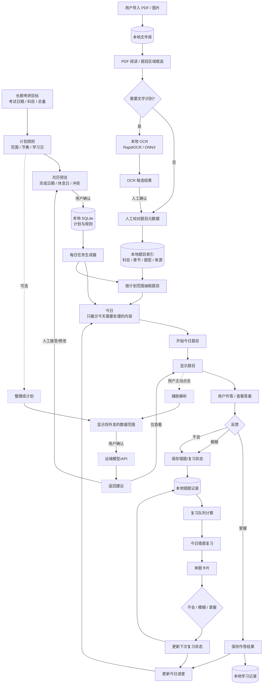

# KyStudy 前端 UI 与用户体验优化深度研究报告

## 执行摘要

KyStudy 的产品方向本身已经相当接近这次优化目标：它不是以“记录更多数据”为核心，而是希望把“长期目标 → 学习计划 → 今日任务 → 做题 → 错题复习”串成闭环，并明确强调“打开软件，只处理今天”；OCR 是可选本地能力，AI 由用户主动触发，并在调用前展示外发范围。更重要的是，仓库中的新版信息架构已经明确提出“一级页面围绕用户行为组织，不围绕工程模块、数据库对象或 AI 能力组织”“本地规则优先于 AI”“AI 对话不再拥有一级入口”。因此，本报告的核心判断是：**KyStudy 不需要再做一次大的产品重构，而应把现有信息架构原则真正落实成一套低干扰、工具化、学习任务导向的视觉与交互系统。** citeturn16view1turn16view2turn16view3

目前最值得改善的并不是配色本身，而是“界面语法”。公开截图中的暖米色 + 墨绿色已经有明显个性，但同时存在较典型的 SaaS/AI 模板感：大字号页面标题、大块白色圆角阴影卡片、多个统计小卡、较多空白，以及把一个简单任务包装成“Dashboard 模块”的倾向。例如“今日”页使用一个非常大的“下一项”卡片，而“习题册”顶部又采用四个独立统计卡；这会让用户感觉自己在操作一个“产品仪表盘”，而不是一本安静、直接的考研学习工具。citeturn25view0turn25view2

现有 CSS Token 已经提供了很好的改造基础：背景 `#f4f1e8`、主色 `#1e5b42`、强调色 `#d08a35`，并已有语义色、focus ring、skip link、`prefers-reduced-motion` 处理和响应式断点。因此**不建议为了“现代化”整体迁移到另一套 UI 框架或 Tailwind**；当前仓库实际使用 React 19 + TypeScript 6 + Vite 8，并维护了 `tokens.css / primitives.css / app-shell.css`，更合理的方法是在现有 Design Token 基础上完成“去卡片化、减阴影、提高信息密度、统一状态与交互”。citeturn18view0turn19view0turn19view1turn26view0

本次调研后，最值得 KyStudy 重点借鉴的不是某一个产品的完整外观，而是几种不同产品的**局部成熟模式**：

- **Anki**：错题复习最重要的参考；一次只处理一张卡，反馈动作极少，键盘 `1/2/3/4`，提交立即进入下一题，把次要操作放入 More。citeturn26view1
- **Super Productivity**：最值得借鉴“Today / Focus”思想，用当前任务压过统计和工具本身。citeturn21view8turn26view2
- **SiYuan 思源笔记**：最值得借鉴本地优先、PDF、分屏、块级钻取和高信息密度桌面工作区。citeturn21view3
- **Vikunja**：适合借鉴周期计划的列表/月历多视图、快速操作与“界面不能挡住任务”的速度意识。citeturn21view7
- **RemNote**：适合参考“PDF → 学习材料 → 复习”的连续工作流，但**不应复制其如今非常明显的 AI 营销和 AI-first 文案**。citeturn21view6
- **AFFiNE / AppFlowy**：适合参考中性、内容优先的 workspace 结构、块/表格组织和跨终端布局，但 KyStudy 不应发展成一个通用 Notion 替代品。citeturn26view3turn26view4

最终建议把 KyStudy 定义成：

> **“本地优先的考研学习工作台”**，而不是“AI 考研助手”。

AI 应该表现为“计划整理”“辅助解析”“资料提取”等**任务中的次级能力**，而不是一个带特殊渐变、星光图标、聊天首页、模型品牌和提示词输入框的产品层。值得注意的是，当前 `package.json` 已经依赖 `@assistant-ui/react` 与 `@lobehub/icons`，而 README 又提到“独立 AI 学习助手”；技术上完全可以保留这些能力，但视觉上建议严格限制在辅助抽屉/子页面，不让它们决定全局设计语言。citeturn26view0turn16view1turn16view3

本报告同时存在一个研究边界：仓库目前公开截图只有“今日、计划、习题册、资料”四个核心页面；真实 PDF 阅读、题目区域、组卷、错题反馈、设置等关键交互尚未提供公开截图。因此对这些页面的建议主要依据 KyStudy 已公开的信息架构、代码和同类产品模式，而不是对完整成品 UI 的逐屏审计。citeturn25view5

## KyStudy 现状与关键问题

KyStudy 的现有信息架构事实上已经是此次改版最重要的“设计规范”。新版文档明确固定一级导航为“今日、计划、习题册、错题、资料”，设置置于侧栏底部，并移除 AI 对话、学习分析、思维导图、数据/备份等一级入口；同时规定默认打开“今日”，深层页面必须有清晰返回路径。这种设计非常适合考研场景，因为用户打开应用的首要问题通常不是“系统有什么功能”，而是“我现在该做什么”。citeturn16view2

**当前最值得保留的部分**包括：暖米色 + 墨绿色的品牌基础、固定五项行为导航、本地优先理念、今日任务导向、计划与错题的明确分离、AI 的人工确认和外发预览机制，以及已经存在的可访问性基础。CSS 中已有 skip link、明显的 `focus-visible` 描边和 reduced-motion 处理，说明没有必要换掉基础组件系统重新开始。citeturn18view0turn19view0turn19view1

**当前最需要改变的是“所有东西都像一个卡片”。** “今日”截图中，一个普通学习事项被放进大面积白色阴影容器；“习题册”则把科目数、练习册数、已索引、已做分别放成四张 KPI 卡。这是企业 Dashboard 很常见的视觉模式，却不是学习流程真正需要的层次。对于每天反复打开几十、上百次的长期学习工具，列表、分组标题、细分隔线和文本层级通常比“大卡片 + 大留白”更适合长期使用。当前 Token 中 `--radius-lg: 1rem` 与 `--shadow-surface` 被用于 `page-surface`，因此这一问题可以主要通过 CSS 层解决，不需要改业务模型。citeturn18view0turn19view1turn25view0turn25view2

**“今日”应该更像学习队列，而不是首页 Dashboard。** 当前信息架构文档本身已经规定今日页只需展示最近考试、今日计划、今日错题和完成数量，同时明确禁止出现计时器、优先级、AI Provider、Token 信息、复杂统计图、数据库状态和错题筛选。建议继续收缩：页面上只保留一个显著的“继续/开始”主操作；计划项和错题方案使用紧凑列表，其余解释按需展开。citeturn16view2

**计划页方向正确，但当前日历仍可以更“课程表化”。** 信息架构已经设计了很成熟的规则：今天只描边、休息日低对比、考试日期独立标记、已完成降低饱和度、超期只给小警告、每格最多三项、多日任务连续表示，而且明确禁止把错题队列塞入月历。这一套规则比“每个状态都染一个大色块”更克制，建议直接作为最终规范执行。citeturn16view3

**移动响应目前更像桌面布局缩小，而不是移动任务流。** 当前 `app-shell.css` 在 900px 以下把左侧导航改成横向可滚动菜单，各入口仍有 `6.5–7.5rem` 的最小宽度。这在平板上尚可，但在手机上会出现“一级导航需要横向寻找”的发现性问题。考虑用户给出的 Web + 移动响应式目标，建议手机端直接使用五项底部导航，并让错题复习、PDF 做题等专注任务进入全屏模式。citeturn19view0

**现有可访问性基础优于大多数个人开源项目，但移动目标尺寸可以进一步提高。** WCAG 2.2 AA 的指针目标最低要求为 24×24 CSS px，而 KyStudy 当前常规控制高度约 2.25rem；因此没有必要为了“易用”把桌面所有按钮都做得巨大，但移动端建议主动采用 44–48px 的项目级舒适目标，并继续维持清晰 focus ring。W3C 同时要求普通文本达到至少 4.5:1 对比度，并强调键盘焦点必须可辨识；这些应该纳入组件验收，而不是只靠肉眼看颜色。citeturn24view0turn24view1turn24view2

最关键的一项“去 AI 味”规则建议定义为：

> **在用户没有主动调用智能能力时，界面中不应存在任何视觉证据要求用户意识到这是一个 AI 产品。**

例如，不使用紫蓝渐变、光晕边框、星光/魔法棒作为全局图标，不设置常驻聊天浮球，不在首页出现模型名、Token、Prompt，不写“让 AI 帮你开启高效学习”之类人格化文案。使用“整理计划”“辅助解析”“识别题目”“生成建议”等功能动词；真正需要联网模型时，再通过次级说明展示“由模型辅助”和“将发送哪些内容”。这与 KyStudy 当前“用户主动触发、调用前展示外发范围”的隐私设计是一致的。citeturn16view1turn16view3

## 候选项目对标

下表中的“适配性”是本报告针对 **KyStudy 考研场景**的判断，而非对产品整体质量的评分；“实现难度”指借用相关 UI/UX 模式的成本，而不是重新实现整个项目。

| 项目 | 链接 | 平台 | 最值得借鉴的亮点 | 适配性 | 实现难度 |
|---|---|---|---|---:|---|
| **Anki** | [官网](https://apps.ankiweb.net/) · [源码](https://github.com/ankitects/anki) | 桌面 / Web / 移动生态 | 单卡复习、答案前后两阶段、极少正式反馈动作、键盘快捷键、次要操作收进 More；非常接近 KyStudy 错题流程。citeturn21view4turn26view1 | **5/5** | 低 |
| **SiYuan 思源笔记** | [源码](https://github.com/siyuan-note/siyuan) · [文档](https://siyuan-en.b3log.org/) | 桌面 / 移动 / 自托管 Web | 本地优先、块级组织、PDF 注释链接、闪卡、OCR、多标签与分屏；适合习题册/PDF 工作区。citeturn21view3 | **5/5** | 中 |
| **Super Productivity** | [官网](https://super-productivity.com/) · [源码](https://github.com/johannesjo/super-productivity) | Web / 桌面 / 移动 | Today/Focus、紧凑列表、快捷键、不同任务视图、离线私有；适合“打开就学习”。citeturn21view8turn26view2 | **5/5** | 低–中 |
| **Vikunja** | [官网](https://vikunja.io/) · [Demo](https://try.vikunja.io/) | Web / 自托管 | List/Table/Kanban/Gantt 同一任务不同视图、快速添加、层级项目和重视交互速度。citeturn21view7 | **4/5** | 中 |
| **RemNote** | [官网](https://www.remnote.com/) | Web / 桌面 / iOS / Android | PDF、笔记、闪卡、间隔复习、考试计划和主题掌握度形成完整学习闭环。citeturn21view6 | **4/5** | 中 |
| **Logseq** | [源码](https://github.com/logseq/logseq) · [文档](https://docs.logseq.com/) | 桌面 / 移动 | Privacy-first、任务/知识管理、PDF 等内容围绕上下文而非独立工具组织；适合参考“每日上下文”思路。citeturn21view2 | **4/5** | 低–中 |
| **AppFlowy** | [官网](https://appflowy.com/) · [源码](https://github.com/AppFlowy-IO/AppFlowy) | Web / Windows / macOS / Linux / iOS / Android | 中性工作区、表格/页面组织、跨端响应、数据控制；适合习题索引和资料列表。citeturn21view1turn26view4 | **4/5** | 中 |
| **Quizlet** | [官网](https://quizlet.com/) · [Android](https://play.google.com/store/apps/details?id=com.quizlet.quizletandroid) | Web / 移动 | Study mode、Flashcards、Learn、Practice Test、间隔复习和掌握度反馈；适合研究“少步骤进入练习”。citeturn21view9 | **4/5** | 低–中 |
| **AFFiNE** | [官网](https://affine.pro/) · [源码](https://github.com/toeverything/AFFiNE) · [Demo](https://app.affine.pro/) | Web / 跨平台客户端 | 文档、表格与画布使用统一内容块，视觉中性、内容优先；可借鉴弹性 workspace，而不应照搬复杂度。citeturn21view0turn26view3turn26view5 | **3/5** | 中–高 |

**Anki。** 布局和任务流值得直接参考：先展示“今天有多少待复习”，点击 Study Now 后进入一题一屏；问题先显示，用户主动显示答案，再使用 Again / Hard / Good / Easy 反馈，其中 `1–4` 都有快捷键，甚至允许把四级反馈简化为两级。KyStudy 当前已经设计“不会 / 模糊 / 掌握 + 1/2/3 + 自动下一题 + 撤销”，这说明无需重新发明复习交互，只需要把 Anki 式的“单任务沉浸”和 KyStudy 的三状态模型实现得更干净。特别值得复用：**单题卡、底部固定反馈栏、键盘提示、撤销 Snackbar、More 次级菜单**。难度低，基本不涉及后端。官方实现参考：[Anki Studying Manual](https://docs.ankiweb.net/studying.html)。citeturn26view1turn16view4

**SiYuan 思源笔记。** 它是本次最重要的中文开源参考之一。官方项目明确支持块编辑、outline、block zoom、PDF annotation link、数据库表格、闪卡间隔复习、OCR、多标签及拖拽分屏，同时坚持隐私优先。KyStudy 不应复制它庞大的知识管理能力，而应借鉴“一个主内容区 + 需要时出现辅助面板”的桌面工作方式。特别适合复用到：**PDF 左侧/中央阅读 + 右侧题目元数据面板、题目索引列表、可折叠章节、分屏校对、局部放大阅读**。难度中等。资源：[GitHub](https://github.com/siyuan-note/siyuan)、[官方用户指南](https://siyuan-en.b3log.org/)、[截图目录](https://github.com/siyuan-note/siyuan/tree/master/screenshots)。citeturn21view3

**Super Productivity。** 最大价值不是 Pomodoro，而是“当前工作优先”。官方描述中提供 quick add、compact list、多种任务布局、Focus Mode、全面快捷键，并强调离线和隐私；Focus Mode 的核心就是隐藏干扰、突出当前承诺完成的任务。这与 KyStudy“打开软件，只处理今天”高度一致。建议借鉴 **Today compact list、继续当前任务、快速添加/调整、完成后的轻量反馈、保存视图和键盘导航**，但不要复制时间追踪、计时器和企业集成，因为 KyStudy 自己的信息架构已经明确禁止在“今日”显示这类内容。难度低至中。资源：[官网](https://super-productivity.com/)、[源码](https://github.com/johannesjo/super-productivity)。citeturn26view2turn16view2

**Vikunja。** 它非常适合作为“计划页”而非“学习页”的参考。官方提供 List、Gantt、Table、Kanban 等不同视图，并明确宣称以速度为设计目标；相关任务可以通过项目层级、子任务、重复任务等方式组织。KyStudy 可借鉴的并不是看板，而是**同一计划数据由月历和紧凑列表分别呈现、筛选状态保持、任务弹出卡只给少量直接动作**。KyStudy 现有“完成 / 顺延 / 跳过 + 短时撤销”的设计已经比通用任务软件更适合考研，应保持这一限制。难度中。资源：[Features](https://vikunja.io/features/)、[在线 Demo](https://try.vikunja.io/)。citeturn21view7turn16view3

**RemNote。** 官方产品把笔记、PDF、PDF 标注、闪卡、间隔复习和 Exam Scheduler 放在同一学习系统里，并直接提供 topic mastery，因此很适合研究 KyStudy 的“资料不是仓库，而是做题和复习入口”。可借鉴 **PDF 页面中的学习动作、从材料直接进入复习、主题维度掌握度、小范围进度反馈**。但当前 RemNote 市场定位已经明显 AI-first，因此 KyStudy 应“借流程、不借语言”：不要首页出现“AI cards / AI study tools”一类卖点，也不要把 OCR/模型生成结果与普通人工内容视觉上完全混淆。难度中。资源：[RemNote 官网及官方功能截图](https://www.remnote.com/)。citeturn21view6

**Logseq。** 官方定位是 privacy-first、open-source 的知识管理与协作平台。对 KyStudy 更有价值的是它代表的一种理念：用户经常从“当前上下文”进入工作，而不是先选择工具模块。借鉴方式应是将“今日”视为学习上下文，把相关计划、题目和错题自动带进来，而不是要求学生不断在“计划 → 题库 → 错题”之间导航。适合复用：**上下文侧栏、轻量 breadcrumb、键盘导向操作、内容优先页面**。不建议复制复杂双向链接和图谱。难度低至中。资源：[GitHub](https://github.com/logseq/logseq)、[文档](https://docs.logseq.com/)。citeturn21view2

**AppFlowy。** 官方客户端覆盖 Web、Windows、macOS、Linux、iOS 和 Android，并强调用户对数据与部署的控制。它非常适合参考 KyStudy 未来 Web/移动响应式的“同一内容模型、多终端表现”，以及习题索引、资料表格这类结构化数据页面。建议借鉴 **侧栏 + 内容区、表格列可见性、上下文菜单、状态 chip、移动端把多列表格降级成卡片/详情页**。不建议引入 AppFlowy 式自由数据库能力，否则会让考研工具变成通用 workspace。难度中。资源：[官网](https://appflowy.com/)、[源码](https://github.com/AppFlowy-IO/AppFlowy)、[开发文档](https://docs.appflowy.io/)。citeturn21view1turn26view4

**Quizlet。** 官方移动应用将 Flashcards、Learn、Practice Tests、Spaced Repetition 和 retention insights 组合为不同学习方式，而不是要求用户理解底层算法。这一点尤其值得 KyStudy 借鉴：系统可以智能选择复习题，但用户只需要看到“今天复习 5 题”“开始”。建议借鉴 **模式入口的普通语言、练习中的大内容区、完成进度和结束态**，而不要复制游戏化或 AI 内容生成作为首页卖点。难度低至中。资源：[Quizlet](https://quizlet.com/)、[官方 Android 页面与截图](https://play.google.com/store/apps/details?id=com.quizlet.quizletandroid)。citeturn21view9

**AFFiNE。** 官方把 docs、whiteboard 和 database 合并在同一内容系统，并采用 local-first 模式。它对 KyStudy 最有价值的是“组件化内容但不让组件感压过内容”：笔记、任务和表格都嵌在统一工作区中。可借鉴 **中性表面、上下文工具条、block 式区域和响应式 workspace**；不建议复制无限画布、自由数据库和大量通用编辑能力。难度中高，如果只借视觉/布局则中低。资源：[官网](https://affine.pro/)、[源码](https://github.com/toeverything/AFFiNE)、[官方文档](https://docs.affine.pro/)、[BlockSuite](https://blocksuite.io/)。citeturn26view3turn26view5

综合这些产品，KyStudy 最合理的组合不是“做得像 Notion/RemNote”，而是：

**Anki 的复习 + Super Productivity 的 Today/Focus + SiYuan 的 PDF 工作区 + Vikunja 的计划视图 + AFFiNE/AppFlowy 的中性界面骨架。**

## 优先级改进清单

以下以前端实际仓库为准：当前是 React 19 + TypeScript 6 + Vite 8 + Tauri 2 + 自维护 CSS Tokens/Primitives，而不是 Tailwind 项目。因此建议**沿用现有 CSS 设计系统**；若未来独立开发 Web 客户端，再考虑 Tailwind 作为实现方式，而不是当前改版前置条件。citeturn16view1turn26view0

| 优先级 | 改进项 | 具体做法 | 预期效果 | 前端复杂度 | 后端 / AI 改动 | 数据结构 | 隐私 / 本地 OCR |
|---|---|---|---|---|---|---|---|
| **P0** | **把五项行为导航作为唯一主 IA** | 固定“今日 / 计划 / 习题册 / 错题 / 资料”；AI、模型、Token、备份、思维导图等不得再成为一级视觉入口 | 极大减少“这是一个 AI 平台”的感觉；用户更容易建立肌肉记忆 | 低 | 无 | 无 | 无影响 |
| **P0** | **今日页从 Dashboard 改为学习队列** | 顶部只显示考试倒计时 + 一个“继续学习”；下面紧凑展示今日计划与错题；删除/合并 KPI 卡、过量说明和大面积空白 | 打开软件 1–2 秒内知道下一步；显著减少认知负担 | 低–中 | 无 | 无 | 无影响 |
| **P0** | **全局“去卡片化”** | 普通分组改用标题、分隔线、浅底层；只有可点击聚合对象或 modal 才用卡片；`radius-lg` 从约 16px 降到 8–12px 使用，常规 section 去 shadow | 从“SaaS/AI 模板”变成长期使用的桌面工具 | 低 | 无 | 无 | 无影响 |
| **P0** | **AI 改为上下文次级动作** | “AI 解析”建议文案改为“辅助解析”，“AI 帮我整理”主文案可改“整理成计划”，旁边用低调说明“可使用模型辅助”；不使用 sparkle/机器人/彩色 AI logo | 保留价值但不让产品身份变成 AI | 低 | API 不改；仅入口和展示层调整 | 无 | **必须保留**外发范围预览、用户主动确认 |
| **P0** | **落实一题一屏错题复习** | 题目区域最大化；底部固定“不会 / 模糊 / 掌握”；`1/2/3`；反馈后自动下一题；短时撤销；次要动作进 `···` | 显著提高连续复习速度和专注度 | 中 | 通常无；沿用现有队列逻辑 | 通常无 | AI 解析仍按用户主动调用 |
| **P0** | **建立明确的可访问性门槛** | 正文对比度至少 4.5:1；任何操作都可键盘完成；保留 visible focus；移动高频控件建议 44–48px；toast/status 用 `aria-live` | 键盘用户、移动端和长时间学习都更稳 | 中 | 无 | 无 | 无影响 |
| **P1** | **计划月历改成“课程表密度”** | 每日最多三条；已完成降饱和度；超期只显示小警示；多日计划连续色条；点击后 Popover 给“完成 / 顺延 / 跳过”并可撤销 | 一眼看节奏，而不是阅读几十张任务卡 | 中 | 基本无 | 无或只需现有 derived state | 无影响 |
| **P1** | **重做题目抽取/PDF 工作区** | 桌面采用“题目索引/筛选 — PDF — 当前题元数据”主从结构；流程固定为“选范围 → 框题 → 校对 → 保存”；章节、题型等自动继承上一题 | 这是最可能节省考研学生重复工作的页面 | 中–高 | OCR API 仅需暴露现有状态 | 不一定；OCR confidence 可只做瞬态 | **保持本地 OCR；结果仍需人工确认** |
| **P1** | **手机端使用底部五项导航** | ≤768px 从横向滚动 nav 改成底部固定导航；错题复习/PDF 做题进入全屏；表格转为主列表→详情 | 真正适配移动，而不是缩小桌面网页 | 中 | 无 | 无 | 无影响 |
| **P1** | **减少顶部“统计卡片”** | 习题册的“科目 / 练习册 / 已索引 / 已做”等改为一句 summary 或紧凑指标行；仅重要进度保留 progress | 降低视觉噪声，并让主要对象更快进入视线 | 低 | 无 | 无 | 无影响 |
| **P1** | **用解释性文案替代算法展示** | 错题出现时显示“3 天前标记为模糊，因此今天再次出现”，不要展示内部评分/权重/模型指标 | 用户理解“为什么出现”，无需理解算法 | 中 | 需要后端提供或前端组合 reason 信息 | 若现有队列没有 reason，可能增加派生字段 | 无隐私影响 |
| **P2** | **增加桌面快捷操作入口** | `Ctrl/Cmd+K` 只提供“去今日 / 搜资料 / 导入 PDF / 开始错题复习 / 新建计划”等确定动作，不做聊天框 | 强化工具感和键盘效率 | 中 | 无 | 无 | 无影响 |
| **P2** | **统一 120–180ms 微交互与 Undo** | 完成任务、错题反馈、隐藏计划只做 opacity/position 小变化；避免弹跳、粒子、彩色 loading；尊重 `prefers-reduced-motion` | 界面有反馈但不“表演智能” | 低 | 无 | 无 | 无影响 |
| **P2** | **增加紧凑/舒适密度偏好** | 桌面默认紧凑，触控设备默认舒适；主要改变行高、gap、目标面积，不改变信息结构 | 同时照顾大屏高密度与移动触控 | 低–中 | 无 | 本地 preference 可增加一个键 | 无影响 |

其中 P0 的大部分工作可以纯前端完成。尤其“去卡片化”“Today 重排”“AI 入口降级”“文案重命名”都不要求改变 SQLite、OCR 或模型接口，因此是**性价比最高的一轮改版**。

错题复习部分尤其建议直接贯彻 KyStudy 已经写好的 IA：图片可缩放，底部三个反馈按钮是唯一正式反馈，提交自动进入下一题，支持 `1/2/3` 与撤销，并且不显示耗时、答案笔记和人工优先级。这与 Anki 的成熟复习模式高度一致。citeturn16view4turn26view1

计划页也不建议新增拖拽排程。KyStudy 当前设计主动禁止直接拖拽改期，而是通过“完成 / 顺延 / 跳过”让系统按规则重新计算，这反而能避免学生反复微调日历、产生“规划式拖延”。建议坚持这一约束，而不是因为通用日历软件都支持 Drag & Drop 就加入。citeturn16view3

可访问性方面，除了已有 focus/reduced-motion，建议将自动完成、OCR 完成、任务顺延、错题反馈成功等非模态状态用语义化 status message 宣告，而不要用只能视觉看到的小 Toast。W3C WCAG 2.2 对状态消息和交互目标均有专门要求。citeturn24view0turn24view3

## 三套视觉风格参考

| 风格 | 推荐配色 | 字体 | 适用场景 | 示例参考 | 如何避免“AI 味” |
|---|---|---|---|---|---|
| **书桌 / 图书馆风** | `#F7F5EF` 纸张背景；`#FFFFFF` 内容面；`#202923` 主文字；`#315C4D` 墨绿主色；`#B47A3E` 暖棕强调；`#DDE1DC` 边框 | `Noto Sans SC / 思源黑体` 为主；英文/数字 `Inter` | **最推荐**。适合当前 KyStudy 品牌，尤其计划、资料、习题册 | [KyStudy 今日截图](https://raw.githubusercontent.com/Trey5-7e/KyStudy/main/docs/screenshots/demo-workspace/today-demo.png)、[计划截图](https://raw.githubusercontent.com/Trey5-7e/KyStudy/main/docs/screenshots/demo-workspace/planning-demo.png)、[SiYuan screenshots](https://github.com/siyuan-note/siyuan/tree/master/screenshots) citeturn25view0turn25view1turn21view3 | 没有渐变；阴影只用于浮层；8–10px 圆角；大部分 section 只靠线和间距分组；AI 使用普通文本按钮 |
| **黑白效率 / 复习机风** | `#F8F9FA` 背景；`#FFFFFF` 内容；`#181A1B` 主文字；`#60666C` 次文字；`#315A74` 功能蓝；正确/模糊/不会仅在反馈瞬间出现语义色 | 系统 UI 字体 / `Noto Sans SC`；数字使用 tabular figures | 错题复习、每日题目、题目抽取等**高频任务模式** | [Anki Study Manual](https://docs.ankiweb.net/studying.html)、[Super Productivity](https://super-productivity.com/) citeturn26view1turn26view2 | 不用插画、不用 mascot、不用“智能光效”；一屏一个任务；状态颜色只有语义作用，不做装饰 |
| **现代文档 / 中性工作台风** | `#FAFAF8` 背景；`#FFFFFF` surface；`#202124` 文字；`#6B7280` 次文字；`#355C7D` 主操作；`#EBEEF0` 分隔；少量 `#758B72` 学习状态 | `Inter + Noto Sans SC` 或系统 UI 字体 | Web 响应式、资料管理、题目索引、大屏多栏工作区 | [AFFiNE](https://affine.pro/)、[AppFlowy](https://appflowy.com/) citeturn26view4turn26view5 | 视觉重点放内容和排版，不放“智能身份”；图标单色；按钮以 outline/ghost 为主；只允许一个主 CTA |

**首选建议是第一套“书桌 / 图书馆风”**。它不需要推翻 KyStudy 已有品牌，只需在当前 Token 上做一次克制化处理。现有 `#f4f1e8 / #1e5b42 / #d08a35` 本身已经相当接近这一方向，所以可以保留品牌识别，只把背景稍微提亮、边框变得更中性、阴影减少约 70–90%，并降低常规卡片圆角。citeturn18view0

例如，当前：

```css
--color-bg-app: #f4f1e8;
--color-primary: #1e5b42;
--color-accent: #d08a35;
--radius-lg: 1rem;
--shadow-surface: 0 0.75rem 2rem rgb(40 58 48 / 6%);
```

可以演进为更偏工具型的语义：

```css
:root {
  --color-bg-app: #f7f5ef;
  --color-bg-surface: #ffffff;
  --color-bg-subtle: #f0f2ee;

  --color-text-primary: #202923;
  --color-text-secondary: #56615a;

  --color-primary: #315c4d;
  --color-primary-hover: #274c40;
  --color-accent: #b47a3e;

  --color-border-subtle: rgb(32 41 35 / 10%);
  --color-border-default: rgb(32 41 35 / 18%);

  --radius-sm: 0.375rem;
  --radius-md: 0.5rem;
  --radius-lg: 0.625rem;

  /* 常规页面不再默认使用 shadow；只给 popover/dialog */
  --shadow-surface: none;
  --shadow-popup: 0 8px 24px rgb(20 30 24 / 12%);
}
```

这类调整不会影响业务代码，却能很明显地改变产品气质。

“去 AI 味”还应落实到**文案与图标体系**：

| 不推荐 | 推荐 |
|---|---|
| ✨ AI 帮我规划 | 整理成计划 `可选模型辅助` |
| AI 智能组卷 | 今日抽题 / 按范围抽题 |
| AI 解析 | 辅助解析 |
| AI OCR | 识别文字 / OCR |
| AI 推荐复习 | 今日复习 |
| AI 正在思考… | 正在生成解析… |
| Ask AI | 查看提示 / 辅助整理 |
| 机器人头像聊天气泡 | 普通侧栏/抽屉 |
| 紫蓝渐变模型按钮 | 与普通 secondary button 相同 |
| “AI 为你智能安排学习” | “根据计划规则生成今日任务” |

只有在真正发生远端模型调用的地方才明确注明模型性质，而且这种透明度不能为了“减少 AI 味”被隐藏。KyStudy 已经承诺 AI 调用前展示外发范围、Token 预算并由用户主动触发；这是隐私保证，应继续保留。citeturn16view1

## 可复用组件与实现建议

KyStudy 已有自己的 `ui-button`、`ui-control`、badge/chip、toolbar、section header、status、page surface 等 primitives，因此第一原则是：**不要为了获得一套漂亮默认主题而把整个应用换成第三方组件库。** 更合理的是让第三方库只解决交互困难的 primitive，例如 Dialog、Popover、Menu、可访问日期选择器和复杂表格，外观继续使用 KyStudy Token。citeturn19view1

| 组件 | 建议交互/视觉 | 推荐实现或库 | 难度 |
|---|---|---|---|
| **App Shell / 导航** | 桌面 200–220px 左栏；只显示图标 + 主标签，删除每项的小解释文字；移动端五项 bottom nav | 现有 CSS Grid 即可；复杂无障碍菜单可参考 [Radix Primitives](https://www.radix-ui.com/primitives) | 低 |
| **学习任务列表** | 行式结构取代卡片：checkbox / 标题 / 范围 / 状态 / `···`；行高桌面约 44–52px | 原生列表 + 当前 Button primitives；不要引入 Kanban 框架 | 低 |
| **计划卡** | 卡只用于“整个周期计划”这种聚合对象；正文显示名称、进度、下一项、预计完成日 | 当前 `page-surface` 派生一个 `plan-summary`，去阴影 | 低 |
| **月历** | CSS Grid；每格最多三项；连续计划带；点击日期/事项出现 Popover | 月历主体建议领域定制；日期选择/输入可用 [React DayPicker](https://daypicker.dev/)；其官方文档说明支持本地化和 WCAG 2.1 AA。citeturn23view0 | 中 |
| **题目抽取面板** | 桌面三段式：筛选/索引 → PDF → 当前题信息；移动端顺序步骤化 | PDF 继续使用现有 PDF.js；Popover/Dialog 可用 Radix；不要另引 Canvas UI 框架 | 中–高 |
| **OCR 校对条** | “识别中 / 已识别 / 需确认 / 识别失败”；结果直接在原位置可改；永远有取消 | 现有 status primitive + `aria-live="polite"`；OCR 后端不变 | 中 |
| **错题复习卡** | 顶部来源 breadcrumb，中部最大化题图，底部固定三个大按钮；`1/2/3` | 自定义组件；交互参考 [Anki](https://docs.ankiweb.net/studying.html) citeturn26view1 | 中 |
| **题库/资料表格** | 桌面可排序/筛选，移动端转列表；不要把所有 metadata 默认显示 | 数据量增大后可用 [TanStack Table](https://tanstack.com/table/latest)，其 headless 模式让 KyStudy 保留全部视觉控制。citeturn23view1 | 中 |
| **进度条** | 只显示“完成 8/20 · 40%”，不加环形图、渐变、动画数字 | 原生 `<progress>` 或轻量自定义 | 低 |
| **Popover / Context menu** | 用于日期事项、题目 `···`、计划筛选；避免 modal 套 modal | [Radix Primitives](https://www.radix-ui.com/primitives) 或 [Floating UI](https://floating-ui.com/) citeturn23view3turn23view5 | 低–中 |
| **微交互** | 完成：行淡出/打勾；顺延：短时 Snackbar + Undo；复习反馈：按钮短暂 pressed；不要 confetti | CSS transition 已足够；复杂布局变换再用 [Motion](https://motion.dev/docs/react)，并使用 `useReducedMotion`。citeturn23view2 | 低 |
| **状态/Toast** | 保存成功通常不弹；只有用户需要知道结果时显示；可撤销操作 4–6 秒 | 自定义 live region / Radix Toast 类实现；遵循 WCAG status-message 语义。citeturn24view3 | 低 |
| **搜索/快捷命令** | `Ctrl/Cmd+K` 搜资料、跳页面、开始复习，不变成 prompt 输入器 | 自定义 Command Dialog；可基于 Radix Dialog | 中 |

第三方库选择建议以“**headless / unstyled**”为优先。TanStack Table 明确把状态、排序、筛选等逻辑与渲染样式分离，因此特别适合 KyStudy；而 shadcn/ui 虽然提供可复制源码的 React building blocks，但建议只将其作为实现范例，不直接复制默认视觉，否则很容易重新产生用户想避免的“现代 SaaS 模板味”。citeturn23view1turn15search1

对于无障碍难点，也可以选择性参考 [React Aria / React Spectrum](https://react-spectrum.adobe.com/)。官方组件明确考虑触控适配、reduced motion、高对比度和自适应字体等情况，但 KyStudy 没必要把 Spectrum 的完整视觉层引进来；把它作为行为与 ARIA 参考即可。citeturn15search2

错题复习组件可以直接设计为下面这种结构，而不需要“AI 对话框”：

```text
← 今日错题                    2 / 5

《660题》 / 高等数学 / 极限 / 第 42 页
────────────────────────────────────

          [ 题目图片 / PDF 区域 ]

            点击放大 · 滚轮缩放

────────────────────────────────────
查看答案                   辅助解析 ···

[ 1  不会 ]    [ 2  模糊 ]    [ 3  掌握 ]
```

“辅助解析”点击后再打开右侧/底部 Drawer：

```text
辅助解析

将使用：
✓ 当前题目区域
✓ 你的本题答案
○ 不发送整本 PDF

[开始解析]

解析结果……
来源：模型辅助生成，请自行核对
```

这样 AI 功能仍然完整，隐私说明甚至比“AI 聊天首页”更清楚，但视觉上它只是一个工具动作。KyStudy 当前关于 AI 外发范围和本地数据控制的设计可以原样保留。citeturn16view1

题目抽取页面则更适合工具式三栏布局：

```text
习题册 / 1000题 / 高等数学                     保存题目

┌──────────────┬──────────────────────────┬───────────────┐
│ 题目索引     │ PDF                      │ 当前题        │
│              │                          │               │
│ 第八章       │     ┌──────────────┐     │ 章节 第八章   │
│  81 ✓        │     │  框选区域    │     │ 类型 选择题   │
│  82 ✓        │     └──────────────┘     │ 题号 83       │
│  83 ←        │                          │               │
│  84          │                          │ OCR 识别结果   │
│              │                          │ [校对文本…]    │
└──────────────┴──────────────────────────┴───────────────┘

上一题                             保存并继续 →
```

它比“点击工具 → 打开弹窗 → 选择 PDF → 打开 AI/OCR → 再弹表单”的流程更容易形成肌肉记忆，也更接近 SiYuan 的分屏信息工作方式。SiYuan 官方能力中确实包含 PDF annotation、多标签和 split screen，这些都是很适合 KyStudy 桌面端借鉴的基础模式。citeturn21view3

## 主流程与数据流

下面的流程图把“用户看到的任务流”和“本地数据流”放在一起。核心原则是：**常规闭环完全可以在本地完成；OCR 默认走本地组件；远端 AI 是旁路而非主干，而且 AI 输出不能绕过用户确认直接修改计划。** 这与 KyStudy 当前公开架构和隐私原则一致。citeturn16view1turn16view3



这张图还体现了一个重要的界面设计原则：**“智能”最好体现在结果自动出现，而不是增加一个 AI 操作步骤。**

例如：

“长期目标 → 规则 → 今日任务”可以由确定性规则完成，不需要在今日页展示“AI 正在规划”；“错题 → 到期 → 今天再次出现”也应由队列逻辑直接完成；OCR 只在需要识别题目时出现；模型只有在用户确实想整理材料或查看辅助解析时才进入流程。KyStudy 当前文档明确提出“本地规则优先于 AI”，并要求 AI 计划建议以 1–5 张计划卡片返回，由用户逐张修改/接受后才能进入月历预览，这正是非常适合继续坚持的设计。citeturn16view2turn16view3

从隐私角度看，这个改版**不需要破坏现有本地 OCR 流程**。KyStudy 当前定义是 PDF、题目区域、导图、笔记等资料本地保存，OCR 可选、本地运行且结果人工确认；AI 则需用户主动触发并展示外发数据范围。UI 优化应做的不是减少这些保护步骤，而是让它们更“就地化”：OCR 校对出现在题目右栏，AI 数据范围出现在辅助解析 Drawer 内，而不是跳入一个复杂设置/聊天流程。citeturn16view1

## 资源链接索引

**KyStudy 本身应作为第一优先级设计资料。** 项目主页：[GitHub](https://github.com/Trey5-7e/KyStudy)；信息架构：[INFORMATION_ARCHITECTURE.md](https://github.com/Trey5-7e/KyStudy/blob/main/docs/INFORMATION_ARCHITECTURE.md)；公开 UI 截图：[demo-workspace](https://github.com/Trey5-7e/KyStudy/tree/main/docs/screenshots/demo-workspace)；截图工作区规范：[DEMO_SCREENSHOT_WORKSPACE.md](https://github.com/Trey5-7e/KyStudy/blob/main/docs/DEMO_SCREENSHOT_WORKSPACE.md)。公开文档显示截图使用合成数据，真实 PDF/OCR/AI 写入不会在浏览器预览中执行，因此这些图适合做 UI 基线而不会泄露真实学习资料。citeturn25view4turn25view5

**最值得直接参考的学习交互资源：** [Anki Studying Manual](https://docs.ankiweb.net/studying.html) 可直接研究题目→显示答案→反馈→下一题及快捷键模式；[RemNote](https://www.remnote.com/) 可研究 PDF、复习和考试计划如何串联；[Quizlet](https://quizlet.com/) 可研究不同学习模式如何用普通用户语言呈现。citeturn26view1turn21view6turn21view9

**中文 / 本地优先工作区参考：** [SiYuan GitHub](https://github.com/siyuan-note/siyuan)、[SiYuan 官方用户指南](https://siyuan-en.b3log.org/)、[SiYuan screenshots](https://github.com/siyuan-note/siyuan/tree/master/screenshots)。其 PDF annotation、OCR、flashcard、multi-tab/split-screen 等能力与 KyStudy 的资料→题目→复习链路高度相关。citeturn21view3

**任务与计划参考：** [Super Productivity](https://super-productivity.com/)、[Super Productivity GitHub](https://github.com/johannesjo/super-productivity)、[Vikunja Features](https://vikunja.io/features/)、[Vikunja Demo](https://try.vikunja.io/)。前者主要参考 Today/Focus/keyboard-first，后者主要参考计划多视图、任务 Popover 和紧凑信息架构。citeturn21view7turn26view2

**中性 workspace 参考：** [AppFlowy](https://appflowy.com/)、[AppFlowy GitHub](https://github.com/AppFlowy-IO/AppFlowy)、[AppFlowy Dev Docs](https://docs.appflowy.io/)、[AFFiNE](https://affine.pro/)、[AFFiNE GitHub](https://github.com/toeverything/AFFiNE)、[AFFiNE Docs](https://docs.affine.pro/)、[BlockSuite](https://blocksuite.io/)、[Logseq GitHub](https://github.com/logseq/logseq)。这些项目适合研究信息密度、导航、表格/内容区和跨终端布局，但 KyStudy 应只吸收局部模式，避免扩张成通用 PKM。citeturn21view0turn21view1turn21view2

**React UI 实现资源：** [shadcn/ui](https://ui.shadcn.com/) 适合查找可复制实现，但不建议复制其整套默认审美；[Radix UI Primitives](https://www.radix-ui.com/primitives) 适合 Dialog、Popover、Tabs、Menu 等行为层；[React Aria / Spectrum](https://react-spectrum.adobe.com/) 适合参考键盘、触控、高对比度与 reduced-motion；[React DayPicker](https://daypicker.dev/) 适合日期输入和日期选择；[TanStack Table](https://tanstack.com/table/latest) 适合题库/资料表格；[Floating UI](https://floating-ui.com/) 适合浮层定位；[Motion](https://motion.dev/docs/react) 仅建议用于少量状态/布局动画。citeturn15search1turn15search2turn23view0turn23view1turn23view2turn23view3turn23view5

**无障碍验收资源：** [WCAG 2.2 Target Size](https://www.w3.org/WAI/WCAG22/Understanding/target-size-minimum.html)、[Contrast Minimum](https://www.w3.org/WAI/WCAG22/Understanding/contrast-minimum.html)、[Focus Appearance](https://www.w3.org/WAI/WCAG22/Understanding/focus-appearance.html)、[Status Messages](https://www.w3.org/WAI/WCAG22/Understanding/status-messages.html)。其中 AA 指针目标最低为 24×24 CSS px，普通文字对比度原则上至少 4.5:1；KyStudy 可在此基础上把移动高频控件自行提高到 44–48px，以提升长时间、单手和触屏场景的容错率。citeturn24view0turn24view1turn24view2turn24view3